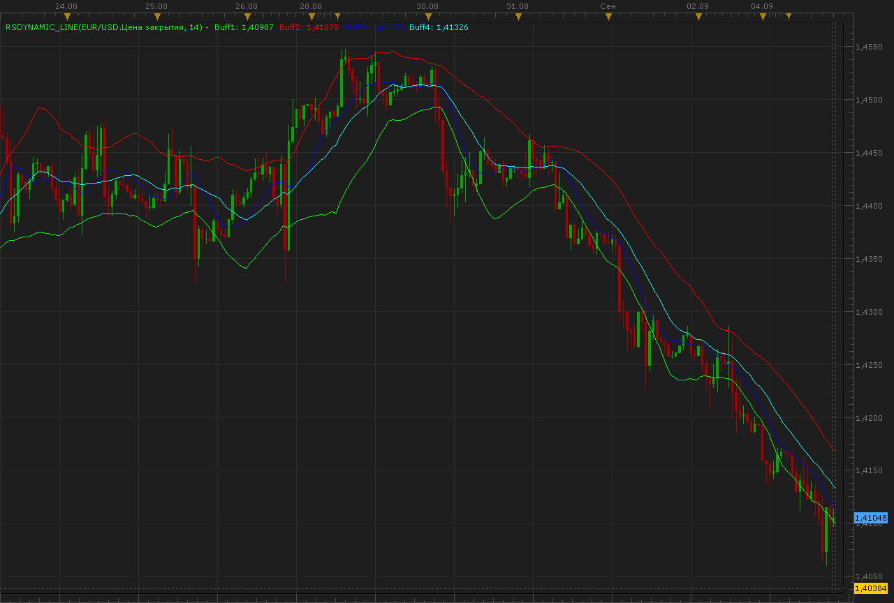

# Resistance/Support dinamyc lines.

> Source: https://fxcodebase.com/code/viewtopic.php?f=17&t=6306  
> Forum: 17 · Topic 6306 · 57 post(s)

---

## Resistance/Support dinamyc lines.

**Alexander.Gettinger** · Mon Sep 05, 2011 11:53 am

The indicator is written at the request: [viewtopic.php?f=27&t=5859](https://fxcodebase.com/code/viewtopic.php?f=27&t=5859)

 

Download:

 [RSdynamic_line.lua](files/14549/RSdynamic_line.lua)

The indicator was revised and updated

---

## Re: Resistance/Support dinamyc lines.

**lucmat** · Mon Sep 05, 2011 4:43 pm

Thnaks Alexander, this indicator is great!
There is only a problem: is it possible to draw not only Buff1, Buff2, Buff3 and Buff4, but also Stream1, Stream2, Stream3 and Stream4?
Thank you

Lucmat

---

## Re: Resistance/Support dinamyc lines.

**Alexander.Gettinger** · Thu Sep 08, 2011 9:30 am

> **lucmat wrote:**
> Thnaks Alexander, this indicator is great!
> There is only a problem: is it possible to draw not only Buff1, Buff2, Buff3 and Buff4, but also Stream1, Stream2, Stream3 and Stream4?
> Thank you
> Lucmat

Download:

 [RSdynamic_line.lua](files/14682/RSdynamic_line.lua)

---

## Re: Resistance/Support dinamyc lines.

**lucmat** · Thu Sep 08, 2011 9:55 am

Thanks for your help, but there is still a problem. The output should show stream1, 2, 3 and 4 (light) with buff1, 2, 3 and 4, which is the moving average of the stream. So the output should show 8 lines.
Is this possible?
Thanks

---

## Re: Resistance/Support dinamyc lines.

**lucmat** · Thu Sep 08, 2011 10:02 am

The result should be that in the attached picture.

---

## Re: Resistance/Support dinamyc lines.

**lucmat** · Wed Sep 14, 2011 10:45 am

Anyone can help me?
Thanks

---

## Re: Resistance/Support dinamyc lines.

**Apprentice** · Thu Sep 15, 2011 4:44 am

Your request is added to the developmental cue.

---

## Re: Resistance/Support dinamyc lines.

**Alexander.Gettinger** · Fri Sep 16, 2011 1:46 am

> **lucmat wrote:**
> Thanks for your help, but there is still a problem. The output should show stream1, 2, 3 and 4 (light) with buff1, 2, 3 and 4, which is the moving average of the stream. So the output should show 8 lines.
> Is this possible?
> Thanks

Please, see this version of indicator.

Download:

 [RSdynamic_line2.lua](files/15035/RSdynamic_line2.lua)

---

## Re: Resistance/Support dinamyc lines.

**lucmat** · Fri Sep 16, 2011 4:18 am

It's simply perfect!!!
Thanks for your help!!

Lucmat

---

## Re: Resistance/Support dinamyc lines.

**lucmat** · Sat Oct 22, 2011 12:04 pm

Is it possible to create a trading system with this indicator?
- BUY when stream1 crosses over buff1
- SELL when stream2 crosses under buff2

- BUY closed when stream2 crosses under buff2
- SELL closed when stream1 crosses over buff1

Thanks if you help me!

Lucmat

---

## Re: Resistance/Support dinamyc lines.

**Apprentice** · Sat Oct 22, 2011 4:28 pm

Your request is added to the developmental cue.

---

## Re: Resistance/Support dinamyc lines.

**lucmat** · Mon Oct 24, 2011 10:53 am

By changing the period of the indicator, you can get excellent signals.
In other words, if you handle the daily cycle (24 hours), you can put the indicator (1H time frame) with a period 48 or 96 and get good signals.
Try it!
Thanks
Lucmat

---

## Re: Resistance/Support dinamyc lines.

**lucmat** · Fri Oct 28, 2011 11:02 am

I use this indicator in conjuncion with macd, stoch and dss bressert.
It helps me to detect cycles.
Try it changing period and you may easily find cycles.
 Lucmat

---

## Re: Resistance/Support dinamyc lines.

**lucmat** · Wed Nov 02, 2011 2:24 am

I've tried the strategy requested in 1h time frame and it looks very promising!
If the signals are filtered with macd and dss, they are very good!

Any way, where I can found a simple and good manual to learn to write a trading system?

Lucmat

---

## Re: Resistance/Support dinamyc lines.

**Apprentice** · Wed Nov 02, 2011 6:37 pm

All you need is on this forum.
In this way, I learned everything I know.
Programing experience helps.

Read the Wiki and SDK sections.
Download DSK.
SDK Includes, Editor, Debuger the SDK documentation

---

## Re: Resistance/Support dinamyc lines.

**sunshine** · Thu Nov 03, 2011 1:22 am

> **lucmat wrote:**
> Any way, where I can found a simple and good manual to learn to write a trading system?

Please visit the section [Recommended reading](https://fxcodebase.com/code/viewtopic.php?f=28&t=2026) on this site.

---

## Re: Resistance/Support dinamyc lines.

**lucmat** · Fri Nov 04, 2011 9:25 am

It's not exactly easy, but I'm trying.
Thanks for your helpful reply.

Lucmat

---

## Re: Resistance/Support dinamyc lines.

**Alexander.Gettinger** · Mon Nov 07, 2011 11:29 am

> **lucmat wrote:**
> Is it possible to create a trading system with this indicator?
> - BUY when stream1 crosses over buff1
> - SELL when stream2 crosses under buff2
>
> - BUY closed when stream2 crosses under buff2
> - SELL closed when stream1 crosses over buff1
>
> Thanks if you help me!
>
> Lucmat

Please, see this strategy:

 [RSdynamic_line_Strategy.lua](files/17493/RSdynamic_line_Strategy.lua)

---

## Re: Resistance/Support dinamyc lines.

**lucmat** · Sun Nov 27, 2011 3:55 am

Thanks Alexander!
Your work is simply wonderful!
You are great!
Very thanks!

Lucmat

---

## Re: Resistance/Support dinamyc lines.

**southwallholdingsltd** · Wed Aug 08, 2012 4:57 pm

Hi, first of all, this seriously is the best indicator I've ever found in many years of trading. It has become the backbone to all my trades on the FTSE. Even though I'm just posting this now, i've been using this indicator for a long time.

Combined with a standard setting MACD, it gets me in at the right time pretty much every time on the FTSE 15m chart trends and keeps me out of fake outs and dips (which on naked chart could look like a trend change)

anyway, I'm just wondering if anyone could help me recreate this indicator for another platform such as mt4 ie what MA's are used etc...
I love trading station 2 for the FTSE, but I don't trade forex or commodities, just FTSE index and LSE stocks but unfortunately fxcm/trading station doesn't offer stocks and if I had the recipe to create this indicator on a platform that offers stocks it would open up a whole new world for my trading .

If anyone could help it would be much appreciated.

If not no problem, the creator of this has made me a lot of money so thank you.

Thanks

---

## Re: Resistance/Support dinamyc lines.

**Apprentice** · Thu Aug 09, 2012 1:58 am

Your request is added to the development list.

---

## Re: Resistance/Support dinamyc lines.

**Alexander.Gettinger** · Thu Aug 09, 2012 1:33 pm

MQL4 version of this indicator: [viewtopic.php?f=38&t=22223](https://fxcodebase.com/code/viewtopic.php?f=38&t=22223)

---

## Re: Resistance/Support dinamyc lines.

**southwallholdingsltd** · Thu Aug 09, 2012 3:40 pm

Hi, many thanks for the speedy turn around.

Sorry to be a pain but I was referring to the RS_Dynamicline2 further down in this post with the buffs. Would it be possible to create an mt4 version of that too?

Many thanks in advance

---

## Re: Resistance/Support dinamyc lines.

**southwallholdingsltd** · Thu Aug 09, 2012 4:55 pm

Please can you code an mt4 version of the RS_Dynamicline2 indicator further down this post....the one with all the buffs

thanks

---

## Re: Resistance/Support dinamyc lines.

**Apprentice** · Fri Aug 10, 2012 1:58 am

Your request is added to the development list.

---

## Re: Resistance/Support dinamyc lines.

**southwallholdingsltd** · Sun Aug 19, 2012 2:24 am

Hi, any idea when rs_dynamiclines2 indicator will be coded for mt4?

thanks

---

## Re: Resistance/Support dinamyc lines.

**lucmat** · Mon Sep 03, 2012 3:51 pm

> **Alexander.Gettinger wrote:**
>
>
> > **lucmat wrote:**
> > Is it possible to create a trading system with this indicator?
> > - BUY when stream1 crosses over buff1
> > - SELL when stream2 crosses under buff2
> >
> > - BUY closed when stream2 crosses under buff2
> > - SELL closed when stream1 crosses over buff1
> >
> > Thanks if you help me!
> >
> > Lucmat
>
>
>
> Please, see this strategy:
>
>
> RSdynamic_line_Strategy.lua

Hi guys!
Your works are always excellent and useful!

Is it possible to add MACD to this strategy?
In other words, is it possible to use MACD as a filter for signal from RSdynamic_line_strategy?

Thanks

Lucmat

---

## Re: Resistance/Support dinamyc lines.

**Apprentice** · Mon Sep 03, 2012 3:56 pm

Your request is added to the development list.

---

## Re: Resistance/Support dinamyc lines.

**lucmat** · Sun Sep 09, 2012 3:05 am

> **southwallholdingsltd wrote:**
> Hi, first of all, this seriously is the best indicator I've ever found in many years of trading. It has become the backbone to all my trades on the FTSE. Even though I'm just posting this now, i've been using this indicator for a long time.
>
> Combined with a standard setting MACD, it gets me in at the right time pretty much every time on the FTSE 15m chart trends and keeps me out of fake outs and dips (which on naked chart could look like a trend change)
>
> anyway, I'm just wondering if anyone could help me recreate this indicator for another platform such as mt4 ie what MA's are used etc...
> I love trading station 2 for the FTSE, but I don't trade forex or commodities, just FTSE index and LSE stocks but unfortunately fxcm/trading station doesn't offer stocks and if I had the recipe to create this indicator on a platform that offers stocks it would open up a whole new world for my trading .
>
> If anyone could help it would be much appreciated.
>
> If not no problem, the creator of this has made me a lot of money so thank you.
>
> Thanks

Hi southwallholdingsltd
I'm glad to know that other people use this indicator successfully.
I also use the MACD to filter the signals.
If you want to compare the strategies, please do not hesitate to contact me.
Bye

---

## Re: Resistance/Support dinamyc lines.

**southwallholdingsltd** · Mon Sep 10, 2012 6:51 pm

Hi lucmat, yes it would be good to hear your system for using this indicator and I'd be happy to tell you how I use it. I'm not a mechanical system trader completely, I still judge each and every trade with other things even if the indicators are lining up. I use this with MACD on marketscope and Ichi on MT4....and somtimes a Renko script on MT4.

Anyway please feel free to send me a private message on here to discuss further.

---

## Re: Resistance/Support dinamyc lines.

**lucmat** · Thu Sep 13, 2012 6:51 am

> **lucmat wrote:**
>
>
> > **Alexander.Gettinger wrote:**
> >
> >
> > > **lucmat wrote:**
> > > Is it possible to create a trading system with this indicator?
> > > - BUY when stream1 crosses over buff1
> > > - SELL when stream2 crosses under buff2
> > >
> > > - BUY closed when stream2 crosses under buff2
> > > - SELL closed when stream1 crosses over buff1
> > >
> > > Thanks if you help me!
> > >
> > > Lucmat
> >
> >
> >
> > Please, see this strategy:
> >
> >
> > RSdynamic_line_Strategy.lua
>
>
>
> Hi guys!
> Your works are always excellent and useful!
>
> Is it possible to add MACD to this strategy?
> In other words, is it possible to use MACD as a filter for signal from RSdynamic_line_strategy?
>
> Thanks
>
> Lucmat

Hi all
I'm trying to write this strategy but I've had some problem understanding some syntax (for example "RSDL" stand for?).
Is there a step by step manual for writing a strategy?
Thanks

Lucmat

---

## Re: Resistance/Support dinamyc lines.

**Apprentice** · Fri Sep 14, 2012 3:34 am

Please install SDK, Try to read SDK documentation and Wiki.
[http://fxcodebase.com/documentation.php](https://fxcodebase.com/documentation.php)
[http://fxcodebase.com/wiki/index.php/Main_Page](https://fxcodebase.com/wiki/index.php/Main_Page)

Definition of external indicators call for "RSDYNAMIC_LINE2" indicator.
 RSDL = core.indicators:create("RSDYNAMIC_LINE2", Source, instance.parameters.Period);

Indicators call.
RSDL:update(coreIndicators call..UpdateLast);

Access indicator value ​​for a given period, Stream1 of "RSDYNAMIC_LINE2".
RSDL.Stream1[period]

---

## Re: Resistance/Support dinamyc lines.

**lucmat** · Fri Sep 14, 2012 10:23 am

> **Apprentice wrote:**
> Please install SDK, Try to read SDK documentation and Wiki.
> [http://fxcodebase.com/documentation.php](https://fxcodebase.com/documentation.php)
> [http://fxcodebase.com/wiki/index.php/Main_Page](https://fxcodebase.com/wiki/index.php/Main_Page)
>
> Definition of external indicators call for "RSDYNAMIC_LINE2" indicator.
> RSDL = core.indicators:create("RSDYNAMIC_LINE2", Source, instance.parameters.Period);
>
> Indicators call.
> RSDL:update(coreIndicators call..UpdateLast);
>
> Access indicator value ​​for a given period, Stream1 of "RSDYNAMIC_LINE2".
> RSDL.Stream1[period]

Thanks for your help Apprentice.
You're always nice

I start to understand lua syntax.
I also try to make this strategy with FX Strategy Wizard, but the results are not so good even if I try all the combinations!
Is there someone that can hel p me to use FX Strategy Wizard?

Thanks

---

## Re: Resistance/Support dinamyc lines.

**southwallholdingsltd** · Sat Sep 15, 2012 6:56 am

Dear Apprentice,

Just wondering if it will still be possible to code RSDYNAMICLINES2 indicator for MT4 at some point?

Many thanks in advance.

---

## Re: Resistance/Support dinamyc lines.

**Apprentice** · Sat Sep 15, 2012 1:38 pm

Requested can be found here.
[viewtopic.php?f=38&t=23440](https://fxcodebase.com/code/viewtopic.php?f=38&t=23440)

---

## Re: Resistance/Support dinamyc lines.

**southwallholdingsltd** · Sun Sep 16, 2012 9:04 am

Hi Apprentice, thanks for the fast reply.

Sorry to be a pain but the indicator I'm am seeking is the RSDYNAMIC_line2 indicator on the 1st page, please see image.

Is is possible to do it for MT4?

thanks

---

## Re: Resistance/Support dinamyc lines.

**Apprentice** · Sun Sep 16, 2012 11:04 am

Click on the following link.
[viewtopic.php?f=38&t=23440](https://fxcodebase.com/code/viewtopic.php?f=38&t=23440)

---

## Re: Resistance/Support dinamyc lines.

**southwallholdingsltd** · Sun Sep 16, 2012 12:55 pm

Hi, thanks for the reply.

The indicator you're suggesting isn't the same as the one I'm referring to though? There isn't enough buffs/lines...

---

## Re: Resistance/Support dinamyc lines.

**Apprentice** · Sun Sep 16, 2012 2:10 pm

If you set USE parameter to true, you'll get just that.

---

## Re: Resistance/Support dinamyc lines.

**Pitcher** · Sun Jan 20, 2013 9:37 am

Dear Apprentice, dear Alexander,

First of all, thank you very much for your work guys!

Would it be possible to create an alert for RSDynamic_Line2 Indicator?

Parameter as follows:
If Stream 1 crosses Buff 1 (close of the candle) send email to…
If Stream 2 crosses Buff 2 (close of the candle) send email to…
combined with an eMail-Alert of the current MACD Status when a Stream crosses the Buffer.

Or – and that would be much more efficient - would it be possible for you to create a indicator/ programm which makes every hour (close of 1h candle) an image respectively a screenshot of my monitor and send it to me via eMail? So I can see the current chart and the used indicators?

I would be grateful if you could help me in this matter. Thanks in advance for your efforts and reply! And once again thanks for your excellent work!

All the best.

Pitcher

---

## Re: Resistance/Support dinamyc lines.

**Apprentice** · Sun Jan 20, 2013 3:49 pm

Definitely not for the screenshot, at least free forum service.
Can you explain the first request, Did I understand you correctly.
Send Alert and MACD Indicator Status on Stream / Buff Crosses.

---

## Re: Resistance/Support dinamyc lines.

**transformer** · Mon Jan 21, 2013 11:24 am

can you create a strategy based on rs dynamic line

**buy: price cross over lower line( stream1)
sell: price cross under upper line (stream2)**

---

## Re: Resistance/Support dinamyc lines.

**Pitcher** · Mon Jan 21, 2013 5:44 pm

What a shame.

Yes, you got me right.

It would be great to get an eMail if...
Stream 1 crosses Buff 1 (based on candle close) or
Stream 2 crosses Buff 2 (based on candle close)
in addition with the status of the current MACD Status (e.g. 7.13 or -7.13)

The result should be e.g....

Stream 1 crosses Buff in 1h-Chart (14 o'clock) and the status of the MACD is 7,88.

Thanks in advance for your support!

Best regards, Pitcher

---

## Re: Resistance/Support dinamyc lines.

**Apprentice** · Wed Jan 23, 2013 9:02 am

transformer
Your request is added to the development list.

---

## Re: Resistance/Support dinamyc lines.

**alaaroshdy** · Wed Jan 23, 2013 10:26 am

guys, could you explain how this system works, i am seeing you talking about stream, buff 1and 2, what about 3 and 4??

---

## Re: Resistance/Support dinamyc lines.

**Apprentice** · Thu Jan 24, 2013 4:41 pm

Transformer, Requested can be found here.
[viewtopic.php?f=31&t=31385](https://fxcodebase.com/code/viewtopic.php?f=31&t=31385)

---

## Re: Resistance/Support dinamyc lines.

**transformer** · Fri Jan 25, 2013 3:10 am

thank you apprentice .
this must be a leading edge for a trader who is trading in any chart..

---

## Re: Resistance/Support dinamyc lines.

**Pitcher** · Sat Mar 02, 2013 9:32 am

Dear Apprentice, dear Alexander,

Once again, thank you very much for your efforts!

Would it be possible to create an alert (just) for RSDynamic_Line2 Indicator?

Parameter as follows:
If Stream 1 crosses Buff 1 (close of the candle) send email to…
If Stream 2 crosses Buff 2 (close of the candle) send email to…

If you have any further Question, please do not hesitate to contact me.

I would be greatful if you could arrange it for us. in advance thank you very much!
Best regards
Pitcher

---

## Re: Resistance/Support dinamyc lines.

**fxtradingstudent** · Sat Mar 16, 2013 6:12 am

hi,

can you create a simple strategy based on rsdynamic indicator;

**buy: buff3>buff4 and price cross over lower line ( buff1)

sell:buff3<buff4 and and price cross under top line{ buff2)**

---

## Re: Resistance/Support dinamyc lines.

**Apprentice** · Sat Mar 16, 2013 8:48 am

Your requests are added to the development list.

---

## Re: Resistance/Support dinamyc lines.

**rplust** · Fri Apr 26, 2013 10:39 am

Could you please add the option to change the colour of the Streams separately. It's just a visual thing but it helps the eyes. Thank you.

---

## Re: Resistance/Support dinamyc lines.

**Apprentice** · Mon Apr 29, 2013 5:05 am

Your request is added to the development list.

---

## Re: Resistance/Support dinamyc lines.

**sliova** · Thu May 02, 2013 9:45 pm

Hello guys,

I download this strategy and run it on my TS2 platform. I have been waiting for three days since 30th Apr,however it seems doesn't work aotumatic.

Maybe I didn't set it right? Pls anyone can help me to make it work, thanks!!!

---

## Re: Resistance/Support dinamyc lines.

**LeTigre30** · Mon May 06, 2013 5:51 am

Hello Sliova,

Have you set the Trading Parameter : "Allow the Strategy to trade" to True ?
Obligatory to trigger Orders.

---

## Re: Resistance/Support dinamyc lines.

**LeTigre30** · Tue May 07, 2013 2:47 am

Hello Sliova,

As in testing this strategy on my own platform, it does not enter orders Buy nor Sell.
I took a look at the code of it, and have resolved the problem like as follows :
from line 46 to 49, i put them in comments like that :

Code: [Select all](https://fxcodebase.com/code/)
`(line 46 :) --   CreateTradingParameters();
(line 47 :) --end
(line 48 :)
(line 49 :) --function CreateTradingParameters()`

Now it enters orders.

Bst Rgds

---

## Re: Resistance/Support dinamyc lines.

**touchnsp** · Fri May 24, 2013 4:07 am

i have some problem whith this strategy...

see this please:
[viewtopic.php?f=31&t=31385&p=61701#p61701](https://fxcodebase.com/code/viewtopic.php?f=31&t=31385&p=61701#p61701)

or if you ask me to set the perfect period for this strategy... 14 period is too fast, 21 the signal is in delay, 50 period is not affidable... please send me a feedback

---

## Re: Resistance/Support dinamyc lines.

**Apprentice** · Thu May 11, 2017 2:00 pm

Indicator was revised and updated.
