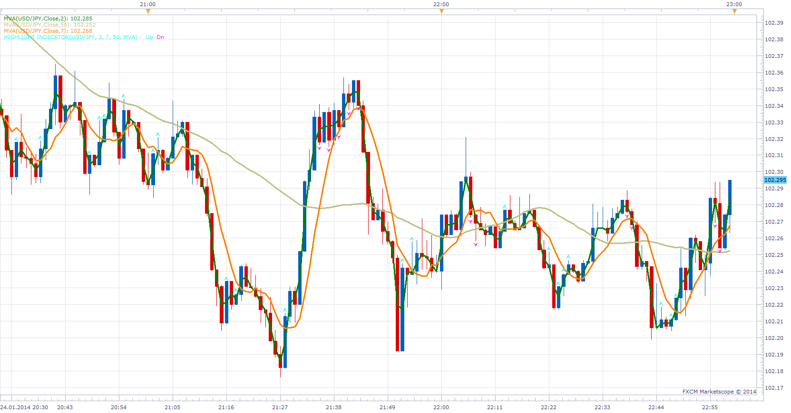

# Reversal Continuation Indicator

> Source: https://fxcodebase.com/code/viewtopic.php?f=17&t=60241  
> Forum: 17 · Topic 60241 · 3 post(s)

---

## Reversal Continuation Indicator

**Apprentice** · Sat Jan 25, 2014 3:15 pm

Inspired by request.
[viewtopic.php?f=27&t=60231](https://fxcodebase.com/code/viewtopic.php?f=27&t=60231)
Will show Reversal / Continuation of the trend.
The trend is defined by at positions of moving averages.

 [Reversal Continuation Indicator.lua](files/92275/Reversal%20Continuation%20Indicator.lua)

The indicator was revised and updated

---

## Re: Reversal Continuation Indicator

**Alexander.Gettinger** · Sun Jul 27, 2014 11:44 am

MQL4 version of Reversal Continuation Indicator: [viewtopic.php?f=38&t=60986](https://fxcodebase.com/code/viewtopic.php?f=38&t=60986).

---

## Re: Reversal Continuation Indicator

**Apprentice** · Tue Jul 11, 2017 2:00 pm

The indicator was revised and updated.
