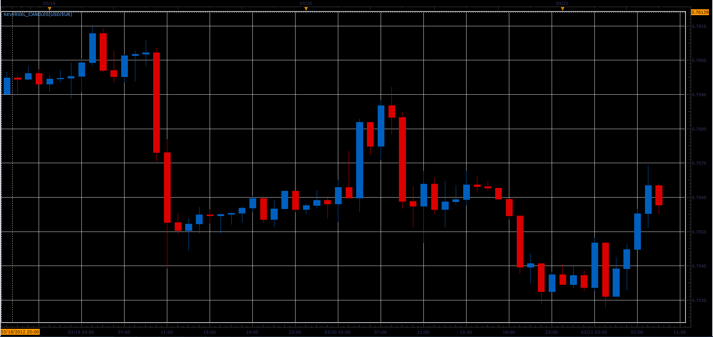
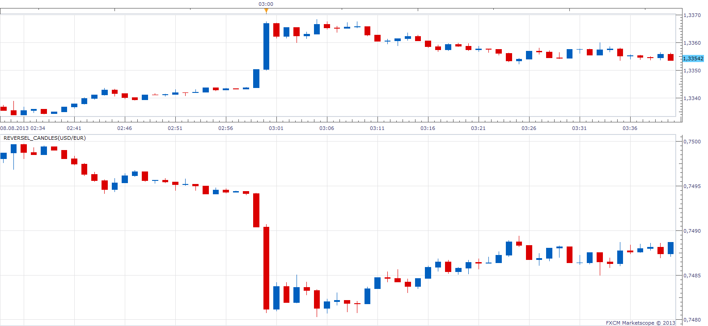
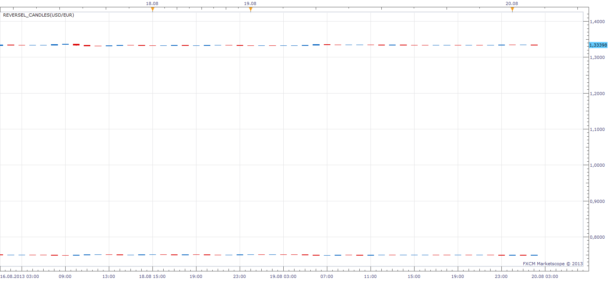
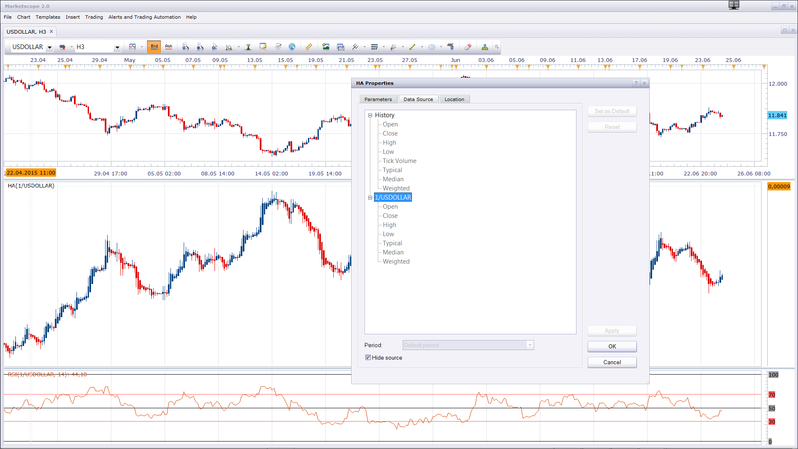

# Reverse chart indicator

> Source: https://fxcodebase.com/code/viewtopic.php?f=17&t=14988  
> Forum: 17 · Topic 14988 · 35 post(s)

---

## Reverse chart indicator

**Alexander.Gettinger** · Wed Mar 21, 2012 8:47 am

Indicator inverts the symbol.
Instead, EUR/USD will be USD/EUR.

Before:

 

After:

 

Download indicator:

 [Reversel_Candles.lua](files/28401/Reversel_Candles.lua)

 [Tick Reverse.lua](files/28401/Tick%20Reverse.lua)

The indicator was revised and updated

---

## Re: Reverse chart indicator

**Hailkayy** · Wed Mar 21, 2012 8:13 pm

Hi,

I find this very useful, Im not much of a long person, so see chart upside down, seeming like a short, feels great to me.
Pleaase find a way to be able to add, all great indicators you make, onto this one. For now there's little bug.

Thanks a lot.

---

## Re: Reverse chart indicator

**sunmoon** · Thu Mar 22, 2012 8:42 am

hello SIR

 could you make all indicaters reverse on chart ,not only candle.

 thanks

 mr .sun

---

## Re: Reverse chart indicator

**Apprentice** · Fri Mar 23, 2012 2:53 am

Yes this is possible. I am interested in the practical purpose of this.

---

## Re: Reverse chart indicator

**Alexander.Gettinger** · Fri Mar 23, 2012 8:27 am

> **sunmoon wrote:**
> could you make all indicaters reverse on chart ,not only candle.

You may use reverse chart as source data for other indicators.

---

## Re: Reverse chart indicator

**rtsayers** · Fri Jul 19, 2013 12:45 pm

I would like to use this but it's not working small bug but it would be great also if I could use indicators with a price line or function normal. This as well thanks alot!

---

## Re: Reverse chart indicator

**Apprentice** · Sat Jul 20, 2013 9:43 am

If I understood you.
You want normalized oscillator on main chart.

---

## Re: Reverse chart indicator

**rtsayers** · Sat Jul 20, 2013 1:39 pm

I want this indicator above exactly like it is but to work with indicators and have a price line to show where price is and work with USindex for correlation purposes.

Thanks a million

---

## Re: Reverse chart indicator

**Apprentice** · Mon Jul 22, 2013 4:29 am

Try Tick Version.

---

## Re: Reverse chart indicator

**rtsayers** · Mon Jul 22, 2013 5:08 pm

Sorry but not working and I wanted to use it on all timeframes and to be able to add indicators. Exactly like the indicator above reversed but be able to add indicators and have a current price line too.

Thanks

---

## Re: Reverse chart indicator

**scandisk** · Thu Jul 25, 2013 4:55 pm

Is it possible to fix this indicator to work with indicators and different time frames?

Thanks you very much!

---

## Re: Reverse chart indicator

**Apprentice** · Sat Jul 27, 2013 3:24 am

Simply chose the second, desired Time Frame from Indicator Source parameters.

---

## Re: Reverse chart indicator

**scandisk** · Sat Jul 27, 2013 1:16 pm

I don't understand the indicators don't work with this Reverse chart indicator. I can't put pivots on Reverse chart or will the RSI and others don't work? Maybe I don't understand what your saying? Also there is no current price line?

Thanks

---

## Re: Reverse chart indicator

**Apprentice** · Sun Jul 28, 2013 1:57 am

Bar / Candle version requires Bar / Candle source.
If the use RSI and other single, line indicators, use tick version of Reverse.

---

## Re: Reverse chart indicator

**rtsayers** · Sun Jul 28, 2013 1:30 pm

I wanted a candle stick version to work with indicators and the tick version uses a line and when you add indicators it doesn't work? Is it possible to just reverse the chart and have it normally function?

---

## Re: Reverse chart indicator

**Tahomahome** · Tue Jul 30, 2013 2:20 pm

Please Write this! It would be so useful to my trading to have a visually clean representation of this correlation......

Thank you in advance!

R

---

## Re: Reverse chart indicator

**rplust** · Thu Aug 01, 2013 2:46 am

Would be great if these two charts could be overlaid (candle, bar or line). In the parameter window/Location it says yes, but then it shows only the reverse. Don't want to place it in the sub window. Isn't much of use there.

---

## Re: Reverse chart indicator

**scandisk** · Sun Aug 04, 2013 1:28 pm

Thank you rplust exactly we need it not in the lower sub window but on main chart!

Any word from staff on progress?

---

## Re: Reverse chart indicator

**Apprentice** · Mon Aug 05, 2013 2:39 am

For every indicator, you can define the location of placing.
Click on the chart, then, appy.

---

## Re: Reverse chart indicator

**Apprentice** · Mon Aug 05, 2013 2:41 am

For every indicator, you can define the location of placing.
Go to Indicator Properties, then Location
Click on the chart, then, appy.

---

## Re: Reverse chart indicator

**rplust** · Tue Aug 06, 2013 10:04 am

Yes, Apprentice, I know that. But as I stated in my reply above, if I chose the Chart as location, the original candles disappear and it shows only the revers. I'd like them both on the same chart. At certain areas they will intersect which is what I'm looking for.

---

## Re: Reverse chart indicator

**Apprentice** · Thu Aug 08, 2013 2:46 am

Try this version

 [Reversel_Candles.lua](files/88084/Reversel_Candles.lua)

---

## Re: Reverse chart indicator

**rplust** · Tue Aug 13, 2013 7:16 am

I've been trying to download the Indicator. But I get the message "the attachment is not available anymore" meaning there's no attachment. Could you please upload it again. Thanks!

---

## Re: Reverse chart indicator

**Apprentice** · Tue Aug 13, 2013 8:08 am

Works for me.
Try once more, It was probably a temporary glitch.

---

## Re: Reverse chart indicator

**rplust** · Mon Aug 19, 2013 1:48 am

But this is the same. Once I load it into the main window, the original chart disappears and it shows only the reverse. As stated, I would like it to show both.

---

## Re: Reverse chart indicator

**Apprentice** · Tue Aug 20, 2013 1:48 am

As shown here,
i have both of them on the same chart.
Unfortunately, without some kind of normalization,
is quite difficult to compare the data.

See this two implementations.

[viewtopic.php?f=17&t=2324&p=4958&hilit=inverse#p4958](https://fxcodebase.com/code/viewtopic.php?f=17&t=2324&p=4958&hilit=inverse#p4958)

[viewtopic.php?f=17&t=34005&p=57805&hilit=inverse#p57805](https://fxcodebase.com/code/viewtopic.php?f=17&t=34005&p=57805&hilit=inverse#p57805)

---

## Re: Reverse chart indicator

**rtsayers** · Sun Jun 21, 2015 7:27 pm

Hi Apprentice

I am trying to use this with the USdollar index which it works fine but doesn't have price levels? I am not able to add indicators either? I have tried to put them on with using location but doesn't work with usdollar index it works fine with currency pairs but not index is there any fix for this? It would be greatly appreciated!

Thanks

---

## Re: Reverse chart indicator

**Apprentice** · Mon Jun 22, 2015 2:31 am

Try this version.
[download/file.php?id=9624](https://fxcodebase.com/code/download/file.php?id=9624)

---

## Re: Reverse chart indicator

**rtsayers** · Mon Jun 22, 2015 11:58 am

Hi Apprentice

It works good but still won't let me put indicators on the USdollar index?

Thanks

---

## Re: Reverse chart indicator

**rtsayers** · Tue Jun 23, 2015 1:53 pm

Hi Apprentice

I would like to be able to put indicators on the USdollar index chart like pivots and prime levels?

---

## Re: Reverse chart indicator

**Apprentice** · Wed Jun 24, 2015 5:24 am

As you can see will work for both tick or bar based indicators.
I'm not sure why the pivot has a problem.
We will investigate.

---

## Re: Reverse chart indicator

**Apprentice** · Wed Jun 24, 2015 5:29 am

While other indicators retrieved data from the chart.
Pivot retrieves raw data directly from the server.
Not reciprocal value provided by indicator.

---

## Re: Reverse chart indicator

**Apprentice** · Tue Jul 04, 2017 9:16 am

The indicator was revised and updated.

---

## Re: Reverse chart indicator

**easytrading** · Fri Jul 07, 2017 5:23 am

If you please , Apprentice could you produce the price bar overlay of this two pairs in the same main chart not in separated area of chart :

EUR/CHF with USD/EUR (reverse of EUR/USD)

with my appreciation as always.

---

## Re: Reverse chart indicator

**Apprentice** · Sun Jul 30, 2017 10:37 am

Did you try Price Overlay?
[viewtopic.php?f=17&t=2324&p=12778&hilit=overlay#p12778](https://fxcodebase.com/code/viewtopic.php?f=17&t=2324&p=12778&hilit=overlay#p12778)
