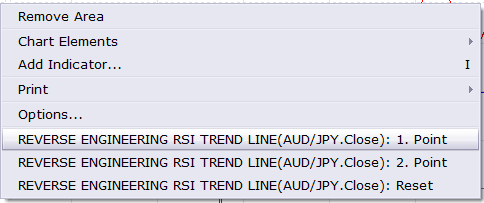

# Reverse Engineering RSI

> Source: https://fxcodebase.com/code/viewtopic.php?f=17&t=60010  
> Forum: 17 · Topic 60010 · 13 post(s)

---

## Reverse Engineering RSI

**Apprentice** · Thu Nov 28, 2013 7:25 am

As described in the article by Giorgos Siligardos, The Revenge Of The Indicators Reverse Engineering RSI

 [Reverse Engineering RSI.lua](files/91194/Reverse%20Engineering%20RSI.lua)

 

Based on the request.
[viewtopic.php?f=27&t=62048&p=99520#p99520](https://fxcodebase.com/code/viewtopic.php?f=27&t=62048&p=99520#p99520)

 [Reverse Engineering RSI Trend Line.lua](files/91194/Reverse%20Engineering%20RSI%20Trend%20Line.lua)

 [Trans Currency Reverse Engineering RSI Trend Line.lua](files/91194/Trans%20Currency%20Reverse%20Engineering%20RSI%20Trend%20Line.lua)

For Trans Currency Reverse Engineering RSI Trend Line you can only define a date.
Value is defined by date, as the RSI value at that moment in time.

 

Use the right mouse menu to set the start and end point of the trend line.
Available if the cursor is over Reverse Engineering RSI Trend Line indicator.

The indicator was revised and updated

---

## Re: Reverse Engineering RSI

**Patrick Sweet** · Thu Nov 28, 2013 2:01 pm

Really Nice!

---

## Re: Reverse Engineering RSI

**xpertizetrading** · Mon Dec 09, 2013 11:25 am

Hi Apprentice,

Is it meant to be used as a cross over system?
 E.g. Price Crosses below Reverse Engineering RSI = Sell
 Price Crosses above Reverse Engineering RSI = Buy

Please clarify

Thanks and Regards,
Xpertize Trading

---

## Re: Reverse Engineering RSI

**Apprentice** · Wed Dec 11, 2013 9:39 am

As much I can understanding, this is the author's intention.
More information can be found in the aforementioned article.

---

## Re: Reverse Engineering RSI

**Alexander.Gettinger** · Wed Aug 20, 2014 9:56 am

MQL4 version of Reverse Engineering RSI: [viewtopic.php?f=38&t=61057](https://fxcodebase.com/code/viewtopic.php?f=38&t=61057).

---

## Re: Reverse Engineering RSI

**Apprentice** · Sun Mar 29, 2015 1:48 pm

Reverse Engineering RSI Trend Line Added.

---

## Re: Reverse Engineering RSI

**Apprentice** · Wed Apr 01, 2015 4:34 am

Trans Currency Reverse Engineering RSI Trend Line Added.

---

## Re: Reverse Engineering RSI

**francois.avi** · Fri Apr 03, 2015 4:51 am

Bonjour,

is it possible to construct metatrader 4 version of Reverse Engineering RSI Trend Line.lua

[download/file.php?id=13881](https://fxcodebase.com/code/download/file.php?id=13881)
merci beaucoup

---

## Re: Reverse Engineering RSI

**Apprentice** · Fri Apr 03, 2015 7:04 am

Your request is added to the development list.

---

## Re: Reverse Engineering RSI

**francois.avi** · Fri May 01, 2015 11:35 am

Hi
any news about this indicator,

merci beaucoup

---

## Re: Reverse Engineering RSI

**Apprentice** · Mon May 04, 2015 3:06 am

U can ask Alex, he have committed to this task.

---

## Re: Reverse Engineering RSI

**Apprentice** · Mon Jul 03, 2017 7:58 am

The indicator was revised and updated.

---

## Re: Reverse Engineering RSI

**Alexander.Gettinger** · Fri Jan 04, 2019 6:27 pm

> **francois.avi wrote:**
> Bonjour,
>
> is it possible to construct metatrader 4 version of Reverse Engineering RSI Trend Line.lua
>
> merci beaucoup

Reverse Engineering RSI Trend Line added to [viewtopic.php?f=38&t=61057&p=123198#p123198](https://fxcodebase.com/code/viewtopic.php?f=38&t=61057&p=123198#p123198)
