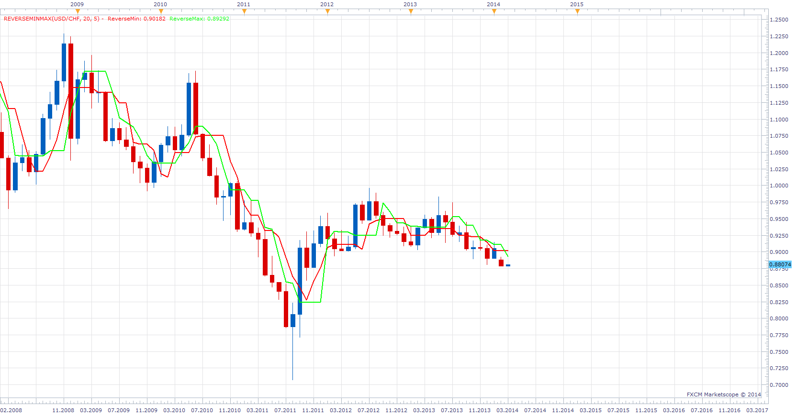

# ReverseMinMax

> Source: https://fxcodebase.com/code/viewtopic.php?f=17&t=60385  
> Forum: 17 · Topic 60385 · 3 post(s)

---

## ReverseMinMax

**Apprentice** · Mon Mar 03, 2014 7:31 am

As requested.
[viewtopic.php?f=27&t=60328](https://fxcodebase.com/code/viewtopic.php?f=27&t=60328)
Indicator will show
Smallest High of last N Periods
Biggest Low of last N Periods

 [ReverseMinMax.lua](files/92982/ReverseMinMax.lua)

The indicator was revised and updated

---

## Re: ReverseMinMax

**Alexander.Gettinger** · Mon Jun 02, 2014 5:06 pm

MQL4 version of ReverseMinMax indicator: [viewtopic.php?f=38&t=60762](https://fxcodebase.com/code/viewtopic.php?f=38&t=60762).

---

## Re: ReverseMinMax

**Apprentice** · Thu Jun 22, 2017 7:10 am

The indicator was revised and updated.
