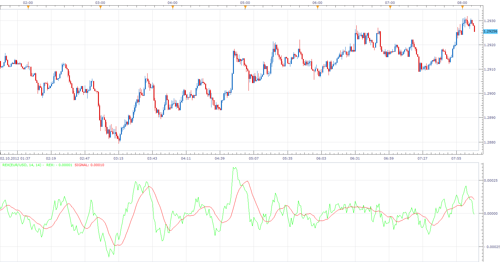

# Rex Indicator

> Source: https://fxcodebase.com/code/viewtopic.php?f=17&t=24005  
> Forum: 17 · Topic 24005 · 7 post(s)

---

## Rex Indicator

**Apprentice** · Tue Oct 02, 2012 7:07 am

True Value of a Bar (TVB) gives us an indication of how healthy the market is.

Rex Oscillator is a moving average of the TVB, indicating the inertia of the market. When the Rex Oscillator turns positive in a bearish trend, a reversal is indicated.
Likewise, Rex turning negative in a bull market indicates a reversal to the downside.

TVB = 3 * Close – (Low + Open + High)

 [REX.lua](files/41259/REX.lua)

The indicator was revised and updated

 

 [MTF MCP Rex Heat Map.lua](files/41259/MTF%20MCP%20Rex%20Heat%20Map.lua)

MT4/MQ4 version.
[viewtopic.php?f=38&t=61373](https://fxcodebase.com/code/viewtopic.php?f=38&t=61373)

---

## Re: Rex Indicator

**DjinTrader** · Fri Oct 19, 2012 9:29 pm

Hi Apprentice ,
Nice indicator. Any chance of getting a cross over alert signal for this indicator? Thanks

---

## Re: Rex Indicator

**Apprentice** · Sun Oct 21, 2012 3:36 am

Your request is added to the development list.

---

## Re: Rex Indicator

**Apprentice** · Sun Oct 21, 2012 4:32 am

Alert capable Strategy can be found here.
[viewtopic.php?f=31&t=24705](https://fxcodebase.com/code/viewtopic.php?f=31&t=24705)
Turn off trading functionality, if you only use it for Alerts.

---

## Re: Rex Indicator

**Alexander.Gettinger** · Thu Oct 23, 2014 10:09 am

MQL4 version of Rex indicator: [viewtopic.php?f=38&t=61373](https://fxcodebase.com/code/viewtopic.php?f=38&t=61373).

---

## Re: Rex Indicator

**Apprentice** · Thu Jun 29, 2017 6:12 am

The indicator was revised and updated.

---

## Re: Rex Indicator

**Apprentice** · Tue Apr 30, 2019 3:43 am

MTF MCP Rex Heat Map.lua added.
