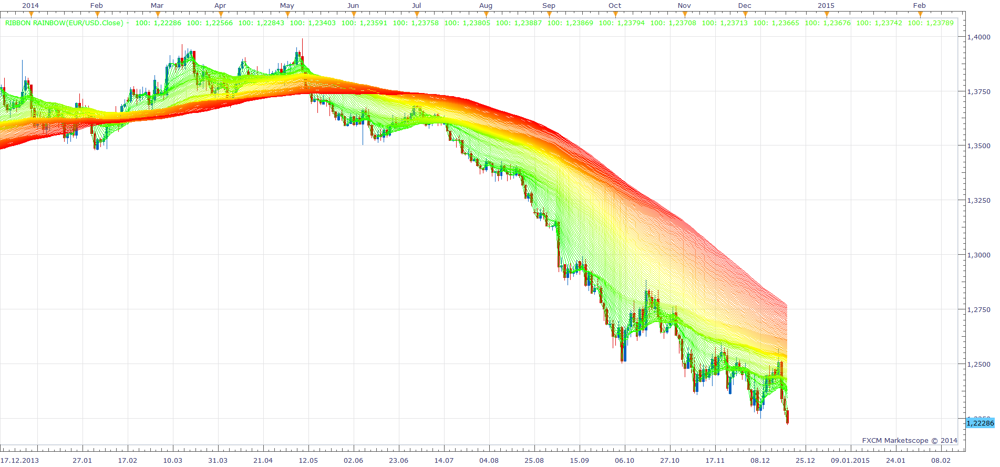
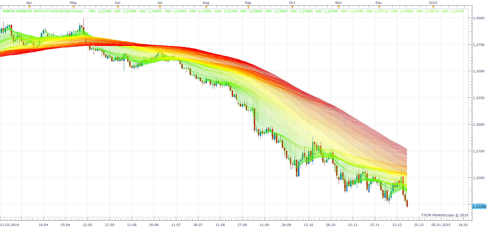

# RIBBON RAINBOW

> Source: https://fxcodebase.com/code/viewtopic.php?f=17&t=61618  
> Forum: 17 · Topic 61618 · 3 post(s)

---

## RIBBON RAINBOW

**Apprentice** · Sun Dec 21, 2014 5:04 am

Based on the request.
[viewtopic.php?f=27&t=61591](https://fxcodebase.com/code/viewtopic.php?f=27&t=61591)

 

 [RIBBON RAINBOW.lua](files/97795/RIBBON%20RAINBOW.lua)

 

 [RIBBON RAINBOW with Style.lua](files/97795/RIBBON%20RAINBOW%20with%20Style.lua)

---

## Re: RIBBON RAINBOW

**Univest** · Mon Dec 22, 2014 2:03 pm

Beautiful. Thank you apprentice

---

## Re: RIBBON RAINBOW

**Apprentice** · Mon Feb 05, 2018 11:02 am

The indicator was revised and updated.
