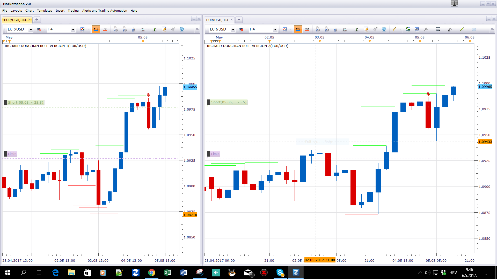

# Richard Donchian Rule

> Source: https://fxcodebase.com/code/viewtopic.php?f=17&t=64641  
> Forum: 17 · Topic 64641 · 5 post(s)

---

## Richard Donchian Rule

**Apprentice** · Sat May 06, 2017 4:41 am

Based on the request.
[viewtopic.php?f=27&t=64640&p=112319#p112319](https://fxcodebase.com/code/viewtopic.php?f=27&t=64640&p=112319#p112319)
The same presentation via two different methods.

 [Richard Donchian Rule Version 1.lua](files/112320/Richard%20Donchian%20Rule%20Version%201.lua)

 [Richard Donchian Rule Version 2.lua](files/112320/Richard%20Donchian%20Rule%20Version%202.lua)

---

## Re: Richard Donchian Rule

**xiupingge** · Sat May 06, 2017 10:44 pm

Thank you so much Apprentice for your great effort!
Is there possible to add the indicator tips like MA when I click on the candle?

---

## Re: Richard Donchian Rule

**Apprentice** · Tue May 09, 2017 3:53 am

Your request is added to the development list, Under Id Number 3797
 If someone is interested to do this task, please contact me.

---

## Re: Richard Donchian Rule

**Alexander.Gettinger** · Fri Oct 20, 2017 11:22 am

> **xiupingge wrote:**
> Thank you so much Apprentice for your great effort!
> Is there possible to add the indicator tips like MA when I click on the candle?

The indicators were updated.

---

## Re: Richard Donchian Rule

**Apprentice** · Mon May 07, 2018 12:52 pm

The Indicator was revised and updated.
