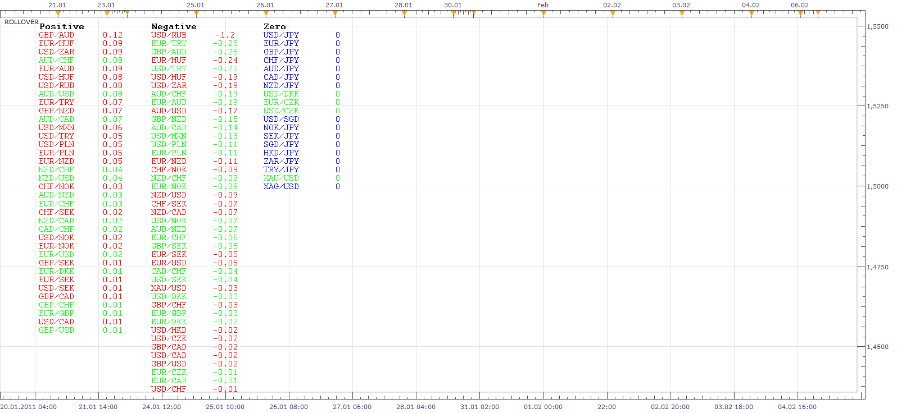

# Rollover

> Source: https://fxcodebase.com/code/viewtopic.php?f=17&t=3367  
> Forum: 17 · Topic 3367 · 12 post(s)

---

## Rollover

**Apprentice** · Thu Feb 10, 2011 7:00 am

This indicator make lists of rollover for all currency pairs.
Long positions are highlighted in green.
Short positions are highlighted in red.
Pairs highlighted in blue do not have rollover.
The values are sorted from largest to smallest.

 [Rollover.lua](files/8061/Rollover.lua)

 

This simplified version shows Rollover value for the current chart.

 [Rollover Overlay.lua](files/8061/Rollover%20Overlay.lua)

The indicator was revised and updated

---

## Re: PIP Boxed Indicator Update New Version

**Trader1** · Thu Sep 01, 2011 8:29 pm

I get errors when Im trying to load this indicator
please advise

An error occurred during the calculation of the indicator 'ROLLOVER'. The error details: [string "Rollover.lua"]:291: attempt to index field '?' (a nil value).

---

## Re: Rollover

**sunshine** · Fri Sep 02, 2011 8:19 am

This is a misprint in the code. I've uploaded the corrected version in the to post. Please download and reinstall the indicator.

---

## Re: Rollover

**jsotor** · Thu Feb 09, 2012 8:24 pm

Can we have this indicator only for the pair of the chart?

I mean that uses symbol of the chart as parameter and shows rates color coded @ top right corner.

For example: ROLLOVER(EUR/USD)

---

## Re: Rollover

**Apprentice** · Fri Feb 10, 2012 4:37 am

It is possible to write something similar.
I'm curious how this indicator would help you in daily trading.

---

## Re: Rollover

**jsotor** · Fri Feb 10, 2012 6:38 am

I am working with a group that had developed a strategy.

We are using microlots 1pip = $0.1

We open 1 microlot for each 1000$ in the account, and a limited number of simultaneous operations.

It is a no brainer.

The strategy is only buy or sell if rollover is in favor.

We don't use stop loss, so knowing the trend is also important.

If a trade remains open several days before hitting our target we don't care. It could be 50 - 100 pips against us and we will wait, meanwhile we are using rollover as an aditional benefit.

The benefit is that you have no pressure, no stress on such small trades, specially if you are aware of the prevailing trend.

We want to trade more pairs, so we need a way to see it right in the chart without having to remember if we buy or a sell this pair.

Actually, a good mtf trend indicator is also a good idea. Is there any?

Thanks in advance

---

## Re: Rollover

**Apprentice** · Thu Mar 01, 2012 6:58 am

Requested can be found on top post.

---

## Re: Rollover

**jsotor** · Thu Apr 05, 2012 9:18 am

Thanks apprentice.

---

## Re: Rollover

**Apprentice** · Mon Apr 03, 2017 5:44 am

Indicator was revised and updated.

---

## Re: Rollover

**YOJIMBO** · Thu May 17, 2018 9:02 pm

Hy apprentice,

First of all, thx for all your work, i really appreciate your indicator. But, for the first time i cant download one of them.

When i try to load this one, an error message told me (Market scope in unable to open the file).

Did you know if it is still work?

Thx

---

## Re: Rollover

**Apprentice** · Fri May 18, 2018 4:59 am

I just tested it.
Everything is anticipated.

---

## Re: Rollover

**YOJIMBO** · Sat May 19, 2018 4:48 pm

My marketscope cant open this one, that weird.

Thx again
