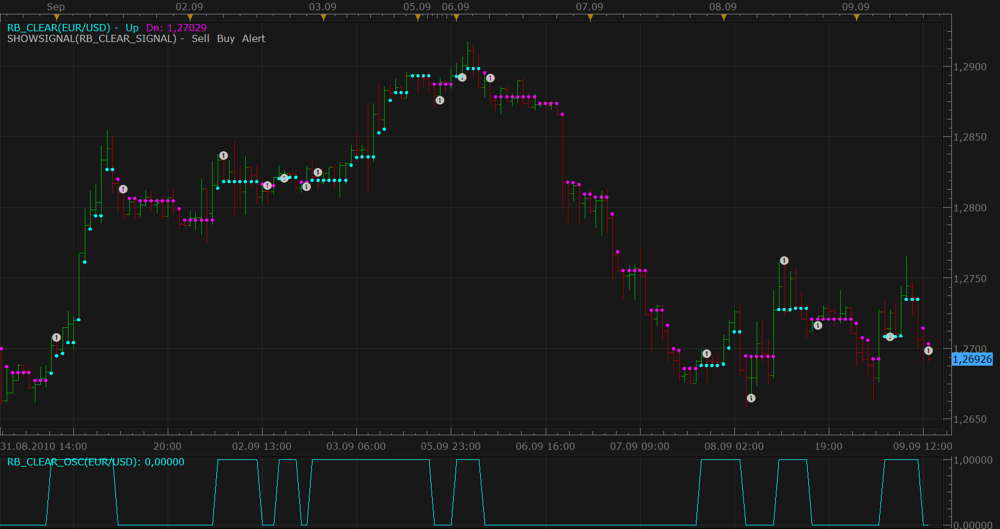

# Ron Black's 'Getting Clear With Short-Term Swings'

> Source: https://fxcodebase.com/code/viewtopic.php?f=17&t=2107  
> Forum: 17 · Topic 2107 · 13 post(s)

---

## Ron Black's 'Getting Clear With Short-Term Swings'

**Nikolay.Gekht** · Thu Sep 09, 2010 12:24 pm

The Ron Black's “Getting Clear With Short-Term Swings” described in Sep 2010 issue of Stock & Commodities (Pg. 18-21).

The main idea of the method is analysis of the past price distribution over the price range. If newer distribution doesn’t not overlap, it can signal that the market changes.

The indicator shows up and down swings of the market. The switch from up swing to down swing appears when the high price breaks trough the current highest low price reached during up swing. And vise versa, the switch from down swing to up swing appears when the low price breaks trough the lowest high price reached during down swing.

For more details, please, read the whole Ron Black’s article.

 

Downloads:
Indicator:

 [rb_clear.lua](files/4348/rb_clear.lua)

 [Clear.lua](files/4348/Clear.lua)

Oscillator:

 [rb_clear_osc.lua](files/4348/rb_clear_osc.lua)

Signal:

 [rb_clear_signal.lua](files/4348/rb_clear_signal.lua)

Please note that the indicator is must be downloaded and installed if oscillator or signal is used.

Update, Aug 09, 2011 (by sunshine): The 'rb_clear.lua' indicator has been updated. Reason: the signal based on this indicator generated duplicate alerts.

---

## Re: Ron Black's 'Getting Clear With Short-Term Swings'

**AAcoolguy** · Fri Sep 17, 2010 3:05 pm

Thanks, I was hoping someone would code this. I read the article and thought it was a great idea.

---

## Re: Ron Black's 'Getting Clear With Short-Term Swings'

**rretch** · Mon Aug 01, 2011 8:05 am

Thanks for introducing me to this method. As well as the indicator that makes it a lot easier than counting all the bars manually.

I was also wondering if anyone, who has the article, would mind scanning it for me? It doesn't have to be the whole article or anything. I just need the basic rules.

The reason I'm asking is that Ninja Traders indicator -modeled from Black's article- don't always have the same plots....I would guess both software packages should have the same plotting since they were taken from the same article.

Also, for some reason, this indicator doesn't always paint the bars for me. When i 'refresh' (from Trading Station 2.0) to get the correct candles marked and painted correctly.

thanks,
robert
.

---

## Re: Ron Black's 'Getting Clear With Short-Term Swings'

**nikpapado** · Sun Nov 27, 2011 2:45 am

I Tried to load
rb_clear_signal.lua

A new window appeared
Confirmation........result ....error
I have got the rest Rb.... succesfully
Pls Your help about

---

## Re: Ron Black's 'Getting Clear With Short-Term Swings'

**jackfx09** · Mon Nov 28, 2011 6:50 am

Nikolay,

this is a great indicator! It is very accurate on any time frame, effective and yet very simple visually. Could you please add Trading Parameters for this system. Thanks again for all your efforts.

sjc

---

## Re: Ron Black's 'Getting Clear With Short-Term Swings'

**Apprentice** · Mon Nov 28, 2011 6:29 pm

Your request is added to the developmental cue.

---

## Re: Ron Black's 'Getting Clear With Short-Term Swings'

**nikpapado** · Tue Nov 29, 2011 4:16 am

Pls your help
In the “”downloads “” directory of my computer I have already
1.	Rb_clear.lua
2.	Rb_clear_osc.lua
3.	Rb_clear_signal.lua
I loaded (imported) in the “”add Indicator”” ,” other” the
1.	Rb_clear.lua
2.	Rb_clear_osc.lua and I see them on the chart.
The 3. Rb_clear_signal.lua
cannot be loaded (imported) in the “”add Indicator”” ,” other”,
instead a new window appears
…Confirmation
…Results of loading
…Rb_clear_signal.lua…..result ….error.
I tried it many times, what is wrong I did not find , please help.

---

## Re: Ron Black's 'Getting Clear With Short-Term Swings'

**jackfx09** · Tue Nov 29, 2011 9:43 am

Much Thanks!

---

## Re: Ron Black's 'Getting Clear With Short-Term Swings'

**Coondawg71** · Mon Sep 10, 2012 5:28 am

Can we please request a strategy for RB Clear Oscillator Signal. Please construct the strategy to operate the same as the newly created Elliot Wave Signal Strategy in this case the CROSSING of the "0.50" value on the RB Oscillator.

Thanks,

sjc

---

## Re: Ron Black's 'Getting Clear With Short-Term Swings'

**Apprentice** · Tue Sep 11, 2012 4:02 am

Your request is added to the development list.

---

## Re: Ron Black's 'Getting Clear With Short-Term Swings'

**jamrocktrader** · Sun Oct 18, 2015 11:44 pm

Hi Apprentice,

Could you please adjust the signal algorithm so that the alert is given live instead of end of turn.

Thank You

---

## Re: Ron Black's 'Getting Clear With Short-Term Swings'

**Apprentice** · Mon Oct 19, 2015 2:59 am

You can find an adequate strategy here.
[viewtopic.php?f=31&t=62793](https://fxcodebase.com/code/viewtopic.php?f=31&t=62793)

---

## Re: Ron Black's 'Getting Clear With Short-Term Swings'

**Apprentice** · Fri Oct 12, 2018 5:24 am

The indicator was revised and updated.
