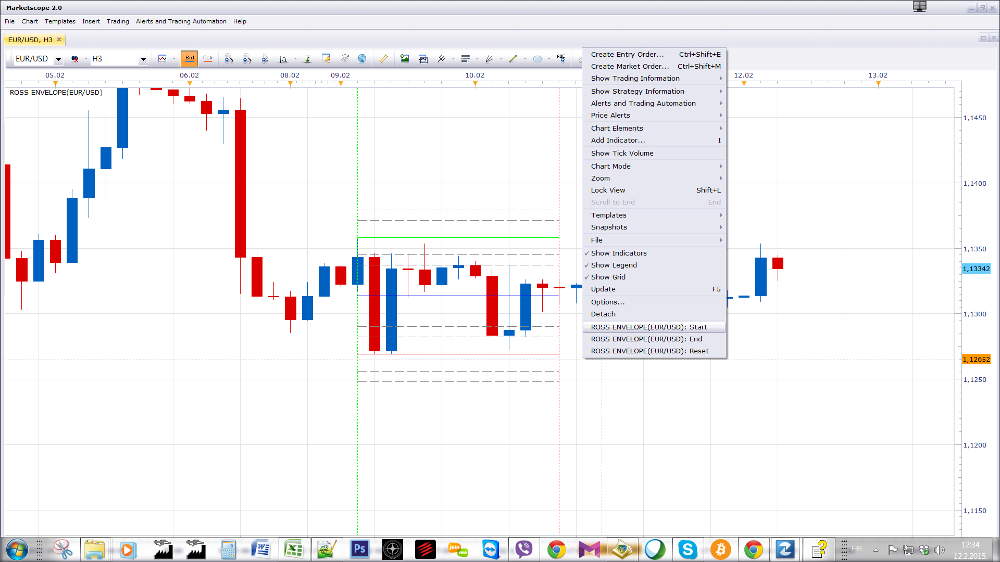

# Ross Envelope

> Source: https://fxcodebase.com/code/viewtopic.php?f=17&t=61813  
> Forum: 17 · Topic 61813 · 2 post(s)

---

## Ross Envelope

**Apprentice** · Thu Feb 12, 2015 6:30 am

Based on the request.
[viewtopic.php?f=27&t=61810](https://fxcodebase.com/code/viewtopic.php?f=27&t=61810)

 

Use the right mouse menu to define Start / End Points.

 [Ross Envelope.lua](files/98625/Ross%20Envelope.lua)

The indicator was revised and updated

---

## Re: Ross Envelope

**Apprentice** · Tue Aug 08, 2017 5:54 am

The indicator was revised and updated.
