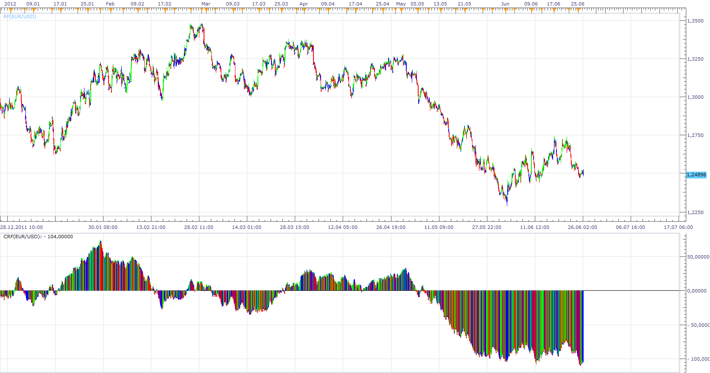

# Rotation Factor

> Source: https://fxcodebase.com/code/viewtopic.php?f=17&t=20592  
> Forum: 17 · Topic 20592 · 3 post(s)

---

## Rotation Factor

**Apprentice** · Tue Jun 26, 2012 3:57 am

RF Overlay shows the current state of Rotation Factor.
CRF oscillator shows the cumulative of previous Rotation Factor.

 [RF.lua](files/36077/RF.lua)

 [CRF.lua](files/36077/CRF.lua)

The indicator was revised and updated

---

## Re: Rotation Factor

**Alexander.Gettinger** · Tue Nov 18, 2014 11:47 am

MQL4 version of Rotation Factor oscillator: [viewtopic.php?f=38&t=61466](https://fxcodebase.com/code/viewtopic.php?f=38&t=61466).

---

## Re: Rotation Factor

**Apprentice** · Wed Jun 28, 2017 5:39 am

The indicator was revised and updated.
