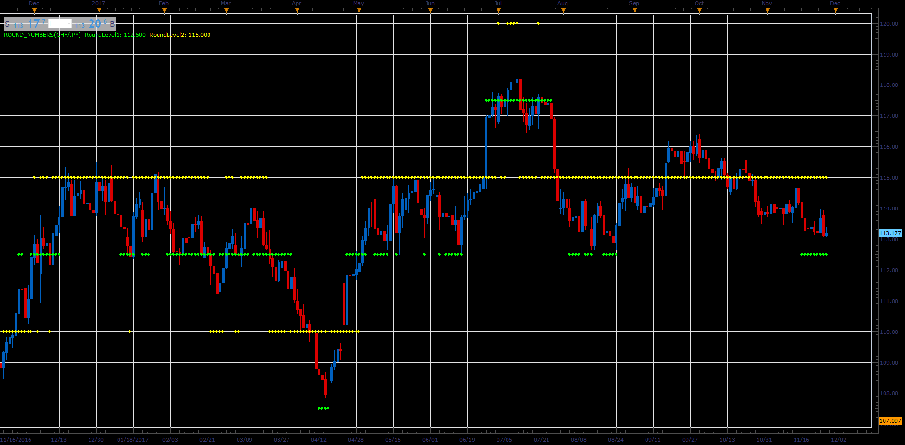

# Round numbers

> Source: https://fxcodebase.com/code/viewtopic.php?f=17&t=65407  
> Forum: 17 · Topic 65407 · 4 post(s)

---

## Round numbers

**Alexander.Gettinger** · Tue Nov 28, 2017 12:10 pm

Based on request: [viewtopic.php?f=27&t=63905](https://fxcodebase.com/code/viewtopic.php?f=27&t=63905)

 

Download:

 [Round_Numbers.lua](files/116266/Round_Numbers.lua)

The indicator was revised and updated

---

## Re: Round numbers

**beck87** · Tue Jan 16, 2018 2:42 pm

could you add a third round level ?
something like this:
Round level1 = 12,5
Round level2 = 25
Round level3 = 50

thanks

---

## Re: Round numbers

**Apprentice** · Wed Jan 17, 2018 9:19 am

Your request is added to the development list under Id Number 4010

---

## Re: Round numbers

**Apprentice** · Wed Jan 17, 2018 10:32 am

Try this version.
