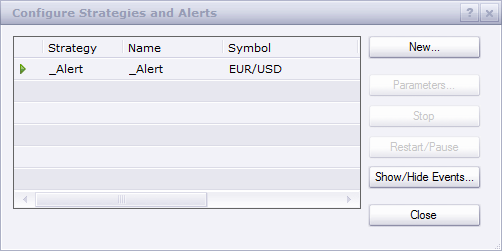

# RSI Alert

> Source: https://fxcodebase.com/code/viewtopic.php?f=17&t=18333  
> Forum: 17 · Topic 18333 · 15 post(s)

---

## RSI Alert

**Apprentice** · Tue May 15, 2012 4:07 am

This indicator provides Audio / Email Alerts, for you the RSI indicator,
It is possible to define a total of six separate signals.
Cross Over / Under for Central / Overbought / Oversold Lines

 [RSI Alert.lua](files/33019/RSI%20Alert.lua)

Dec 14, 2015: Compatibility issue Fixed. _Alert helper is not longer needed.

If you want to use updated version of this indicator,
please make sure to use TS Version 01.14.101415. or higher.

The indicator was revised and updated

---

## Re: RSI Alert

**cccornesss** · Thu Jul 05, 2012 6:31 am

Could it be possible to change the ugly crosslevel signal?

I mean, a single point like this would be better

[http://fxcodebase.com/code/download/file.php?id=6119&mode=view](https://fxcodebase.com/code/download/file.php?id=6119&mode=view)

Thank you very much in advance!

---

## Re: RSI Alert

**SuperTrader** · Mon Jul 09, 2012 2:59 pm

Great Signal !!

---

## Re: RSI Alert

**millertime** · Tue Nov 06, 2012 6:13 am

Is it possible to add an overlay option to this signal that crosses of the 50 line need to be a shift of a minimum of 20 on the cross bar? For instance the signal would trigger on a shift from 65 to 35 on one bar but not if it takes more than one bar for a total move of 20. Or a shift from 48 to 68. If this is possible please set up the signal for closed bars only. Thanks!

---

## Re: RSI Alert

**Apprentice** · Tue Nov 06, 2012 7:10 am

You've mentioned the overlay, In what way do you want it to be implemented.
Or you just want to alert, using the same implementation as we have in RSI Alert
if RSI Delta is greater than the Set values ​​in a given number of periods.

---

## Re: RSI Alert

**fxtrader8687** · Wed Mar 20, 2013 2:26 am

Hi Apprentice, the sound alert couldn't work on my TS. You've mentioned to activate the _alert.lua as well, how exactly to activate it?

Appreciate with thanks!

---

## Re: RSI Alert

**Apprentice** · Thu Mar 21, 2013 5:30 am

Go to Configure strategies and alerts.
There, you need to have an active _Alert.
If not, use New... to add it.

---

## Re: RSI Alert

**alpha_bravo** · Thu Mar 21, 2013 1:25 pm

Would there be any chance of editing this so that we can select which alert to trigger, with a yes/no? For example, there are 6 possible alerts, but to use any of them we need to use all of them...could we have an option to use, say two of them (or however many we need)? Because when you apply it to a few instruments, with 6 alerts going on each one, its crazy

---

## Re: RSI Alert

**Apprentice** · Sat Mar 23, 2013 5:43 am

Alert Selector Added.
Now you can choose from Cental, OB or OS line Cross Alert.
This was one of the first versions of this indicator type.
Now days, all have this functionality and more.

---

## Re: RSI Alert

**alpha_bravo** · Sat Mar 23, 2013 10:30 am

Nice one Apprentice, appreciated.

---

## Re: RSI Alert

**SuperTrader** · Fri Jun 12, 2015 3:29 am

Hi Apprentice. Your "RSI Alert" over here is a **fantastic** indicator, **extremely** helpful. But for some reason I cannot apply it to tick-charts (unlike many other custom indicators of yours). Could you please (if possible, and whenever you have time) modify it somehow so it can also work on tick-charts? Thank you **very much** in advance!

---

## Re: RSI Alert

**Apprentice** · Fri Jun 12, 2015 5:22 am

Try it now.

---

## Re: RSI Alert

**SuperTrader** · Mon Jun 15, 2015 4:10 am

yeap, it can also be applied to tick-charts now, and it works perfectly!
Thank you (you're a genius mate!)

---

## Re: RSI Alert

**Apprentice** · Mon Dec 14, 2015 6:15 am

Dec 14, 2015: Compatibility issue Fixed. _Alert helper is not longer needed.

If you want to use updated version of this indicator,
please make sure to use TS Version 01.14.101415. or higher.

---

## Re: RSI Alert

**Apprentice** · Mon Dec 05, 2016 9:37 am

Bump up.
