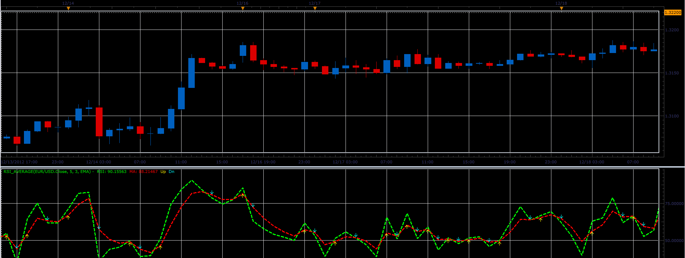

# RSI average indicator

> Source: https://fxcodebase.com/code/viewtopic.php?f=17&t=27797  
> Forum: 17 · Topic 27797 · 2 post(s)

---

## RSI average indicator

**Alexander.Gettinger** · Tue Dec 18, 2012 1:03 pm

This indicator is a ported indicator from [viewtopic.php?f=27&t=27051&p=47083#p47083](https://fxcodebase.com/code/viewtopic.php?f=27&t=27051&p=47083#p47083)

Formulas:
RSI - Relative Strength Index,
MA - Moving average(RSI).

 

Download:

 [RSI_Average.lua](files/48711/RSI_Average.lua)

For this indicator must be installed Averages indicator ([viewtopic.php?f=17&t=2430](https://fxcodebase.com/code/viewtopic.php?f=17&t=2430)).

---

## Re: RSI average indicator

**Apprentice** · Thu Mar 15, 2018 6:11 pm

Indicator was revised and updated.
