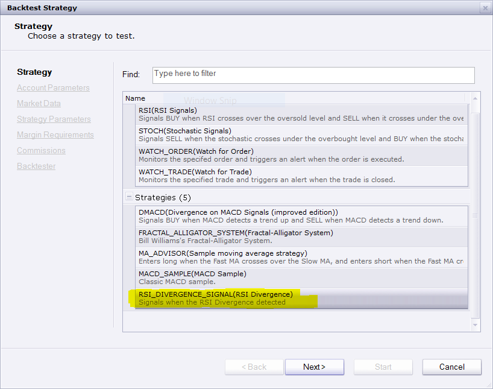
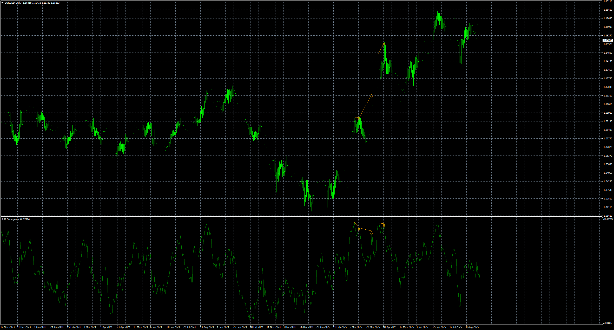
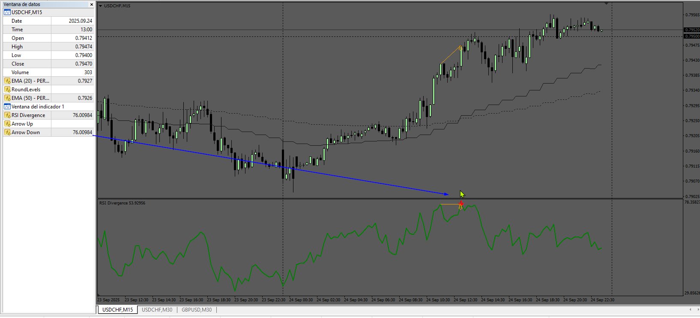

# RSI Divergence indicator and signal

> Source: https://fxcodebase.com/code/viewtopic.php?f=17&t=846  
> Forum: 17 · Topic 846 · 49 post(s)

---

## Re: RSI Divergence indicator and signal

**beni40** · Tue Apr 27, 2010 2:38 am

i trade macd divergenc, is it posibel to make it like this

it wod be perfect

best regards
bent

---

## Re: RSI Divergence indicator and signal

**Alexander.Gettinger** · Tue Apr 27, 2010 11:04 pm

> **beni40 wrote:**
> i trade macd divergenc, is it posibel to make it like this
>
> it wod be perfect
>
> best regards
> bent

You use macd divergence or histogram of macd divergence?

---

## Re: RSI Divergence indicator and signal

**beni40** · Wed Apr 28, 2010 1:32 am

i use the macd divergence, not the histogram, price making new hi macd maiking new lo

wery often price revers and follo the direksjon of the macd

if i cood have a 1 h or 4 h macd on a 15 m cart with an indicator like this

it wil transform my trading big time

bent

---

## Re: RSI Divergence indicator and signal

**Prof8t** · Thu Jul 22, 2010 11:40 am

Hello,

Could I get a a signal file created for this that would trigger upon immediate completion of a divergence occurrance instead of two bars later?

I would definitely appreciate it.

Thanks

---

## Re: RSI Divergence indicator and signal

**boursicoton** · Sun Aug 01, 2010 12:25 pm

cci divergence is good with this setup :

cci 48 div with price
cci 12 breakout trendline on cci

go !

cci div indictaor and signal...possible ?
market profile ?....snif....

---

## Re: RSI Divergence indicator and signal

**raulbanda1** · Fri Oct 22, 2010 10:09 am

What is the purpose of sending the signal after two candles? Why not set it up after one candle?

---

## Re: RSI Divergence indicator and signal

**mosesnobleraj** · Sat Jun 04, 2011 7:15 am

can you add email alert with rsi divergence signal

---

## Re: RSI Divergence indicator and signal

**Apprentice** · Sat Jun 04, 2011 5:05 pm

Request added to the developmental cue.

---

## Re: RSI Divergence indicator and signal

**oitsuki** · Mon Jun 13, 2011 11:10 am

Hello,

Thank for this indicator.
By default the period is 7.
For you what is the best period for this indicator.
I use 14, what do you think ?

Regards

---

## Re: RSI Divergence indicator and signal

**flores_joseg** · Tue Nov 22, 2011 5:31 am

Hi developers,

I was using this indicator without problems for some time but after the new updates of the FXCM Trading Station I realized that the indicator is not actualizing correctly and showing wrong divergences.
To print the correct lines/divergences, you have to double click on the indicator every few minutes and click ok in the configuration windows…

Could you please check this issue?

Thank you very much !!!

Regards...

---

## Re: RSI Divergence indicator and signal

**dohko2a** · Wed Nov 23, 2011 12:21 pm

Hi,
me too, big problem.

RSI Divergence indicator and Signal doesn't work correctly anymore.
New updates of FXCM TSII are responsable of this problem.

Like flores_joseg, i hope you could check this issue.

Thank you

---

## Re: RSI Divergence indicator and signal

**dohko2a** · Mon Nov 28, 2011 7:34 pm

Anybody ?

---

## Re: RSI Divergence indicator and signal

**7510109079** · Wed Nov 30, 2011 1:14 pm

Hi,
also I cant get this to work in the recently upgraded TS2. Looks like a few people are trying to use. Any chance you can check this one out, thx

---

## Re: RSI Divergence indicator and signal

**vstrelnikov** · Wed Nov 30, 2011 3:58 pm

I've replaced two files "RSI_Divergence.lua" and "RSI_Divergence1.lua" in the top post.
The problem with FXTSII should be fixed.
Would you please, re-download and re-install the indicator and check it out.

---

## Re: RSI Divergence indicator and signal

**dohko2a** · Thu Dec 01, 2011 1:08 pm

Yeah thank you !!!!!!!!
It works fine )

---

## Re: RSI Divergence indicator and signal

**rose123** · Thu May 17, 2012 8:07 pm

dear developers,

can you create strategy based on this signal.

thank you.

---

## Re: RSI Divergence indicator and signal

**Apprentice** · Sun May 20, 2012 3:18 am

Your request is added to the development list.

---

## Re: RSI Divergence indicator and signal

**ThemBonez** · Sun May 20, 2012 7:23 am

Hi,
Great indicator
Can you add the 40, 50, and 60 lines to the RSI oscillator window
Thank You

---

## Re: RSI Divergence indicator and signal

**Apprentice** · Tue May 22, 2012 3:23 am

Your request is added to the list of developers.

---

## Re: RSI Divergence indicator and signal

**sdcasper** · Sun Jun 10, 2012 2:12 pm

signal indicator is loading with an error message.

---

## Re: RSI Divergence indicator and signal

**Apprentice** · Tue Jun 12, 2012 2:42 am

Can you specify the error message.
 Do you have RSI_Divergence installed on your TS.
P.S. i have made Minor Update, unrelated with your problem.

---

## Re: RSI Divergence indicator and signal

**londonfx** · Mon Jun 25, 2012 5:01 am

Could you please provide MT4 version of this indicator?

Thanks,

---

## Re: RSI Divergence indicator and signal

**Apprentice** · Wed Jun 27, 2012 4:28 am

Your request is added to the development list.

---

## Re: RSI Divergence indicator and signal

**newton** · Mon Jul 16, 2012 11:11 am

hi ,

recurrent sound in this strategy is not working , can you fix it.

---

## Re: RSI Divergence indicator and signal

**speedytina** · Thu Feb 28, 2013 1:21 pm

> **Apprentice wrote:**
> Your request is added to the development list.

> **Apprentice wrote:**
> Your request is added to the development list.

Hello Apprentice:

Was an EA every developed for this indicator? Either for trading Station II or MT4?

Thanks,
speedytina

---

## Re: RSI Divergence indicator and signal

**Apprentice** · Fri Mar 01, 2013 5:41 am

Unfortunately no, I have not had the time, I can not speak for other developers.

---

## Re: RSI Divergence indicator and signal

**speedytina** · Sat Mar 02, 2013 6:42 am

Understood.
Thank you.

---

## Re: RSI Divergence indicator and signal

**lancelune** · Sun Sep 20, 2015 11:19 am

hello,
I learn how to program indicator and i have made a RSI divergence for training.
The code include the RSI and the search on divergence.
It's work!

I am not sure if is good. i like advice by programmer (thank apprentice if you can).
I can help to program indicator but i'am a beginner and necessary to correct me.

the calcul of peak is different because i use only one period on each size.
(I don't wait 2 periods only one to have signal)
I don't use overbought/oversold levels, and price nivel.
I can hide divergence by type of divergence.

I have difficulty to determine if my firstperiod is good.
I have difficulty to understand what realy do extent option in addstream.

sorry for my english.
good day.

Code: [Select all](https://fxcodebase.com/code/)
`-- RSI avec Divergente
function Init()
    indicator:name(resources:get("name"));
    indicator:description(resources:get("description"));
    indicator:requiredSource(core.Tick);
    indicator:type(core.Oscillator);
    indicator:setTag("group", "Classic Oscillators");

    indicator.parameters:addGroup("Calculation");
    indicator.parameters:addInteger("N", resources:get("R_number_of_periods_name"), resources:get("R_number_of_periods_desciption"), 14, 2, 1000);
    indicator.parameters:addGroup("Style");
    indicator.parameters:addColor("clrRSI", resources:get("R_line_color_name"),
        string.format(resources:get("R_color_of_PARAM_description"), resources:get("param_RSI_line_name")), core.rgb(255, 255, 128));
    indicator.parameters:addInteger("widthRSI", resources:get("R_line_width_name"),
        string.format(resources:get("R_width_of_PARAM_description"), resources:get("param_RSI_line_name")), 1, 1, 5);
    indicator.parameters:addInteger("styleRSI", resources:get("R_line_style_name"),
        string.format(resources:get("R_style_of_PARAM_description"), resources:get("param_RSI_line_name")), core.LINE_SOLID);
    indicator.parameters:setFlag("styleRSI", core.FLAG_LEVEL_STYLE);
   
   indicator.parameters:addBoolean("Affiche_Div_Classique", resources:get("Div_name_class"), resources:get("Div_desc_class"), true);
   indicator.parameters:addBoolean("Affiche_Div_Cache", resources:get("Div_name_cache"), resources:get("Div_desc_cache", true);
   
       
   indicator.parameters:addColor("UP_color", resources:get("R_line_color_name"),
        string.format(resources:get("R_color_of_PARAM_description"), resources:get("param_UP_color_line_name")), core.rgb(0, 255, 0));
      
   indicator.parameters:addColor("DN_color", resources:get("R_line_color_name"),
        string.format(resources:get("R_color_of_PARAM_description"), resources:get("param_DN_color_line_name")), core.rgb(255, 0, 0));
      
    indicator.parameters:addGroup("Levels");
   
    indicator.parameters:addInteger("overbought", resources:get("R_overbought_level_name"), resources:get("R_overbought_level_description"), 70, 0, 100);
    indicator.parameters:addInteger("oversold", resources:get("R_oversold_level_name"), resources:get("R_oversold_level_description"), 30, 0, 100);
    indicator.parameters:addInteger("level_overboughtsold_width", string.format(resources:get("R_width_of_PARAM_name"), resources:get("R_overbought_oversold_name")),
        string.format(resources:get("R_width_of_PARAM_description"), resources:get("R_overbought_oversold_description")), 1, 1, 5);
    indicator.parameters:addInteger("level_overboughtsold_style", string.format(resources:get("R_style_of_PARAM_name"), resources:get("R_overbought_oversold_name")),
        string.format(resources:get("R_style_of_PARAM_description"), resources:get("R_overbought_oversold_description")), core.LINE_SOLID);
    indicator.parameters:addColor("level_overboughtsold_color", string.format(resources:get("R_color_of_PARAM_name"), resources:get("R_overbought_oversold_name")),
        string.format(resources:get("R_color_of_PARAM_description"), resources:get("R_overbought_oversold_description")), core.rgb(128,128,128));
    indicator.parameters:setFlag("level_overboughtsold_style", core.FLAG_LEVEL_STYLE);
end

local n;
local first;
local source = nil;
local pos = nil;
local neg = nil;
local periode_precedent_sommet=nil;
local periode_sommet=nil;
local periode_precedent_creux=nil;
local periode_creux=nil;
local ligne_id = 0;                         -- compteur de ligne servant d'identifiant
local Affiche_Div_Cache = true;
local Affiche_Div_Classique = true;

local RSI = nil;
local UP = nil;
local DN = nil;

function Prepare()
    assert(instance.parameters.oversold < instance.parameters.overbought, resources:get("Erreur: verifier les niveaux de surachat et survente"));

    n = instance.parameters.N;
    source = instance.source;
    first = source:first() + n;
   UP_color = instance.parameters.UP_color;
    DN_color = instance.parameters.DN_color;
   Affiche_Div_Cache = instance.parameters.Affiche_Div_Cache;
   Affiche_Div_Classique = instance.parameters.Affiche_Div_Classique;
   
    local name = profile:id() .. "(" .. source:name() .. ", " .. n .. ")";
    instance:name(name);

   pos = instance:addInternalStream(0, 0);
   neg = instance:addInternalStream(0, 0);
   
      
    RSI = instance:addStream("RSI", core.Line, name, "RSI", instance.parameters.clrRSI, first);
   RSI:setWidth(instance.parameters.widthRSI);
    RSI:setStyle(instance.parameters.styleRSI);
    RSI:setPrecision(2);
   
   
   UP = instance:createTextOutput ("Up", "Up", "Wingdings", 10, core.H_Center, core.V_Bottom, UP_color);
    DN = instance:createTextOutput ("Dn", "Dn", "Wingdings", 10, core.H_Center, core.V_Top, DN_color);
 
         
    RSI:addLevel(0);
    RSI:addLevel(instance.parameters.oversold, instance.parameters.level_overboughtsold_style, instance.parameters.level_overboughtsold_width, instance.parameters.level_overboughtsold_color);
    RSI:addLevel(50);
    RSI:addLevel(instance.parameters.overbought, instance.parameters.level_overboughtsold_style, instance.parameters.level_overboughtsold_width, instance.parameters.level_overboughtsold_color);   
    RSI:addLevel(100);
   
end

local pperiode = nil;

function Update(periode)
   
    -- efface si recalcule et reinitia
    if pperiode ~= nil and pperiode > periode then
        core.host:execute("removeAll");
      ligne_id=0;
      periode_precedent_sommet=nil;
      periode_sommet=nil;
      periode_precedent_creux=nil;
      periode_creux=nil;
    end
   
   pperiode = periode;
   
    if periode >= first then
        local i = 0;
        local sump = 0;
        local sumn = 0;
        local positive = 0;
        local negative = 0;
        local diff = 0;
      
   --calcul du RSI
   if (periode == first) then
        for i = periode - n + 1, periode do
            diff = source[i] - source[i - 1];
            if (diff >= 0) then
                sump = sump + diff;
            else
                sumn = sumn - diff;
            end
        end
        positive = sump / n;
        negative = sumn / n;   
    else
        diff = source[periode] - source[periode - 1];
      if (diff > 0) then
         sump = diff;
      else
         sumn = -diff;
      end
      positive = (pos[periode - 1] * (n - 1) + sump) / n;
      negative = (neg[periode - 1] * (n - 1) + sumn) / n;   
                  
    end
   pos[periode] = positive;
   neg[periode] = negative;
   if (negative == 0) then
      RSI[periode] = 0;
   else
      RSI[periode] = 100 - (100 / (1 + positive / negative));
   end
   -- fin calcul RSI   
            
      if periode > first+2 then
      --detection des sommets
         if (RSI[periode-1] > RSI[periode]) and (RSI[periode-1] > RSI[periode-2]) then
            periode_precedent_sommet=periode_sommet;
            periode_sommet=periode-1;
            --detections des divergences
            if periode_precedent_sommet ~= nil then
                  
               -- div baissiere
               if Affiche_Div_Classique == true then      
                  if (RSI[periode_precedent_sommet]>RSI[periode_sommet]) and (source[periode_precedent_sommet] < source[periode_sommet]) then
                     DN:set(periode_sommet, RSI[periode_sommet], "\226", "Div B");
                     ligne_id = ligne_id + 1;
                     core.host:execute("drawLine", ligne_id, source:date(periode_precedent_sommet), RSI[periode_precedent_sommet], source:date(periode_sommet), RSI[periode_sommet], DN_color);
                  end
               end   
               -- div baissiere cache
               if Affiche_Div_Cache == true then
                  if (RSI[periode_precedent_sommet]<RSI[periode_sommet]) and (source[periode_precedent_sommet] > source[periode_sommet]) then
                     DN:set(periode_sommet, RSI[periode_sommet], "\226", "Div B cache");
                     ligne_id = ligne_id + 1;
                     core.host:execute("drawLine", ligne_id, source:date(periode_precedent_sommet), RSI[periode_precedent_sommet], source:date(periode_sommet), RSI[periode_sommet], DN_color);
                  end
               end   
            end
            -- detection creux
         elseif (RSI[periode-1] < RSI[periode]) and (RSI[periode-1] < RSI[periode-2]) then
            periode_precedent_creux=periode_creux;
            periode_creux=periode-1;
            
            --detection divergence
            if periode_precedent_creux ~= nil then
               -- div haussiere            
               if Affiche_Div_Classique == true then
                  if (RSI[periode_precedent_creux]<RSI[periode_creux]) and (source[periode_precedent_creux] > source[periode_creux]) then
                     UP:set(periode_creux, RSI[periode_creux], "\225", "Div H");
                     ligne_id = ligne_id + 1;
                     core.host:execute("drawLine", ligne_id, source:date(periode_precedent_creux), RSI[periode_precedent_creux], source:date(periode_creux), RSI[periode_creux], UP_color);
                  end
               end   
               --div haussiere cache
               if Affiche_Div_Cache == true then
                  if (RSI[periode_precedent_creux]>RSI[periode_creux]) and (source[periode_precedent_creux] < source[periode_creux])then
                     UP:set(periode_creux, RSI[periode_creux], "\225", "Div H cache");
                     ligne_id = ligne_id + 1;
                     core.host:execute("drawLine", ligne_id, source:date(periode_precedent_creux), RSI[periode_precedent_creux], source:date(periode_creux), RSI[periode_creux], UP_color);
                  end
               end   
            end
         end
      end   
    end
end`

and the ressource file

Code: [Select all](https://fxcodebase.com/code/)
`include=common.lua.rc
default=enu
[enu]
codepage=1252
name=Relative Strength Index with divergence
description=Shows price strength by comparing upward and downward close-to-close movements. And Divergences between indicator and price.
param_RSI_line_name=Relative Strength Index line
param_UP_color_line_name=Divergence Up
param_DN_color_line_name=Divergence Down
Div_name_class=Shows classic Divergence
Div_desc_class=True: Shows classic Divergences. False: to hide
Div_name_cache=Shows  hidden divergence
Div_desc_cache=True:Shows hidden Divergences. False: to hide

[fra]
codepage=1252
name=Indice de la force relative Avec Divergence
description=Montre la force du prix en le comparant aux mouvement vers son plus haut et son plus bas d'une clôture à l'autre.
param_RSI_line_name=ligne de l'Indice de force relative
param_UP_color_line_name=Divergence Hausse
param_DN_color_line_name=Divergence Baisse

Div_name_class=Affiche les divergences classiques
Div_desc_class=Vrai: pour afficher les divergences classiques
Div_name_cache=Affiche les divergences cachees
Div_desc_cache=Vrai: pour afficher les divergences cachees`

---

## Re: RSI Divergence indicator and signal

**Apprentice** · Mon Sep 21, 2015 2:21 am

extent - The optional parameter. The parameter specifies the difference between the source size and the output size. The positive number means that the output is longer than the source, the negative number means that the output is shorter than the source. The parameter is 0 by default.

For example. if you have 100 candles on our chart.
And you want to have more than 100 candles in your indicator output.
Ichimoku cloud, where cloud spreads beyond last candle, is a good example.

---

## Re: RSI Divergence indicator and signal

**lancelune** · Thu Oct 01, 2015 8:52 am

Thanks,

but
Why in this case the extent is -1. ?

Best REgards.

---

## Re: RSI Divergence indicator and signal

**Apprentice** · Thu Oct 08, 2015 4:33 am

Output is shorter than the source

---

## Re: RSI Divergence indicator and signal

**ramkirshnavarma** · Wed Mar 30, 2016 2:36 am

1. Do we have sound alert for this RSI Divergence indicator
2. Also I want OverBought and OverSold area to be 80 and 20 respectively.

Please suggest on this or direct me to the right place. If we have it somewhere? Also need this only for Trading Station

---

## Re: RSI Divergence indicator and signal

**Apprentice** · Wed Mar 30, 2016 6:12 am

You can use RSI_Divergence_Signal.lua for alerts.
(First/Topmost post in topic)

---

## Re: RSI Divergence indicator and signal

**Apprentice** · Wed Mar 30, 2016 6:17 am

OB/OS Level selector added.

---

## Re: RSI Divergence indicator and signal

**ramkirshnavarma** · Wed Mar 30, 2016 7:43 am

I have added the indicator. But this is not showing in the TS. I can able to see the first 2. Any suggestion on this

---

## Re: RSI Divergence indicator and signal

**Apprentice** · Tue Apr 05, 2016 6:42 am

RSI_Divergence_Signal.lua is signal.
You will find it as Signal / Strategy.

---

## Re: RSI Divergence indicator and signal

**kitefrog** · Sun Apr 24, 2016 3:16 pm

Can this RSI_Divergence be improved?

It would really help if:

1. When it's applied, you had three Booleans to also simultaneously run 5,. HR, and Day signals.
2. IT would really help if you could select ONLY LONG, or ONLY SHORT so you can bias the
indicator signals.
3. IT would be even better if you could set the signal bias to AUTO (YES or NO), then in
AUTO setting you could select a time frame's EMA and units for the 5m and HR signals.

For example, when running AUTO, you call the HR EMA 20, when price is over it, it will only
alert 5m LONG signals, and under it, you'd see only short.
ALSO, if you used daily EMA 81 for the HR events, then it would filter the HR events.

These changes would make this strategy awesome....... Can you fix it up?
David

---

## Re: RSI Divergence indicator and signal

**Apprentice** · Mon Apr 25, 2016 4:10 am

Your request is added to the development list.

---

## Re: RSI Divergence indicator and signal

**Apprentice** · Wed Oct 03, 2018 5:33 am

The indicator was revised and updated.

---

## Re: RSI Divergence indicator and signal

**Alexander.Gettinger** · Wed Dec 12, 2018 7:57 am

> **londonfx wrote:**
> Could you please provide MT4 version of this indicator?
>
> Thanks,

Please, try this MQL4 indicator:
[viewtopic.php?f=38&t=21033&p=104783](https://fxcodebase.com/code/viewtopic.php?f=38&t=21033&p=104783)

---

## Re: RSI Divergence indicator and signal

**chzavala** · Mon Jan 08, 2024 8:53 am

Could you please add to the **RSI Divergence Signa**l, also send it by email?

---

## Re: RSI Divergence indicator and signal

**Apprentice** · Wed Jan 10, 2024 7:17 am

We have added your request to the development list.
Development reference 43

---

## Re: RSI Divergence indicator and signal

**Apprentice** · Fri Jun 20, 2025 2:48 am

Try this version.
[https://fxcodebase.com/code/viewtopic.p ... 45#p159645](https://fxcodebase.com/code/viewtopic.php?f=31&t=76045&p=159645#p159645)

---

## Re: RSI Divergence indicator and signal

**khanatd** · Mon Aug 25, 2025 1:55 am

sir please for mt4 make it too non repaint
thanks
khan

---

## Re: RSI Divergence indicator and signal

**Apprentice** · Mon Aug 25, 2025 2:30 am

We have added your request to the development list.
Development reference 531

---

## Re: RSI Divergence indicator and signal

**Apprentice** · Wed Aug 27, 2025 6:34 am

 [RSI_Divergence.mq4](files/160376/RSI_Divergence.mq4)

---

## Re: RSI Divergence indicator and signal

**khanatd** · Sat Sep 13, 2025 2:12 am

Hi respected sir plz reminder with mt4 version and arrows thanks a lot

---

## Re: RSI Divergence indicator and signal

**Apprentice** · Mon Sep 15, 2025 12:41 pm

We have added your request to the development list.
Development reference 586

---

## Re: RSI Divergence indicator and signal

**Apprentice** · Sun Sep 28, 2025 12:04 pm

 [RSI_Divergence.mq4](files/160658/RSI_Divergence.mq4)
