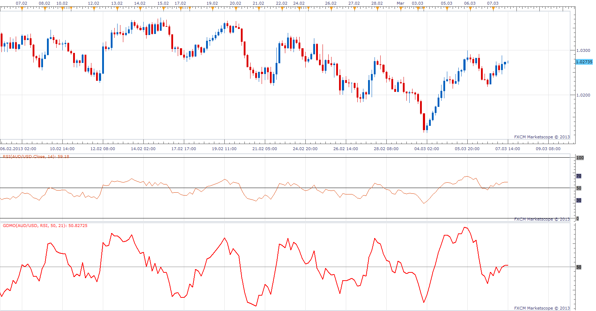

# RSI Dynamic Momentum Oscillator

> Source: https://fxcodebase.com/code/viewtopic.php?f=17&t=5087  
> Forum: 17 · Topic 5087 · 3 post(s)

---

## RSI Dynamic Momentum Oscillator

**Apprentice** · Thu Jul 07, 2011 6:12 am

In July 1996 Futures magazine, E. Marshall Wall introduces the Dynamic Momentum Oscillator (Dynamo).

He describes the Dynamo Oscillator to be:
Dynamo = Mc - ( MAo - O )

where:
Mc = the midpoint of the oscillator
MAo = a moving average of the oscillator
O = the oscillator

 [RSI Dynamic Momentum Oscillator.lua](files/12448/RSI%20Dynamic%20Momentum%20Oscillator.lua)

This concept can be applied to most any oscillator to improve its results.
In this case it is RSI.
Due to the fact that the Mid Point differs from the indicators to the indicators,
I have not found a way to write a generic indicator

The indicator was revised and updated

---

## Generic Dynamic Momentum Oscillator

**Apprentice** · Thu Mar 07, 2013 4:58 pm

Generic version, allows you to create DMO, for any oscillator.
Make sure to enter the appropriate midpoint or Cental Line Level.

 [GDMO.lua](files/55953/GDMO.lua)

---

## Re: RSI Dynamic Momentum Oscillator

**Apprentice** · Wed May 10, 2017 6:00 am

Indicator was revised and updated.
