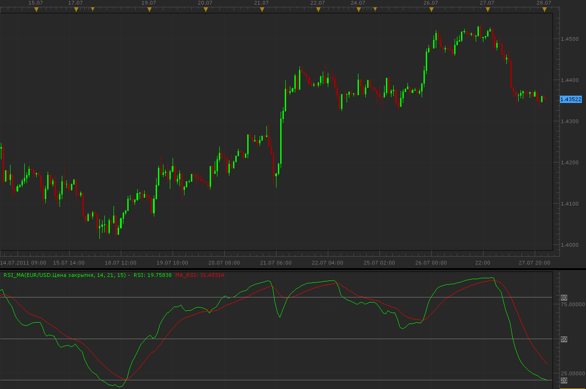

# RSI_MA indicator

> Source: https://fxcodebase.com/code/viewtopic.php?f=17&t=5502  
> Forum: 17 · Topic 5502 · 13 post(s)

---

## RSI_MA indicator

**Alexander.Gettinger** · Thu Jul 28, 2011 12:20 am

Indicator is a combination of RSI and moving average.

Formulas:
RSI=RSI(EMA(Price)) and MA_RSI=EMA(RSI).

 

Download:

 [RSI_MA.lua](files/13211/RSI_MA.lua)

 [RSI_MA with Alert.lua](files/13211/RSI_MA%20with%20Alert.lua)

The indicator was revised and updated

---

## Re: RSI_MA indicator

**fab.111** · Thu Aug 11, 2011 11:27 am

Great indicator. Is it possible to create a strategy based on this indicator ?
Many thanks

---

## Re: RSI_MA indicator

**Apprentice** · Sun Aug 21, 2011 12:15 pm

It is possible. Give me a few days .

---

## Re: RSI_MA indicator

**Apprentice** · Mon Aug 22, 2011 1:08 am

Requested can be found here.
[viewtopic.php?f=31&t=5994](https://fxcodebase.com/code/viewtopic.php?f=31&t=5994)

---

## Re: RSI_MA indicator

**steve50us** · Thu Sep 01, 2011 6:59 pm

You might try putting the ind. on the chart!!????

---

## Re: RSI_MA indicator

**rose123** · Thu Sep 13, 2012 9:34 am

hi programmers,

may i request two time frame rsi ma strategy.

indicator used

1. RSI MA ( TIME FRAME M15)

BUY ENTRY LEVEL 30
 BUY EXIT LEVEL 80
 SELL ENTRY LEVEL 70
 SELL EXIT LEVEL 20

2.RSI MA (TIME FRAME H1)

BUY LEVEL : 50
SELL LEVEL :50

BUY:

1. RSI > MA IN H1 AND RSI > BUY LEVEL
2. RSI CROSS OVER MA IN M15 AND RSI >BUY ENTRY LEVEL AND RSI < BUY EXIT LEVEL

SELL:

1. RSI< MA IN H1 AND RSI< SELL LEVEL
2. RSI CROSS UNDER MA IN M15 AND RSI < SELL ENTRY LEVEL AND RSI> SELL EXIT LEVEL

EXIT BUY:

1. RSI CROSS UNDER MA IN M15

EXIT SELL:

RSI CROSS OVER MA IN M15

---

## Re: RSI_MA indicator

**Apprentice** · Fri Sep 14, 2012 3:38 am

Your request is added to the development list.

---

## Re: RSI_MA indicator

**Apprentice** · Fri Sep 14, 2012 2:08 pm

Requested can be found here.
[viewtopic.php?f=31&t=23417](https://fxcodebase.com/code/viewtopic.php?f=31&t=23417)

---

## Re: RSI_MA indicator

**rose123** · Fri Sep 14, 2012 2:37 pm

Thank you very much.

---

## Re: RSI_MA indicator

**Apprentice** · Wed Apr 12, 2017 6:18 am

Indicator was revised and updated.

---

## Re: RSI_MA indicator

**rch05000** · Fri Jan 12, 2018 12:34 pm

Hi Apprentice,
Is it possible to create an alert based on this indicator?
thank you in advance

---

## Re: RSI_MA indicator

**Apprentice** · Sat Jan 13, 2018 7:34 am

RSI_MA with Alert.lua added.

---

## Re: RSI_MA indicator

**rch05000** · Sat Jan 13, 2018 1:03 pm

Thank you
