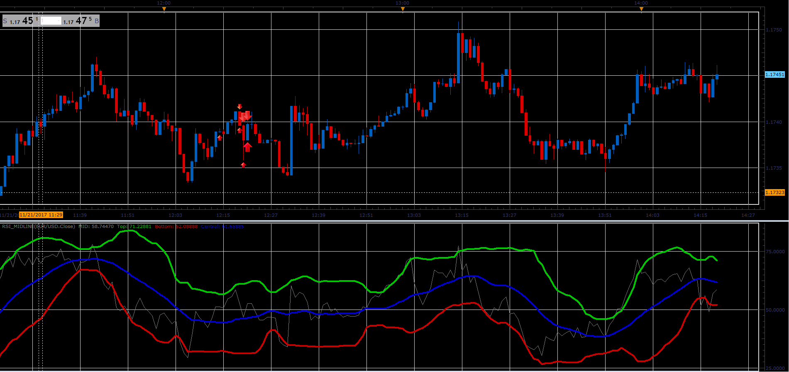

# RSI midline oscillator

> Source: https://fxcodebase.com/code/viewtopic.php?f=17&t=65386  
> Forum: 17 · Topic 65386 · 4 post(s)

---

## RSI midline oscillator

**Alexander.Gettinger** · Tue Nov 21, 2017 4:10 pm

Download:

 [RSI_Midline.lua](files/116154/RSI_Midline.lua)

 

 [MTF MCP RSI_Midline Heat Map.lua](files/116154/MTF%20MCP%20RSI_Midline%20Heat%20Map.lua)

Averages.lua is available here.
[viewtopic.php?f=17&t=2430](https://fxcodebase.com/code/viewtopic.php?f=17&t=2430)

---

## Re: RSI midline oscillator

**Apprentice** · Thu Dec 07, 2017 7:00 am

MTF MCP RSI_Midline Heat Map.lua added.

---

## Re: RSI midline oscillator

**easytrading** · Mon Mar 12, 2018 4:00 pm

hello Apprentice,

 could you please ,fix the line width style of RSI midline (the gray one) cause it is not changing. with my appreciation.

---

## Re: RSI midline oscillator

**Apprentice** · Tue Mar 13, 2018 6:30 am

Try it now.
