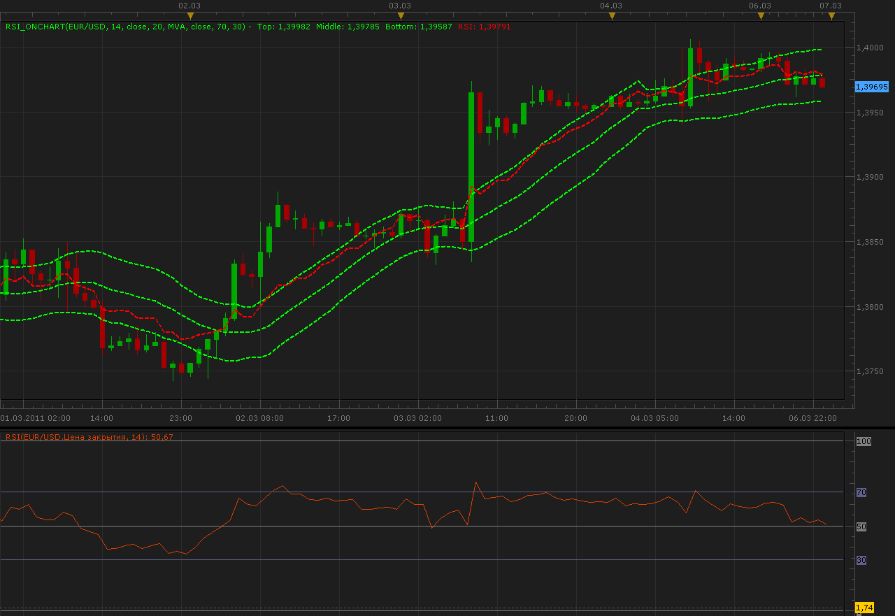

# RSI on chart

> Source: https://fxcodebase.com/code/viewtopic.php?f=17&t=3612  
> Forum: 17 · Topic 3612 · 9 post(s)

---

## RSI on chart

**Alexander.Gettinger** · Sun Mar 06, 2011 11:53 pm

Indicator draw RSI oscillator on data chart with RSI levels.
As center line uses MA.

 

Download:

 [RSI_OnChart.lua](files/8679/RSI_OnChart.lua)

For this indicator must be installed AVERAGES indicator ([viewtopic.php?f=17&t=2430&p=6686](https://fxcodebase.com/code/viewtopic.php?f=17&t=2430&p=6686)).

---

## Re: RSI on chart

**myprince2003** · Sun Apr 10, 2011 3:48 pm

Dear Mr. Gettinger,
i want to thank you for the grate indicator it was very helpful for me along with some other indicators. I have a request:
can you please change the 70 and 30 line in the chart to a horizontal line also is it possible to be able to change the color and the type of these lines?
i am trying to use these lines as S & R and points of entry for my trades.
Thank you very much

---

## Re: RSI on chart

**myprince2003** · Sun Apr 10, 2011 3:53 pm

i mean with horizontal line that the last part of the (RSI on Chart) is a horizontal line. because when i used this indicator it was good to show s & R levels but then i have to Draw it manually and that adds more lines in the chart and it become hard to read the chart

---

## Re: RSI on chart

**Apprentice** · Sun May 08, 2011 2:25 am

Your request has been added to developmental cue.

---

## Re: RSI on chart

**R3boot** · Mon May 09, 2011 1:36 am

i got this error msg and i tried to restart TS2 but i still have the problem

---

## Re: RSI on chart

**Apprentice** · Mon May 09, 2011 3:50 am

For this indicator must be installed AVERAGES indicator
You Can find it and install it from here.
[viewtopic.php?f=17&t=2430&p=6686](https://fxcodebase.com/code/viewtopic.php?f=17&t=2430&p=6686)

---

## Re: RSI on chart

**Alexander.Gettinger** · Wed Jul 20, 2011 2:40 am

> **myprince2003 wrote:**
> Dear Mr. Gettinger,
> i want to thank you for the grate indicator it was very helpful for me along with some other indicators. I have a request:
> can you please change the 70 and 30 line in the chart to a horizontal line also is it possible to be able to change the color and the type of these lines?
> i am trying to use these lines as S & R and points of entry for my trades.
> Thank you very much

Please, see this version of indicator.
I hope that it is correct you have understood.

Download:

 [RSI_OnChart2.lua](files/12880/RSI_OnChart2.lua)

---

## Re: RSI on chart

**Alexander.Gettinger** · Fri Jun 29, 2012 1:31 pm

MQL4 version of this indicator: [viewtopic.php?f=38&t=20674](https://fxcodebase.com/code/viewtopic.php?f=38&t=20674)

---

## Re: RSI on chart

**Apprentice** · Wed Feb 21, 2018 10:43 am

The Indicator was revised and updated.
