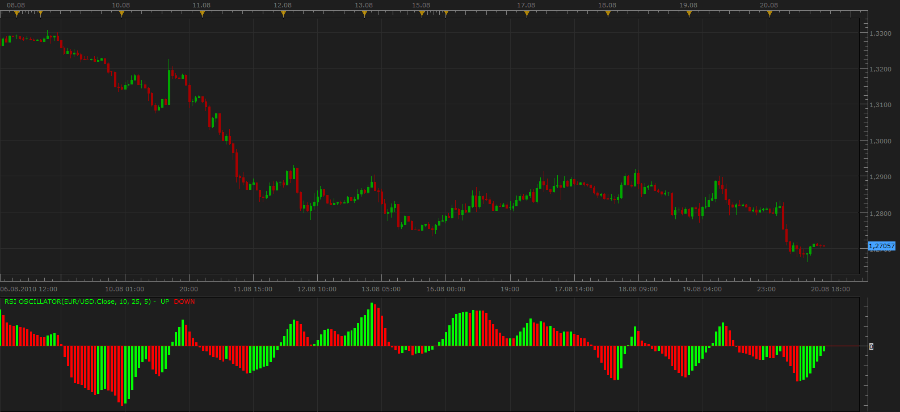

# RSI Oscillator

> Source: https://fxcodebase.com/code/viewtopic.php?f=17&t=1882  
> Forum: 17 · Topic 1882 · 3 post(s)

---

## RSI Oscillator

**Apprentice** · Sat Aug 21, 2010 4:27 am

This oscillator is based on written requests.
RSI OScillator = Moving Average(5) of (RSI(10) - RSI(25))

 [RSI Oscillator.lua](files/3787/RSI%20Oscillator.lua)

MT4/MQ4 version.
[viewtopic.php?f=38&t=63909](https://fxcodebase.com/code/viewtopic.php?f=38&t=63909)

The indicator was revised and updated

---

## Re: RSI Oscillator

**Apprentice** · Sat Aug 21, 2010 5:56 pm

Histogram version

 [RSI Oscillator.lua](files/3793/RSI%20Oscillator.lua)

The indicator was revised and updated

---

## Re: RSI Oscillator

**Apprentice** · Wed Jan 11, 2017 6:23 am

Indicator was revised and updated.
