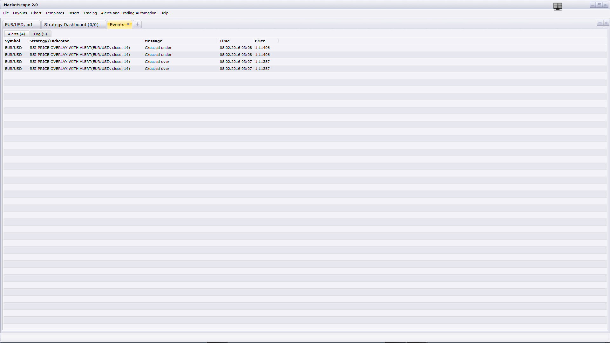

# RSI Price Overlay

> Source: https://fxcodebase.com/code/viewtopic.php?f=17&t=2438  
> Forum: 17 · Topic 2438 · 30 post(s)

---

## RSI Price Overlay

**Apprentice** · Mon Oct 18, 2010 5:30 am

Up Candles
RSI> Buy Level
Down Candles
RSI < Sell Level
Else Neutral Candle

 [RSI Price Overlay.lua](files/5284/RSI%20Price%20Overlay.lua)

 [RSI Price Overlay with Alert.lua](files/5284/RSI%20Price%20Overlay%20with%20Alert.lua)

MT4/MQ4 version.
[viewtopic.php?f=38&t=64125](https://fxcodebase.com/code/viewtopic.php?f=38&t=64125)

The indicator was revised and updated

---

## Re: RSI Price Overlay

**sedraude** · Mon Oct 18, 2010 8:07 am

Hi Apprentice,

Good work and very fast respon... great indi

Thank in advance

---

## Re: RSI Price Overlay

**sedraude** · Mon Nov 01, 2010 10:11 pm

Hi Apprentice,

Can you make average indicator [http://fxcodebase.com/code/viewtopic.php?f=17&t=2430&p=5713&hilit=average#p5713](https://fxcodebase.com/code/viewtopic.php?f=17&t=2430&p=5713&hilit=average#p5713) like RSI Price Overlay?

Thank in Advance

---

## Re: RSI Price Overlay

**Apprentice** · Tue Nov 02, 2010 5:19 am

Added to the developmental cue.

---

## Re: RSI Price Overlay

**Apprentice** · Wed Nov 03, 2010 6:58 am

Requested can be found here.
[viewtopic.php?f=17&t=2583&p=5777#p5777](https://fxcodebase.com/code/viewtopic.php?f=17&t=2583&p=5777#p5777)

---

## Re: RSI Price Overlay

**xpertizetrading** · Mon Jan 19, 2015 12:14 pm

Is it possible to code a strategy based on RSI price overlay? Buy: Green Sell:Red

---

## Re: RSI Price Overlay

**Apprentice** · Tue Jan 20, 2015 3:00 am

Highly adaptable RSI Strategy is one of strategys u content use.
[viewtopic.php?f=31&t=31552&p=54451&hilit=rsi+strategy#p54451](https://fxcodebase.com/code/viewtopic.php?f=31&t=31552&p=54451&hilit=rsi+strategy#p54451)

---

## Re: RSI Price Overlay

**safaranpriest** · Sun Feb 08, 2015 5:17 pm

Hi Apprentice,

Is it possible to add the option of color coding the RSI Price overlay based on overbought and oversold levels. I would like to use this indicator in a way that it only colors candles above 70 as green and below 30 as red.

---

## Re: RSI Price Overlay

**Apprentice** · Wed Feb 11, 2015 3:53 am

Please Try updated version.
U can now define Buy / Sell levels.
Set Buy at 70, and Sell at 30

---

## Re: RSI Price Overlay

**safaranpriest** · Wed Feb 11, 2015 5:23 pm

> **Apprentice wrote:**
> Please Try updated version.
> U can now define Buy / Sell levels.
> Set Buy at 70, and Sell at 30

Thank you so much! You're awesome!!

---

## Re: RSI Price Overlay

**yoelyaacov** · Thu Jan 28, 2016 4:45 pm

hi,

would you update your rsi price overlay that way:

instead of one level buy and one level sell, give us the possibility to select 3 or 4 levels buy and 3 or 4 levels sell, every one with his colour, and every one with a sound alert...thanks for all, tell me if you can update

---

## Re: RSI Price Overlay

**Apprentice** · Fri Jan 29, 2016 5:34 am

RSI Price Overlay with Alert.lua added.

---

## Re: RSI Price Overlay

**yoelyaacov** · Fri Jan 29, 2016 9:37 am

hi, i downloaded your update, great,it seems to be wonderful, but it says a message error: 2 should be lower than sell level 1...but it what i did:

buy level 1 : 50
buy level 2: 58
buy level 3: 62

sell level 1 : 50
sell level 2 : 42
sell level 3: 38

it says : error: sell level 2 should be lower than sell level 1...did i make a mistake ?

thanks

---

## Re: RSI Price Overlay

**yoelyaacov** · Fri Jan 29, 2016 9:40 am

even if i put every sell level with zero or any number, the same error message appears....what can i do ?

thanks

---

## Re: RSI Price Overlay

**yoelyaacov** · Fri Jan 29, 2016 9:46 am

excuse me, but another message error:

Files/Candleworks/FXTS2/Indicators/Custom/RSI Price Overlay with Alert.lua:680: The first parameter must be a string.

and the colos don 't appear on the candles...

thanks

---

## Re: RSI Price Overlay

**Apprentice** · Fri Jan 29, 2016 10:06 am

Ups, I guess I uploaded wrong file version.
Will fix this during the weekend.

---

## Re: RSI Price Overlay

**Apprentice** · Sun Jan 31, 2016 6:44 am

Fixed.

---

## Re: RSI Price Overlay

**yoelyaacov** · Sun Jan 31, 2016 12:34 pm

hi, it s great, but it still says : alert lua 188: sell level 3 should be lower than sell level 2
when i change the color of 2. down, i can not change the colors...it seems that just this one (color of 2 down) makes problem

thanks

---

## Re: RSI Price Overlay

**yoelyaacov** · Sun Jan 31, 2016 5:52 pm

sorry but it doesnt stop showing the dialog box alert,and the alert, and the sound of the alert every second, even if i stopit, it comes back. I put the alert on the utf H1, but every second it comes back.

thanks for your fix.

---

## Re: RSI Price Overlay

**Apprentice** · Sun Jan 31, 2016 6:16 pm

Fixed, please use "End of turn" mode.

---

## Re: RSI Price Overlay

**yoelyaacov** · Mon Feb 01, 2016 1:05 pm

hi,

it works great, cool, but...

the "dialog box" is not as good as the " alert" message which gives the time of the alert, and in the last version of rsi price overlay, even if "show alert " is true, it doesn t show it, and we need it also...and the dialog box doesn t give the possibility to see which money alert...

Would explainme: what do you mean by: "buy level"? when does it alert if buy level = 50 ? does it alert when rsi cross over the 50 and rsi>50 ? or when the rsi cross under the 50 ?

thanks

---

## Re: RSI Price Overlay

**yoelyaacov** · Mon Feb 01, 2016 1:17 pm

hi again,

i deeply studied your wonderful rsi price overlay and this is my conclusion:

" buy level = 65 " rings an alert when the rsi cross under the level 65 for example, and it seems to me that it s an error...

and "sell level = 35" rings an alert when the rsi cross under the level 35, for example, and i seems to be a good signal...

sorry if i made a mistake or a misunderstanding...

thanks

---

## Re: RSI Price Overlay

**yoelyaacov** · Mon Feb 01, 2016 1:21 pm

okay, i understood: it depends on the message croos under or cross over...okay, so excuse me, i will try to understand exactly how to understand the message, i am notsure that you made a mistake...

---

## Re: RSI Price Overlay

**yoelyaacov** · Mon Feb 01, 2016 1:34 pm

okay, i understood exactly when it rings an alert etc...

i just need to show the alert message instead of the "dialog box alert" if it s possible,thanks

---

## Re: RSI Price Overlay

**yoelyaacov** · Mon Feb 01, 2016 2:09 pm

i tried the e-mail notification which is not working...

---

## Re: RSI Price Overlay

**yoelyaacov** · Sun Feb 07, 2016 9:54 pm

Hi apprentice,

the show alert doesn t work, it shows the dialog box which is not easy too work with it, would you fix the show alert ?

thanks

---

## Re: RSI Price Overlay

**Apprentice** · Mon Feb 08, 2016 3:43 am

As shown here, alerts are given.

---

## Re: RSI Price Overlay

**colajam1979** · Wed Jul 12, 2017 4:38 pm

Hi, Can transparency be added to this indicator? one level of transparency for all 6 RSI levels (ie 70%)

Thanks

---

## Re: RSI Price Overlay

**Apprentice** · Thu Jul 13, 2017 3:37 am

for RSI Price Overlay with Alert.lua?
Can you explain it in detail?

---

## Re: RSI Price Overlay

**colajam1979** · Thu Jul 13, 2017 3:49 am

Good morning Apprentice
You have written some indicators before that have an option of transparency. It is this that I would like added to the RSI Price Overlay with Alert.lua

I want to be able to 'see through' the indicator at the candle behind it. Ie working in a 5 minute chart with this indicator set to 15 minutes.
