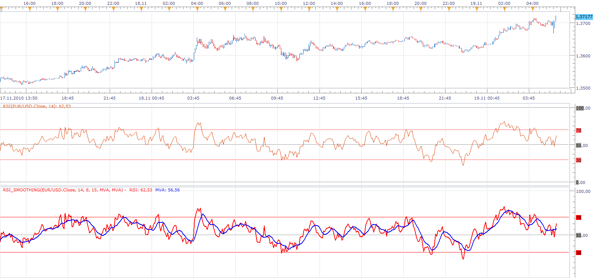
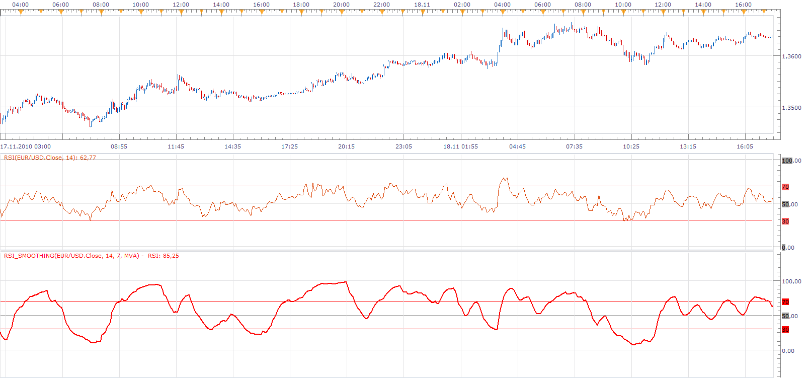

# RSI Smoothing

> Source: https://fxcodebase.com/code/viewtopic.php?f=17&t=2742  
> Forum: 17 · Topic 2742 · 2 post(s)

---

## RSI Smoothing

**Apprentice** · Fri Nov 19, 2010 5:44 am

On request by FXPRO/MT4 Refugee I've developed the following indicator.

In addition to RSI Smoothing, you have the option further, averaged, closing price,
before RSI.
You can choose two moving averages.
Hide RSI.

 [RSI_Smoothing.lua](files/6223/RSI_Smoothing.lua)

 

Comparison of the classic RSI indicator, and RSI indicator of the same period,
based on the moving average of price.

It has less noise, extreme, over bought / sold indications are more frequent.

---

## Re: RSI Smoothing

**Apprentice** · Mon Feb 05, 2018 9:14 am

The Indicator was revised and updated.
