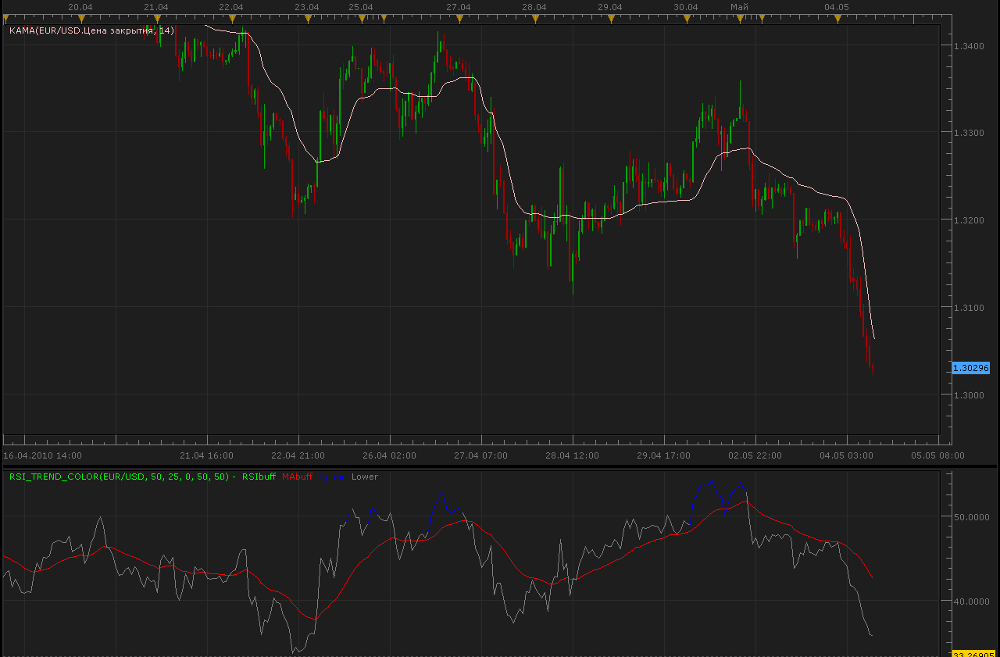
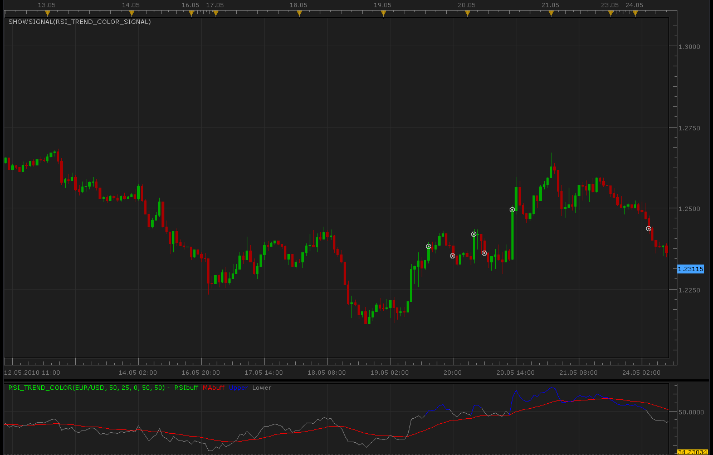

# RSI trend color indicator

> Source: https://fxcodebase.com/code/viewtopic.php?f=17&t=947  
> Forum: 17 · Topic 947 · 10 post(s)

---

## RSI trend color indicator

**Alexander.Gettinger** · Tue May 04, 2010 10:44 am

> moh2001 » Sat Apr 24, 2010 11:24 pm
> can you please convert to trading station II

[viewtopic.php?f=27&t=783](https://fxcodebase.com/code/viewtopic.php?f=27&t=783)

 



```lua
function Init()
    indicator:name("RSI trend color indicator");
    indicator:description("");
    indicator:requiredSource(core.Bar);
    indicator:type(core.Oscillator);
   
    indicator.parameters:addInteger("RSI_Period", "RSI_Period", "Period of RSI", 50);
    indicator.parameters:addInteger("EMA_Period", "EMA_Period", "Period of EMA", 25);
    indicator.parameters:addInteger("PriceType", "PriceType", "0 - close, 1 - open, 2 - hi, 3 -low , 4 - median, 5 - typical, 6 - weighted.", 0);
    indicator.parameters:addInteger("overBought", "overBought", "overBought", 50);
    indicator.parameters:addInteger("overSold", "overSold", "overSold", 50);

    indicator.parameters:addColor("RSI_color", "Color of RSI", "Color of RSI", core.rgb(0, 255, 0));
    indicator.parameters:addColor("MA_color", "Color of MA", "Color of MA", core.rgb(255, 0, 0));
    indicator.parameters:addColor("Upper_color", "Color of Upper", "Color of Upper", core.rgb(0, 0, 255));
    indicator.parameters:addColor("Lower_color", "Color of Lower", "Color of Lower", core.rgb(128, 128, 128));
end

local pCCI;
local pATR;

local first;
local source = nil;
local Price=nil;
local RSI = nil;
local MA = nil;
local RSI_Period;
local EMA_Period;
local PriceType;
local overBought;
local overSold;

local thisCCI, lastCCI;

function Prepare()
    source = instance.source;
    RSI_Period=instance.parameters.RSI_Period;
    EMA_Period=instance.parameters.EMA_Period;
    PriceType=instance.parameters.PriceType;
    overBought=instance.parameters.overBought;
    overSold=instance.parameters.overSold;
    Price = instance:addInternalStream(0, 0);
    RSI = core.indicators:create("RSI", Price, RSI_Period);
    MA = core.indicators:create("EMA", RSI.DATA, EMA_Period);
    first = source:first()+math.max(RSI_Period,EMA_Period);
    local name = profile:id() .. "(" .. source:name() .. ", " .. RSI_Period .. ", " .. EMA_Period .. ", " .. PriceType .. ", " .. overBought .. ", " .. overSold .. ")";
    instance:name(name);
    RSIbuff = instance:addStream("RSIbuff", core.Line, name .. ".RSIbuff", "RSIbuff", instance.parameters.RSI_color, first);
    MAbuff = instance:addStream("MAbuff", core.Line, name .. ".MAbuff", "MAbuff", instance.parameters.MA_color, first);
    Upper = instance:addStream("Upper", core.Line, name .. ".Upper", "Upper", instance.parameters.Upper_color, first);
    Lower = instance:addStream("Lower", core.Line, name .. ".Lower", "Lower", instance.parameters.Lower_color, first);
end

function Update(period, mode)
    if PriceType==0 then
     Price[period]=source.close[period];
    elseif PriceType==1 then
     Price[period]=source.open[period];
    elseif PriceType==2 then
     Price[period]=source.high[period];
    elseif PriceType==3 then
     Price[period]=source.low[period];
    elseif PriceType==4 then
     Price[period]=(source.high[period]+source.low[period])/2.;
    elseif PriceType==5 then
     Price[period]=(source.high[period]+source.low[period]+source.close[period])/3.;
    elseif PriceType==6 then
     Price[period]=(source.high[period]+source.low[period]+2.*source.close[period])/4.;
    end
    RSI:update(mode);
    MA:update(mode);
    if (period>first) then
     RSIbuff[period]=RSI.DATA[period];
     MAbuff[period]=MA.DATA[period];
     
     if RSI.DATA[period]>overBought then
      Upper[period]=RSI.DATA[period];
      Upper[period-1]=RSI.DATA[period-1];
     else
      Upper[period]=nil;
      if Upper[period-2]==nil then
       Upper[period-1]=nil;
      end
      if RSI.DATA[period]<overSold then
       Lower[period]=RSI.DATA[period];
       Lower[period-1]=RSI.DATA[period-1];
      else
       Lower[period]=nil;
       if Lower[period-2]==nil then
        Lower[period-1]=nil;
       end
      end
     end
    end
end
```

---

## Re: RSI trend color indicator

**moh2001** · Sun May 23, 2010 4:53 am

can you make signal please? thanks

---

## Re: RSI trend color indicator

**Alexander.Gettinger** · Mon May 24, 2010 10:14 pm



```lua
function Init()
    strategy:name("Rsi trend color signal");
    strategy:description("");

    strategy.parameters:addGroup("Parameters");

    strategy.parameters:addInteger("RSI_Period", "RSI_Period", "Period of RSI", 50);
    strategy.parameters:addInteger("EMA_Period", "EMA_Period", "Period of EMA", 25);
    strategy.parameters:addInteger("PriceType", "PriceType", "0 - close, 1 - open, 2 - hi, 3 -low , 4 - median, 5 - typical, 6 - weighted.", 0);
    strategy.parameters:addInteger("overBought", "overBought", "overBought", 50);
    strategy.parameters:addInteger("overSold", "overSold", "overSold", 50);

    strategy.parameters:addString("Period", "Timeframe", "", "m5");
    strategy.parameters:setFlag("Period", core.FLAG_PERIODS);

    strategy.parameters:addGroup("Signals");
    strategy.parameters:addBoolean("ShowAlert", "Show Alert", "", true);
    strategy.parameters:addBoolean("PlaySound", "Play Sound", "", false);
    strategy.parameters:addFile("SoundFile", "Sound File", "", "");
end

local SoundFile;
local gSourceBid = nil;
local gSourceAsk = nil;
local first;

local BidFinished = false;
local AskFinished = false;
local LastBidCandle = nil;

local RSI_T_C;

function Prepare()
    local FastN, SlowN;

    ShowAlert = instance.parameters.ShowAlert;
    if instance.parameters.PlaySound then
        SoundFile = instance.parameters.SoundFile;
    else
        SoundFile = nil;
    end
   
    assert(not(PlaySound) or (PlaySound and SoundFile ~= ""), "Sound file must be specified");
    assert(instance.parameters.Period ~= "t1", "Signal cannot be applied on ticks");

    ExtSetupSignal("Rsi trend color signal:", ShowAlert);

    gSourceBid = core.host:execute("getHistory", 1, instance.bid:instrument(), instance.parameters.Period, 0, 0, true);
    gSourceAsk = core.host:execute("getHistory", 2, instance.bid:instrument(), instance.parameters.Period, 0, 0, false);

    RSI_T_C = core.indicators:create("RSI_TREND_COLOR", gSourceBid, instance.parameters.RSI_Period, instance.parameters.EMA_Period,instance.parameters.PriceType,instance.parameters.overBought,instance.parameters.overSold);

    first = RSI_T_C.DATA:first() + 2;

    local name = profile:id() .. "(" .. instance.bid:instrument() .. "(" .. instance.parameters.Period  .. ")" .. instance.parameters.RSI_Period .. ")" .. instance.parameters.EMA_Period .. ")" .. instance.parameters.PriceType .. ")" .. instance.parameters.overBought .. ")" .. instance.parameters.overSold .. ")";
    instance:name(name);
end

local LastDirection=nil;

-- when tick source is updated
function Update()
    if not(BidFinished) or not(AskFinished) then
        return ;
    end

    local period;

    -- update moving average
    RSI_T_C:update(core.UpdateLast);

    -- calculate enter logic
    if LastBidCandle == nil or LastBidCandle ~= gSourceBid:serial(gSourceBid:size() - 1) then
        LastBidCandle = gSourceBid:serial(gSourceBid:size() - 1);

        period = gSourceBid:size() - 1;
        if period > first then
         if RSI_T_C.Upper[period]>RSI_T_C.Lower[period] and LastDirection~=1 then
                ExtSignal(gSourceAsk, period, "Buy", SoundFile);
                LastDirection=1;
         elseif RSI_T_C.Upper[period]<RSI_T_C.Lower[period] and LastDirection~=-1 then
                ExtSignal(gSourceBid, period, "Sell", SoundFile);
                LastDirection=-1;
         end
       
        end
    end
end

function AsyncOperationFinished(cookie)
    if cookie == 1 then
        BidFinished = true;
    elseif cookie == 2 then
        AskFinished = true;
    end
end

local gSignalBase = "";     -- the base part of the signal message
local gShowAlert = false;   -- the flag indicating whether the text alert must be shown

-- ---------------------------------------------------------
-- Sets the base message for the signal
-- @param base      The base message of the signals
-- ---------------------------------------------------------
function ExtSetupSignal(base, showAlert)
    gSignalBase = base;
    gShowAlert = showAlert;
    return ;
end

-- ---------------------------------------------------------
-- Signals the message
-- @param message   The rest of the message to be added to the signal
-- @param period    The number of the period
-- @param sound     The sound or nil to silent signal
-- ---------------------------------------------------------
function ExtSignal(source, period, message, soundFile)
    if source:isBar() then
        source = source.close;
    end
    if gShowAlert then
        terminal:alertMessage(source:instrument(), source[period], gSignalBase .. message, source:date(period));
    end
    if soundFile ~= nil then
        terminal:alertSound(soundFile, false);
    end
end
```

---

## Re: RSI trend color indicator

**moh2001** · Tue May 25, 2010 8:30 pm

a signal should be according to the color, not bellow or above the moving avg

---

## Re: RSI trend color indicator

**jenniferFX888** · Mon Nov 24, 2014 11:13 pm

Hi Alexander,

Would you please make an option to change width and style?

Thannks,

jennifer

---

## Re: RSI trend color indicator

**Apprentice** · Tue Nov 25, 2014 3:55 am

Style Option Added.

---

## Re: RSI trend color indicator

**Apprentice** · Fri Feb 13, 2015 6:18 am

Bump Up.

---

## Re: RSI trend color indicator

**rch05000** · Wed Apr 22, 2015 11:57 am

Hello Apprentice,
1) It is possible to put a signal in the crossing of the RSI and the mobile average

 


2) I do not arrive has to install the indicator Rsi_Trend_color_signal. I have an error, to see following image

 


Sorry for my English
Thank you in advance
RCH

---

## Re: RSI trend color indicator

**Apprentice** · Thu Apr 23, 2015 5:38 am

Fixed.
Make sure to re-download Rsi_Trend_Color.lua & Rsi_Trend_Color_Signal.lua alike.

---

## Re: RSI trend color indicator

**Apprentice** · Wed Sep 12, 2018 5:54 am

The indicator was revised and updated.
