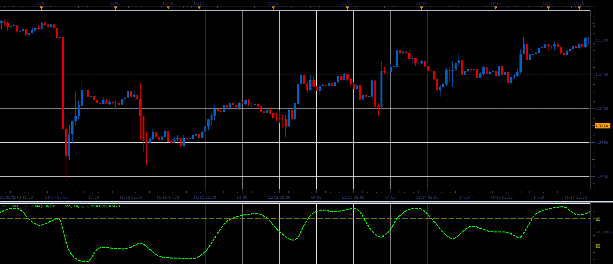

# RSI with step MA oscillator

> Source: https://fxcodebase.com/code/viewtopic.php?f=17&t=60018  
> Forum: 17 · Topic 60018 · 3 post(s)

---

## RSI with step MA oscillator

**Alexander.Gettinger** · Fri Nov 29, 2013 2:01 pm

Formulas:
RSI[i] = 100-(100/(1+Positive/Negative)), where
Positive, Negative - sum of positive and negative changes of Diff,
Diff[i] = MA[i]-MA[i-Step].

 

Download:

 [RSI_With_Step_MA.lua](files/91226/RSI_With_Step_MA.lua)

For this indicator must be installed Averages indicator ([viewtopic.php?f=17&t=2430](https://fxcodebase.com/code/viewtopic.php?f=17&t=2430)).

The indicator was revised and updated

---

## Re: RSI with step MA oscillator

**Alexander.Gettinger** · Fri Nov 29, 2013 2:03 pm

MQL4 version of RSI with step MA oscillator: [viewtopic.php?f=38&t=60019](https://fxcodebase.com/code/viewtopic.php?f=38&t=60019).

---

## Re: RSI with step MA oscillator

**Apprentice** · Sat Jun 17, 2017 4:09 am

The indicator was revised and updated.
