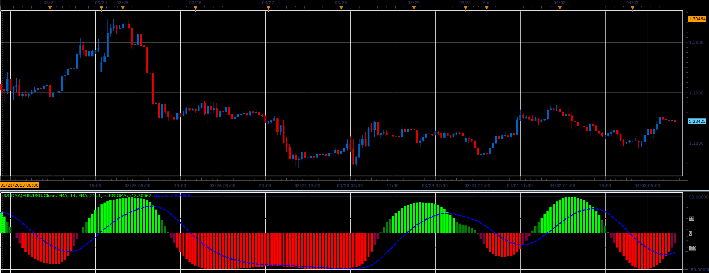

# RSIOMA oscillator

> Source: https://fxcodebase.com/code/viewtopic.php?f=17&t=34066  
> Forum: 17 · Topic 34066 · 5 post(s)

---

## RSIOMA oscillator

**Alexander.Gettinger** · Wed Apr 03, 2013 3:18 pm

This indicator is a ported MQL5 indicators from [http://www.mql5.com/en/code/1581](http://www.mql5.com/en/code/1581)

Formulas:
RSIOMA = 50 - 100/res, where
res = 1+p/n,
p, n - sum of positive and negative changes of Momentum.
Signal - moving average of RSIOMA.

 

Download:

 [RSIOMA.lua](files/57906/RSIOMA.lua)

For this indicator must be installed Averages indicator ([viewtopic.php?f=17&t=2430](https://fxcodebase.com/code/viewtopic.php?f=17&t=2430)) and Momentum ([viewtopic.php?f=17&t=896&p=1638](https://fxcodebase.com/code/viewtopic.php?f=17&t=896&p=1638)).

The indicator was revised and updated

---

## Re: RSIOMA oscillator

**rose123** · Wed Aug 05, 2015 8:28 pm

HI ,

MAY I REQUEST A MTF STRATEGY BASED ON THIS RSI OMA INDICATOR

TIME FRAME 1: M15
RSI OMA WITH DEFAULT PARAMETERS:
BUY LEVEL:-20
SELL LEVEL:20

TIME FRAME: H1
RSI OMA WITH DEFAULT PARAMETERS
BUY LEVEL:20
SELL LEVEL:-20

TIME FRAME: H4
RSI OMA WITH DEFAULT PARAMETERS
BUY LEVEL:20
SELL LEVEL:-20

**BUYING CONDITIONS ARE AS FOLLOW:**

1. RSI OMA > SIGNAL AND SIGNAL > BUY LEVEL{20} IN H4
2. RSI OMA > SIGNAL AND SIGNAL > BUY LEVEL{20} IN H1
3.SIGNAL < BUY LEVEL{-20} AND RSI OMA CROSS OVER SIGNAL IN M15

**SELLING CONDITIONS ARE AS FOLLOW:**

1. RSI OMA < SIGNAL AND SIGNAL < SELL LEVEL{-20} IN H4
2. RSI OMA < SIGNAL AND SIGNAL < SELL LEVEL{-20} IN H1
3.SIGNAL> SELL LEVEL{20} AND RSI OMA CROSS UNDER SIGNAL IN M15

---

## Re: RSIOMA oscillator

**Apprentice** · Thu Aug 06, 2015 5:39 am

Your request is added to the development list.

---

## Re: RSIOMA oscillator

**Apprentice** · Mon Jun 05, 2017 1:42 pm

The indicator was revised and updated.

---

## Re: RSIOMA oscillator

**Apprentice** · Mon Jun 05, 2017 2:24 pm

The strategy is available here.
[viewtopic.php?f=31&t=64769](https://fxcodebase.com/code/viewtopic.php?f=31&t=64769)
