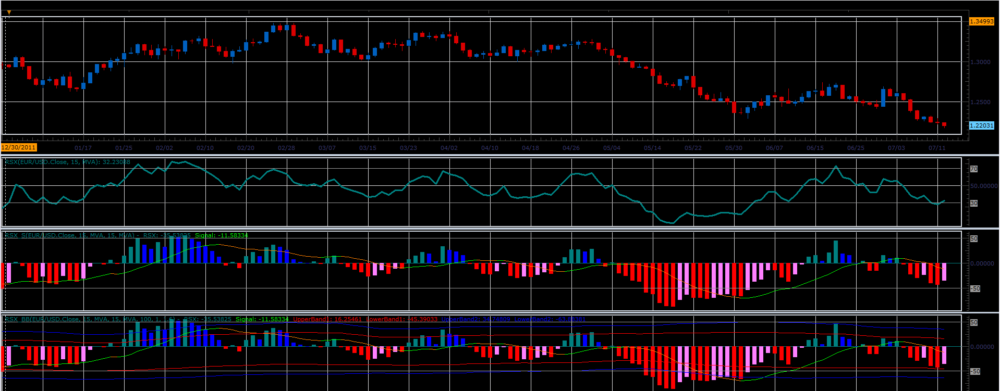

# RSX indicators

> Source: https://fxcodebase.com/code/viewtopic.php?f=17&t=21013  
> Forum: 17 · Topic 21013 · 4 post(s)

---

## RSX indicators

**Alexander.Gettinger** · Thu Jul 12, 2012 3:50 pm

The indicators are written at the request: [viewtopic.php?f=27&t=20415](https://fxcodebase.com/code/viewtopic.php?f=27&t=20415)

Formulas:
RSX=(DMA/AbsDMA)*50+50, where
DMA-moving average for DPrice,
AbsDMA-moving average for AbsDPrice,
DPrice[i]=Price[i]-Price[i-1],
AbsDPrice[i]=Abs(Price[i]-Price[i-1]).

RSX_S - indicator with signal line.

RSX_BB - indicator with signal line and bands.

 

Download:

 [RSX.lua](files/36819/RSX.lua)

 [RSX_S.lua](files/36819/RSX_S.lua)

 [RSX_BB.lua](files/36819/RSX_BB.lua)

The indicator was revised and updated

---

## Re: RSX indicators

**sunshine** · Thu Jul 12, 2012 11:42 pm

Please do not forget to download and install the [Averages](https://fxcodebase.com/code/viewtopic.php?f=17&t=2430&hilit=averages&start=20#p13125) indicator before using RSX indicators.

---

## Re: RSX indicators

**Alexander.Gettinger** · Sat Jul 14, 2012 8:24 am

Thank you.

---

## Re: RSX indicators

**Apprentice** · Thu Apr 06, 2017 3:41 pm

Indicator was revised and updated.
