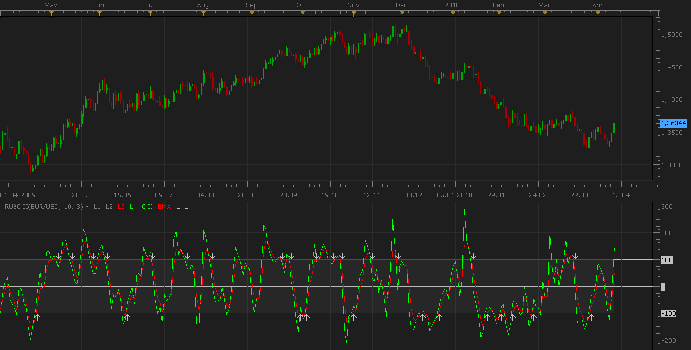

# Rubicons CCI-cross indicator

> Source: https://fxcodebase.com/code/viewtopic.php?f=17&t=613  
> Forum: 17 · Topic 613 · 10 post(s)

---

## Rubicons CCI-cross indicator

**Nikolay.Gekht** · Sun Apr 11, 2010 9:07 pm

The indicator is proposed by Rubicons, a valued member of our forum.

> **Rubicons wrote:**
> I would like someone to please develop this oscillator, which I call "Rubicons CCI-Cross" and share it with the group here.
>
> The Commodity Channel Index (CCI) is an oscillator originally developed by Donald Lambert and featured in his book "Commodities Channel Index". The CCI like most oscillators, helps to determine overbought and oversold levels. There is an interesting variant to the standard set-up that I have been using succesfully for some time and would like to share with you.
>
> What is Rubicons CCI-Cross: Basically it is a standard 10 Period CCI with a 3-EMA exponential moving average layered over it. In addition, there are two horizontal lines for resistance and support at the +100-Level and -100-Level respectfully. If possible, having the ability to select line colors would be great as many trade on different backgrounds - for example I trade on a black background.
>
> How to use it: In addition to standard angle and separation (and divergence) signals are best given when they occur above and below the +100 and -100 Levels first by a cross of the 3-EMA with the CCI-10, and then confirmed when the 3-EMA also crosses the 100 and 0 level horizontal lines either long or short. For example, a 3-EMA cross from above and heading south through the +100 Level confirms a Short. Likewise, a 3-EMA cross from below heading north through the -100-Level confirms a Long.
>
> This indicator should of course be confirmed with related Price Action and any other tools you may wish to use. However, I have found this to work on most timeframes and gives you an earlier signal (heads-up) than many others.

 

Download:

 [RubCCI.lua](files/1083/RubCCI.lua)

See also for the **signal** based on this indicator: [viewtopic.php?f=29&t=614](https://fxcodebase.com/code/viewtopic.php?f=29&t=614)

MT4/MQ4 version.
[viewtopic.php?f=38&t=63886&p=108217#p108217](https://fxcodebase.com/code/viewtopic.php?f=38&t=63886&p=108217#p108217)

---

## Re: Rubicons CCI-cross indicator

**business-investment** · Mon Apr 26, 2010 8:55 am

Thanks for sharing it

---

## Re: Rubicons CCI-cross indicator

**Silver23** · Tue Jun 07, 2016 8:44 am

This is a great indicator! Do we have one on the forum where the arrow shows up on the chart? If we have, please place a link. If not, can we get a signal where the arrow shows up on the chart?

Thanks for the great work.

---

## Re: Rubicons CCI-cross indicator

**Blackcat2** · Tue Jun 07, 2016 10:21 am

Could you please allow for the CCI level to be modified.

Thanks.

Regards,
BC

---

## Re: Rubicons CCI-cross indicator

**Apprentice** · Fri Jun 10, 2016 2:54 am

Try it now.

---

## Re: Rubicons CCI-cross indicator

**Silver23** · Fri Sep 16, 2016 8:31 am

Hi,

Thanks for this amazing indicator. It works well and gives great signals. I would like to request that the line options be included. The ability to make it thicker. I would also like inquire if this indicator can be found in the MT4 format. If it exists please post a link. If it doesn't exist in the MT4 format, it would be wonderful to have one for that platform too.

Thank you for all the help.

Darryl

---

## Re: Rubicons CCI-cross indicator

**Apprentice** · Mon Sep 19, 2016 3:52 am

Major update.
Style option added.

Your request is added to the development list, Under Id Number 3631
If someone is interested to do this task, please contact me.

---

## Re: Rubicons CCI-cross indicator

**Apprentice** · Thu Sep 22, 2016 3:06 am

MT4 / mq4 version is available here.
[viewtopic.php?f=38&t=63886&p=108217#p108217](https://fxcodebase.com/code/viewtopic.php?f=38&t=63886&p=108217#p108217)

---

## Re: Rubicons CCI-cross indicator

**Silver23** · Fri Sep 23, 2016 5:21 am

Thank you very much! This is an excellent indicator, well done.

---

## Re: Rubicons CCI-cross indicator

**Apprentice** · Tue Sep 18, 2018 6:48 am

The indicator was revised and updated.
