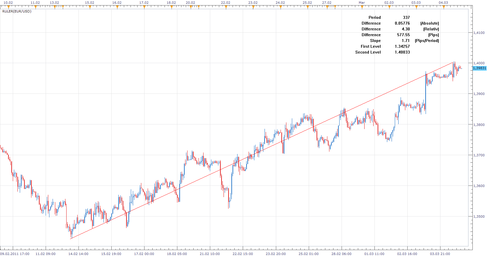
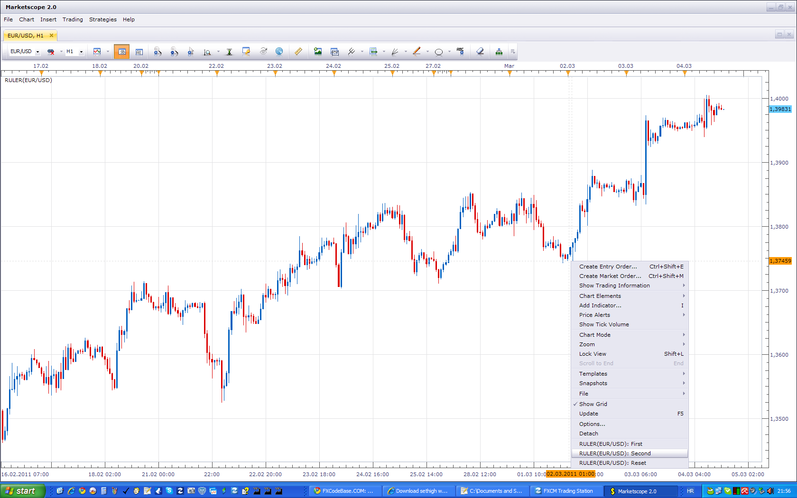
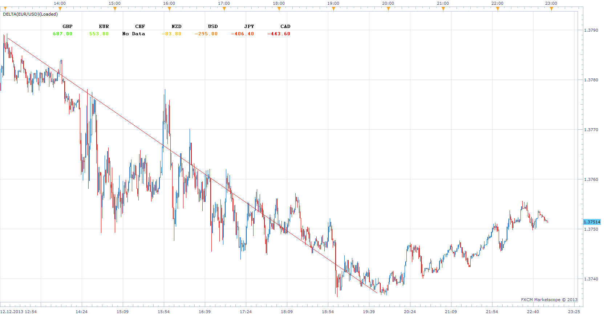
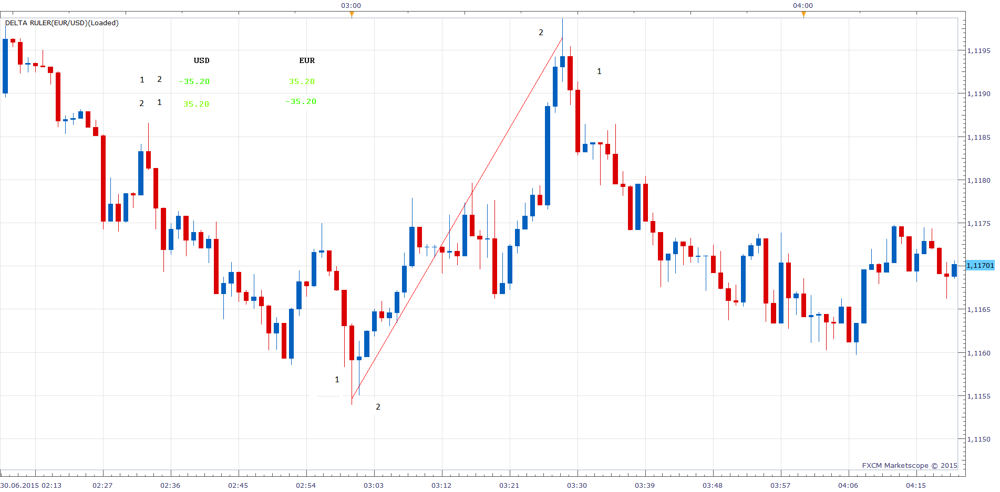

# Ruler

> Source: https://fxcodebase.com/code/viewtopic.php?f=17&t=3598  
> Forum: 17 · Topic 3598 · 27 post(s)

---

## Ruler

**Apprentice** · Sat Mar 05, 2011 2:05 pm

In addition to the standard Ruler Tool functionality.
I added a measurement of percent change and slope in the Pip per period.
For me personally, very important information when trading.

Use Chart Menu to select First and Last Line Values.

 

This is a template for similar indicators.
If you have any idea how to use it.
Or have suggestions for additional features you would like.
Leave your ideas here.

 [Ruler.lua](files/8640/Ruler.lua)

 

Delta Ruler was Inspired bythis request.

Will sum Pip gains / loss of, for all selected major pairs in the selected period.
If Time_2 <Time_1 gains / loss will be inverted.

[viewtopic.php?f=27&t=60077&p=91493#p91493](https://fxcodebase.com/code/viewtopic.php?f=27&t=60077&p=91493#p91493)

 [Delta Ruler.lua](files/8640/Delta%20Ruler.lua)

 [Delta Ruler Table.lua](files/8640/Delta%20Ruler%20Table.lua)

The indicator was revised and updated

---

## Re: Ruler

**craige** · Sat Mar 05, 2011 8:51 pm

Hey Apprentice

thanks for your hard work.

this indicator is OK for me.

just one question, in this indicator, you have to define two points to calculate the pips between them, is it possible to make a line which we could use the mouse to drag from one point to another instead of clicking two points, I think if we could drag up or donw the lines, it would be more handy and easy to carry out.

thanks again for your works.

All the best

Craige

---

## Re: Ruler

**Apprentice** · Sun Mar 06, 2011 4:33 am

Unfortunately, the SDK currently does not support this feature.
This kind of interaction it is not possible, for now.

---

## Re: Ruler

**craige** · Sun Mar 06, 2011 9:49 am

Hi Apprentice

it doesn't matter, thanks for your hard work again.

when the SDK supports this feature, we could do it again in the future.

thank you

all the best

Craige

---

## Re: Ruler

**JBKsox** · Sun Sep 11, 2011 5:17 pm

Hello Mr. Developer...

I followed your instructions (right clicking, changing ruler to 2nd) but still not seeing any changes or extra data to my ruler.

I tried with an FXCM chat guy and he couldn't get it to work either. Same issue...

Let me know if I'm missing something or doing something wrong.

Thanks.

---

## Re: Ruler

**Apprentice** · Mon Sep 12, 2011 4:54 am

Make sure to define two points for reference.
First and Second.

---

## Re: Ruler

**jgwill** · Mon Sep 12, 2011 11:24 am

Great

---

## Re: Ruler

**JBKsox** · Mon Sep 12, 2011 12:47 pm

I'n not sure what you mean by defining the two points. Do you mean right clicking at some price level on the chart, clicking on ": First", then right clicking on another price level and selecting ": Second"? I've tried that and a red line plots for a 5-10 seconds then disappears. I don't see any statistical data. Does it only work on certain timeframe charts?

---

## Re: Ruler

**Apprentice** · Tue Sep 13, 2011 4:26 am

The indicator is designed this way.
To help the user to measure something.
And then the indicator is reset for another measurement.

Works on all timeframes.

---

## Re: Ruler

**jackfx09** · Wed Sep 14, 2011 11:22 am

Nice tool!

Please advise on how to manipulate the position of the results, as you have done.

Thanks!

sjc

---

## Re: Ruler

**jgwill** · Wed Sep 14, 2011 3:03 pm

Hi,

I like it (using it a little more since 2-3 days. Like the information it gives.

I was wondering, when the canvas text is added over the chart, does the indicator framework allow to specify a background color shape (like a rectangle that would be on the back of the text data) ?

If that can be, having a background, transparency level adjustable!, That would be nice.

Thank,

Regards,

JGWill

---

## Re: Ruler

**Apprentice** · Thu Sep 15, 2011 4:38 am

It is possible. But not in a clean manner.
Nikolay promise this option.

---

## Re: Ruler

**Apprentice** · Wed Jul 03, 2013 5:45 am

Updated

---

## Re: Ruler

**Apprentice** · Thu Dec 12, 2013 4:57 pm

Delta Ruler Added.

---

## Re: Ruler

**NicolaeZ** · Sun Dec 15, 2013 8:41 am

Dear Apprentice,

Please help me to understand the reading of the Delta Ruler indicator.
I've taken an example.

Setup:
Time frame: 4H
Chart: GBPUSD

Delta Ruler - First: November 11, 2013, H: 21:00
Delta Ruler - Second: December 09, 2013, H: 21:00

Subscription: All and only the pairs formed by USD, EUR, GBP, CHF, JPY, AUD, NZD, CAD (8 currencies, 28 pairs)

Delta Ruler reading for GBP: 7547.8
Determination using actual values (taken from Marketscope) for GBP: 3664

Direct determination for close price:

_________________________________________________
PAIR______CLOSE PRICE_____CLOSE PRICE___Pips for GBP
_________________________________________________
__________11.11.2013______09.12.2013
__________H 21:00_________H 21:00
_________________________________________________
GBPUSD___1,59781_________1,64585__________480,4
GBPUSD___1,59781_________1,64585__________480,4
EURGBP___0,83806_________0,83581___________22,5
GBPCHF___1,47172_________1,46398___________-77,4
GBPJPY___159,083_________170,030__________1094,7
GBPAUD___1,71231_________1,80783__________955,2
GBPNZD___1,94212_________1,98549__________433,7
GBPCAD___1,67481_________1,75030__________754,9
_________________________________________________
Total pips GBP:____________________________3664,0
_________________________________________________

Taking as entry prices for Open, High, Low (both BID and ASK) for direct determination I've get values ranging from 3558 to 3664.
Any way the difference between 3600 pips and 7500 pips is so important that I presume the values indicated by Delta Ruler have another significance than adding the number of pips gained/lost by each currency (GBP in this example) against other currencies counted between Time 1 and Time 2.

Thank you!

---

## Re: Ruler

**Apprentice** · Sun Dec 15, 2013 2:50 pm

By mistake, try updated version.

---

## Re: Ruler

**NicolaeZ** · Sun Dec 15, 2013 5:22 pm

> **Apprentice wrote:**
> By mistake, try updated version.

Thank you very much for your quick reply.
Now it works fine when counting individual pairs but still gives errors when counting the total value.

Delta Ruler - First: November 11, 2013, H: 21:00
Delta Ruler - Second: December 09, 2013, H: 21:00

GBP (total): 7547
GBP vs. USD: 480.10
GBP vs. EUR: -22.80
GBP vs. CHF: 77.90
GBP vs. JPY: 1094.30
GBP vs. AUD: 955.40
GBP vs. NZD: 433.80
GBP vs. CAD: 755.20

That gives us around 3773 instead of 7547

Please find attached a screen shot.
Thank you in advance,

Nicolae

---

## Re: Ruler

**Apprentice** · Mon Dec 16, 2013 2:43 am

Fixed.

---

## Re: Ruler

**NicolaeZ** · Mon Dec 16, 2013 4:24 am

> **Apprentice wrote:**
> Fixed.

Thank you so much, it works fine now.

---

## Re: Ruler

**jsotor** · Mon Dec 16, 2013 6:24 am

Is it possible to change the drawind mode so it have other options?, like
Snap to nearest
Freehand
High/Low
Close

Measuring high to low and low to high. open to high, open to close, etc are common tasks, and the standard ruler does not give the option to snap to any OHLC price.

---

## Re: Ruler

**NicolaeZ** · Wed Dec 18, 2013 11:32 am

Hello,

I've identified a small bug in the ruler.
When counting the total pips, the algorithm does not take into consideration if one specific currency is the first or the second currency in the pair.

For example:

Time frame: 4H
First: November 13, 2013 H: 01:00
Second: December 2, 2013 H: 01:00

Indicator reading for GBP:

GBP: 3846.00 (Total) +489.00 (USD); -166.60 (EUR); +291.60 (CHF); + 1017.10 (JPY); +811.10 (AUD); +649.90 (NZD); +753.90 (CAD)

489.00 -166.60 + 291.60 + 1017.10 + 811.10 +649.90 + 753.90 = 3846 (correct)

In that interval:

EURGBP did lost 166 pips (GBP gained +166.60 pips, this value should be added at GBP not substracted)

GBPUSD gained 489 pips (GBP gained +489 pips. This is correct. 489 should be added to GBP).

Basically, the algorithm adds a value if the pair traded at a higher price and substracts a value if the pair traded at a lower price, without taking into account if the reference currency is the first or the second currency.

Thank you,
Nicolae

---

## Re: Ruler

**Apprentice** · Wed Jan 01, 2014 5:24 am

Slope/Angle In degrees Added.

---

## Re: Ruler

**gregoryyul** · Mon Jun 29, 2015 8:44 am

I've noticed this as well. Is there anyway of doing a fix so the totals are accurate?

Thanks for your time

---

## Re: Ruler

**Apprentice** · Tue Jun 30, 2015 4:05 am

I did not find any discrepancy.
Indicator is sensitive to the order of the data, sampling.

---

## Re: Ruler

**jgwill** · Mon Oct 12, 2015 1:52 pm

Hi,

thank for the code I appreciate it

I have a question regarding the SDK , I'll try to phrase it the best I can
 Could the SDK enable us to select the start point and use the bar high ? (Like can it read the position on the chart and retrieve programatically the bar data that correspond to the said position ?)
I'd like to add a menu item to my version that would be : "Start as this bar high" and "stop at this bar low" and they would read the bar at that position ! (If all that possible )
thanks for your time and reply,
Regards

---

## Re: Ruler

**Apprentice** · Thu Oct 15, 2015 3:53 am

Sure this is possible.
Ruler indicator is a good example of how this can be done.

---

## Re: Ruler

**Apprentice** · Tue Jul 25, 2017 11:12 am

The indicator was revised and updated.
