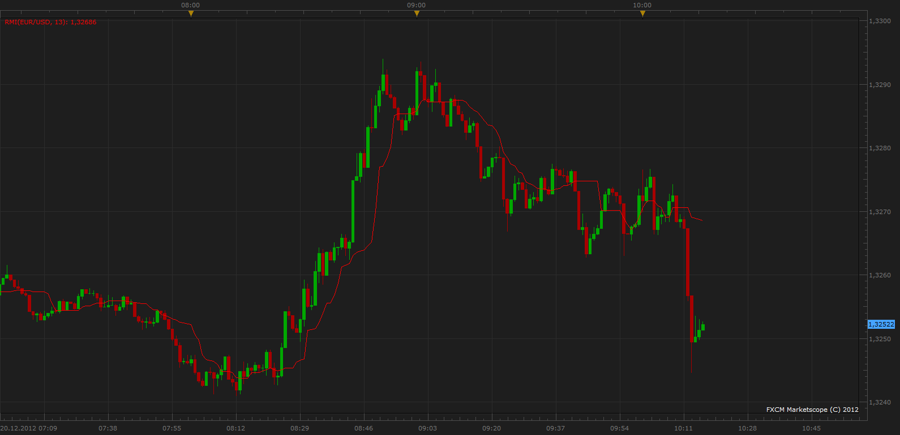

# Running Median Indicator

> Source: https://fxcodebase.com/code/viewtopic.php?f=17&t=27852  
> Forum: 17 · Topic 27852 · 8 post(s)

---

## Running Median Indicator

**Apprentice** · Thu Dec 20, 2012 10:15 am

 [RMI.lua](files/48838/RMI.lua)

 [RMI.lua](files/48838/RMI%20%282%29.lua)

 [Tick RMI with Alert .lua](files/48838/Tick%20RMI%20with%20Alert%20.lua)

 [Two Tick RMI Cros with Alert .lua](files/48838/Two%20Tick%20RMI%20Cros%20with%20Alert%20.lua)

The indicator was revised and updated

---

## Re: Running Median Indicator

**Alexander.Gettinger** · Tue Sep 23, 2014 10:28 am

MQL4 version of Running Median Indicator: [viewtopic.php?f=38&t=61230](https://fxcodebase.com/code/viewtopic.php?f=38&t=61230).

---

## Re: Running Median Indicator

**Paul W** · Mon Mar 02, 2015 12:03 pm

could you create a Two RMI Cross Alert pls,

The same as Two MA Cross Alert.

thanks

---

## Re: Running Median Indicator

**Apprentice** · Mon Mar 02, 2015 5:59 pm

Your request is added to the development list.

---

## Re: Running Median Indicator

**Paul W** · Wed Nov 11, 2015 2:53 pm

please disregard "could you create a Two RMI Cross Alert"

a simple price cross alert would work better - thanks

---

## Re: Running Median Indicator

**Apprentice** · Fri Nov 13, 2015 4:25 am

Tick RMI with Alert.lua & Two Tick RMI Cros with Alert.lua Added.

---

## Re: Running Median Indicator

**Apprentice** · Mon Dec 07, 2015 6:12 am

Compatibility issue fixed.
_Alert Helper is not longer needed.

---

## Re: Running Median Indicator

**Apprentice** · Fri Jul 21, 2017 8:46 am

The indicator was revised and updated.
