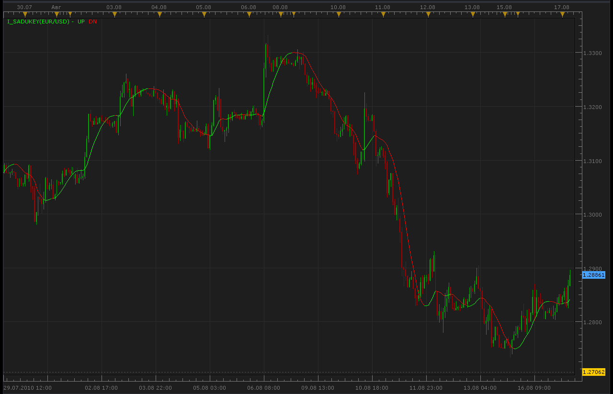
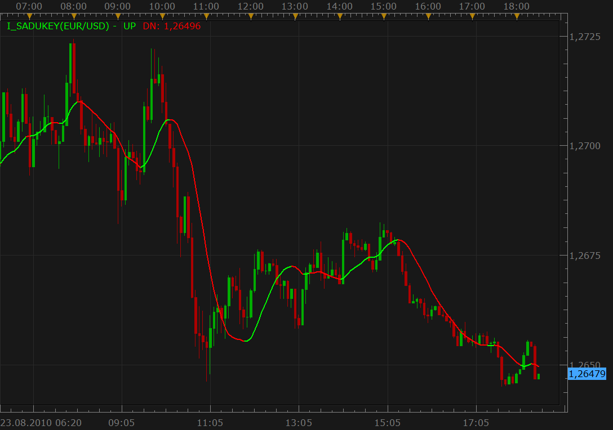

# Sadukey indicator (closed)

> Source: https://fxcodebase.com/code/viewtopic.php?f=17&t=1840  
> Forum: 17 · Topic 1840 · 9 post(s)

---

## Sadukey indicator (closed)

**Alexander.Gettinger** · Tue Aug 17, 2010 3:52 am

**Note!!!** Please find a new version of the indicator here: [viewtopic.php?f=17&t=2525](https://fxcodebase.com/code/viewtopic.php?f=17&t=2525).

[viewtopic.php?f=27&t=1725](https://fxcodebase.com/code/viewtopic.php?f=27&t=1725)

 

The indicator was revised and updated

---

## Re: Sadukey indicator

**virgilio** · Mon Aug 23, 2010 12:20 pm

Hello, im new to this board and although i trade frequently Im not a programmer. What is the exact calculation for the Sadukey indicator? What does it measure exactly?
Thank you so much for your reply?

---

## Re: Sadukey indicator

**Nikolay.Gekht** · Mon Aug 23, 2010 5:33 pm

This indicator is a kind of digital filter applied on the prices. It works like, for example, LF/HF filters in the sound processing. In terms of prices it highlights a kind of "carrier wave". In other words this is an attempt to analyze the market as a system of harmonics (you know, all these Fourier transforms and so on).

From the point of view of the result it's an indicator which shows the trend direction (like a pair of short and long moving average), but with very small latency. As you can see on the snapshot - it detects the trend change in 1-4 bars range. However, it's still vulnerable to the market stagnations, so, it would be great to use it together with other indicators.

 

---

## Re: Sadukey indicator

**virgilio** · Tue Aug 24, 2010 7:28 am

Thank you so much for your reply. I understand the indicator much better now! In terms of calculating the indicator though, what is the formula?
Thanks again.

---

## Re: Sadukey indicator

**jefftrader** · Tue Aug 24, 2010 8:16 am

You don't even want to know!

just take a look at the lua file. the math is crazy (as is the math in most digital filters).

jefftrader

---

## Re: Sadukey indicator

**forexgill** · Wed Oct 20, 2010 8:05 am

Is it possible to create a buy/sell signal for this indicator?

Thank you

---

## Re: Sadukey indicator

**Apprentice** · Wed Oct 20, 2010 9:58 am

Added to Development cue.

---

## Re: Sadukey indicator

**Apprentice** · Wed Oct 20, 2010 1:08 pm

Requested can be found here.
[viewtopic.php?f=29&t=2460](https://fxcodebase.com/code/viewtopic.php?f=29&t=2460)

---

## Re: Sadukey indicator (closed)

**Apprentice** · Mon Jan 30, 2017 7:07 am

Indicator was revised and updated.
