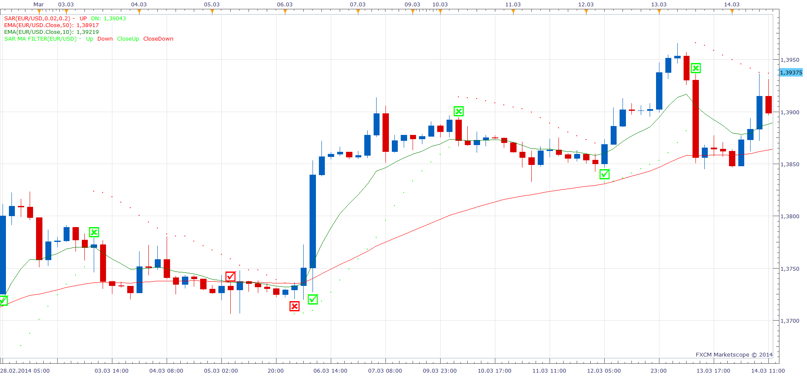

# SAR MA Filter

> Source: https://fxcodebase.com/code/viewtopic.php?f=17&t=60666  
> Forum: 17 · Topic 60666 · 9 post(s)

---

## SAR MA Filter

**Apprentice** · Thu May 08, 2014 6:33 am

Based on the request.
[viewtopic.php?f=27&t=60626](https://fxcodebase.com/code/viewtopic.php?f=27&t=60626)

 

 

 [SAR MA Filter.lua](files/93915/SAR%20MA%20Filter.lua)

---

## Re: SAR MA Filter

**vadhuvai** · Mon May 12, 2014 3:07 am

Thanks a lot for developing both indicator requested by me.
thanks....

---

## Re: SAR MA Filter

**Apprentice** · Mon Feb 05, 2018 9:59 am

The indicator was revised and updated.

---

## Re: SAR MA Filter

**Sospool** · Mon Jul 01, 2019 6:37 am

Hello,

is it possible to add the method of calculation of Tick_sar indicator ?
[http://fxcodebase.com/code/viewtopic.php?f=17&t=2450&p=5320&hilit=tick_sar#p5320](https://fxcodebase.com/code/viewtopic.php?f=17&t=2450&p=5320&hilit=tick_sar#p5320)

Thank you

---

## Re: SAR MA Filter

**Apprentice** · Mon Jul 01, 2019 12:58 pm

Your request is added to the development list under Id Number 4765

---

## Re: SAR MA Filter

**Sospool** · Tue Jul 02, 2019 11:45 am

Thx

---

## Re: SAR MA Filter

**axeas69** · Wed Jul 03, 2019 4:44 am

Hello,
Please could you add a signal with song and email?
Thks in adavance
Axeas

---

## Re: SAR MA Filter

**Apprentice** · Wed Jul 03, 2019 1:45 pm

[Tick SAR MA Filter with Alert.lua](files/127214/Tick%20SAR%20MA%20Filter%20with%20Alert.lua)

Try this version.

---

## Re: SAR MA Filter

**Sospool** · Mon Jul 08, 2019 6:09 pm

Hello Apprentice,

thank you very much for taking the time.
