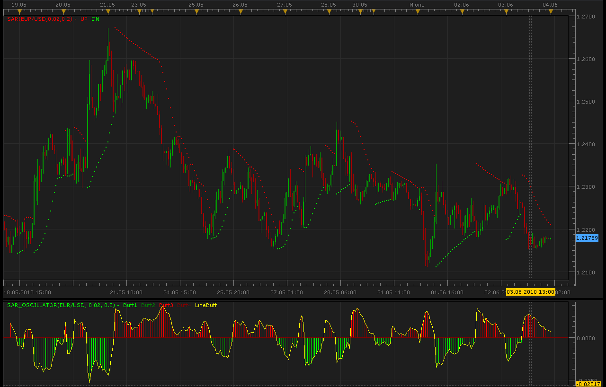
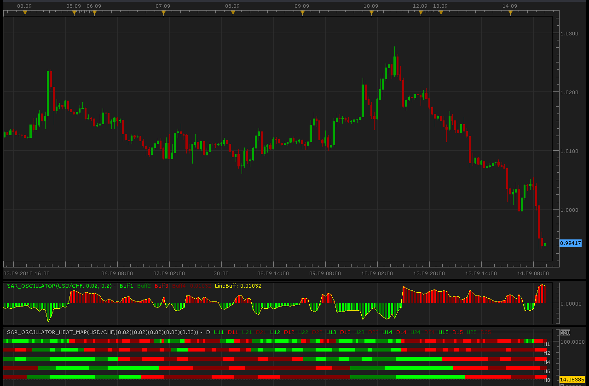

# SAR oscillator

> Source: https://fxcodebase.com/code/viewtopic.php?f=17&t=1259  
> Forum: 17 · Topic 1259 · 6 post(s)

---

## SAR oscillator

**Alexander.Gettinger** · Thu Jun 03, 2010 11:22 pm

SAR oscillator=SAR-Close;

 



```lua
function Init()
    indicator:name("SAR oscillator");
    indicator:description("SAR oscillator");
    indicator:requiredSource(core.Bar);
    indicator:type(core.Oscillator);
   
    indicator.parameters:addDouble("Step", "Step for SAR", "", 0.02, 1, 200);
    indicator.parameters:addDouble("Max", "Max for SAR", "", 0.2, 1, 200);

    indicator.parameters:addColor("clr_buff1", "Color of Buff1", "Color of Buff1", core.rgb(0, 255, 0));
    indicator.parameters:addColor("clr_buff2", "Color of Buff2", "Color of Buff2", core.rgb(0, 128, 0));
    indicator.parameters:addColor("clr_buff3", "Color of Buff3", "Color of Buff3", core.rgb(255, 0, 0));
    indicator.parameters:addColor("clr_buff4", "Color of Buff4", "Color of Buff4", core.rgb(128, 0, 0));
    indicator.parameters:addColor("clr_Line", "Color of Line", "Color of Line", core.rgb(255, 255, 0));
end

local first;
local source = nil;
local Step;
local Max;
local SAR;
local Buff1=nil;
local Buff2=nil;
local Buff3=nil;
local Buff4=nil;
local LineBuff=nil;

function Prepare()
    source = instance.source;
    Step=instance.parameters.Step;
    Max=instance.parameters.Max;
    SAR = core.indicators:create("SAR", source, Step, Max);
    first = SAR.DATA:first()+2;
    local name = profile:id() .. "(" .. source:name() .. ", " .. instance.parameters.Step .. ", " .. instance.parameters.Max .. ")";
    instance:name(name);
    Buff1 = instance:addStream("Buff1", core.Bar, name .. ".Buff1", "Buff1", instance.parameters.clr_buff1, first);
    Buff2 = instance:addStream("Buff2", core.Bar, name .. ".Buff2", "Buff2", instance.parameters.clr_buff2, first);
    Buff3 = instance:addStream("Buff3", core.Bar, name .. ".Buff3", "Buff3", instance.parameters.clr_buff3, first);
    Buff4 = instance:addStream("Buff4", core.Bar, name .. ".Buff4", "Buff4", instance.parameters.clr_buff4, first);
    LineBuff = instance:addStream("LineBuff", core.Line, name .. ".LineBuff", "LineBuff", instance.parameters.clr_Line, first);
end

function Update(period, mode)
    if (period>first) then
     SAR:update(mode);
     LineBuff[period]=math.max(SAR.UP[period],SAR.DN[period])-source.close[period];
     
     if LineBuff[period]<0. then
      if LineBuff[period]>LineBuff[period-1] then
       Buff1[period]=LineBuff[period];
      else
       Buff2[period]=LineBuff[period];
      end
     else
      if LineBuff[period]>LineBuff[period-1] then
       Buff3[period]=LineBuff[period];
      else
       Buff4[period]=LineBuff[period];
      end
     end
    end
end
```

MT4/Mq4 version
[viewtopic.php?f=38&t=63980&p=108612#p108612](https://fxcodebase.com/code/viewtopic.php?f=38&t=63980&p=108612#p108612)

---

## Re: SAR oscillator

**frank62** · Sun Jun 13, 2010 10:38 am

Hello
I have instal this SAR oscillator!
Unfortunadly I cant see it on the chart.
Alexander can u check this SAR oscillator again please?
I want to say that in this forum is an excelent work,thanks much!

---

## Re: SAR oscillator

**Checkz** · Sat Sep 11, 2010 6:49 am

CAN THIS BE TURNED INTO A MULTI HEAT MAP.IT WOULD BE NICE

---

## Re: SAR oscillator

**Apprentice** · Sat Sep 11, 2010 7:01 am

Added to development cue.

---

## Re: SAR oscillator

**Alexander.Gettinger** · Tue Sep 14, 2010 11:15 am

SAR Oscillator Heat Map indicator.

 



```lua
-- Adds SAR parameter
function AddMvaParam(id, frame, step, max)
    indicator.parameters:addString("B" .. id, "Time frame for avegage " .. id, "", frame);
    indicator.parameters:setFlag("B" .. id, core.FLAG_PERIODS);
    indicator.parameters:addDouble("Step" .. id, "Step " .. id .. " parameter", "", step);
    indicator.parameters:addDouble("Max" .. id, "Max " .. id .. " parameter", "", max);
end

function Init()
    indicator:name("Multitimeframe SAR Heat Map");
    indicator:description("");
    indicator:requiredSource(core.Bar);
    indicator:type(core.Oscillator);

    indicator.parameters:addGroup("Calculation");
    AddMvaParam(1, "H1", 0.02, 0.2);
    AddMvaParam(2, "H2", 0.02, 0.2);
    AddMvaParam(3, "H4", 0.02, 0.2);
    AddMvaParam(4, "H6", 0.02, 0.2);
    AddMvaParam(5, "H8", 0.02, 0.2);
    indicator.parameters:addGroup("Display");
    indicator.parameters:addColor("clrUP1", "Up color 1", "", core.rgb(0, 255, 0));
    indicator.parameters:addColor("clrUP2", "Up color 2", "", core.rgb(0, 128, 0));
    indicator.parameters:addColor("clrDN1", "Down color 1", "", core.rgb(255, 0, 0));
    indicator.parameters:addColor("clrDN2", "Down color 2", "", core.rgb(128, 0, 0));
    indicator.parameters:addColor("clrLBL", "Label color", "", core.COLOR_LABEL);
end

-- list of streams
local streams = {}
-- the indicator source
local source;
local day_offset, week_offset;
local dummy;
local host;
local U1 = {};
local D1 = {};
local U2 = {};
local D2 = {};
local L = {};
local SAR = nil;

function Prepare()
    source = instance.source;
    host = core.host;

    day_offset = host:execute("getTradingDayOffset");
    week_offset = host:execute("getTradingWeekOffset");

    CheckBarSize(1);
    CheckBarSize(2);
    CheckBarSize(3);
    CheckBarSize(4);
    CheckBarSize(5);

    local i;
    local name = profile:id() .. "(" .. source:name() .. ",";
    for i = 1, 5, 1 do
        name = name .. "(" ..
                       instance.parameters:getDouble("Step" .. i) .. ", " .. instance.parameters:getDouble("Max" .. i) .. ")";
        L[i] = instance.parameters:getString("B" .. i) .. " " .. instance.parameters:getString("Step" .. i) .. ")";
    end
    name = name .. ")";
    instance:name(name);
    dummy = instance:addStream("D", core.Line, name .. ".D", "D", instance.parameters.clrLBL, 20);
    dummy:addLevel(0);
    dummy:addLevel(120);
    for i = 1, 5, 1 do
        U1[i] = instance:createTextOutput ("U1" .. i, "U1" .. i, "Wingdings", 10, core.H_Center, core.V_Center, instance.parameters.clrUP1, 0);
        D1[i] = instance:createTextOutput ("D1" .. i, "D1" .. i, "Wingdings", 10, core.H_Center, core.V_Center, instance.parameters.clrDN1, 0);
        U2[i] = instance:createTextOutput ("U2" .. i, "U2" .. i, "Wingdings", 10, core.H_Center, core.V_Center, instance.parameters.clrUP2, 0);
        D2[i] = instance:createTextOutput ("D2" .. i, "D2" .. i, "Wingdings", 10, core.H_Center, core.V_Center, instance.parameters.clrDN2, 0);
    end
end

function CheckBarSize(id)
    local s, e, s1, e1;
    s, e = core.getcandle(source:barSize(), core.now(), 0, 0);
    s1, e1 = core.getcandle(instance.parameters:getString("B" .. id), core.now(), 0, 0);
    assert ((e - s) <= (e1 - s1), "The chosen time frame must be equal to or bigger than the chart time frame!");
end

function Update(period, mode)
    local i, p, loading;
    -- request for data and create MVA's if they do not exist yet.
    if SAR == nil then
        SAR = {};
        for i = 1, 5, 1 do
            stream = registerStream(i, instance.parameters:getString("B" .. i), instance.parameters:getDouble("Step" .. i));
            SAR[i] = core.indicators:create("SAR_OSCILLATOR", getPriceStream(stream), instance.parameters:getDouble("Step" .. i), instance.parameters:getDouble("Max" .. i));
        end
    end

    for i = 1, 5, 1 do
        p, loading = getPeriod(i, period);
        if p ~= -1 then
            SAR[i]:update(mode);
            if SAR[i].LineBuff:hasData(p) then
                if SAR[i].Buff1[p] == SAR[i].LineBuff[p] then
                    U1[i]:set(period, (6 - i) * 20, "\110");
                end
                if SAR[i].Buff2[p] == SAR[i].LineBuff[p] then
                    U2[i]:set(period, (6 - i) * 20, "\110");
                end
                if SAR[i].Buff3[p] == SAR[i].LineBuff[p] then
                    D1[i]:set(period, (6 - i) * 20, "\110");
                end
                if SAR[i].Buff4[p] == SAR[i].LineBuff[p] then
                    D2[i]:set(period, (6 - i) * 20, "\110");
                end
            end
        end
    end

    if period == source:size() - 1 then
        for i = 1, 5, 1 do
            host:execute("drawLabel", i, source:date(period), (6 - i) * 20, L[i]);
        end
    end
end

function getPriceStream(stream)
    local s = instance.parameters.S;
    return stream;
end

-- register stream
-- @param barSize       Stream's bar size
-- @param extent        The size of the required exten
-- @return the stream reference
function registerStream(id, barSize, extent)
    local stream = {};
    local s1, e1, length;
    local from, to;

    s1, e1 = core.getcandle(barSize, core.now(), 0, 0);
    length = math.floor((e1 - s1) * 86400 + 0.5);

    -- the size of the source
    if barSize == source:barSize() then
        stream.data = source;
        stream.barSize = barSize;
        stream.external = false;
        stream.length = length;
        stream.loading = false;
        stream.extent = extent;
        stream.loading = false;
    else
        stream.data = nil;
        stream.barSize = barSize;
        stream.external = true;
        stream.length = length;
        stream.loading = false;
        stream.extent = extent;
        local from, dataFrom
        from, dataFrom = getFrom(barSize, length, extent);
        if (source:isAlive()) then
            to = 0;
        else
            t, to = core.getcandle(barSize, source:date(source:size() - 1), day_offset, week_offset);
        end
        stream.loading = true;
        stream.loadingFrom = from;
        stream.dataFrom = dataFrom;
        stream.data = host:execute("getHistory", id, source:instrument(), barSize, from, to, source:isBid());
        setBookmark(0);
    end
    streams[id] = stream;
    return stream.data;
end

function getPeriod(id, period)
    local stream = streams[id];
    assert(stream ~= nil, "Stream is not registered");
    local candle, from, dataFrom, to;
    if stream.external then
        candle = core.getcandle(stream.barSize, source:date(period), day_offset, week_offset);
        if candle < stream.dataFrom then
            setBookmark(period);
            if stream.loading then
                return -1, true;
            end
            from, dataFrom = getFrom(stream.barSize, stream.length, stream.extent);
            stream.loading = true;
            stream.loadingFrom = from;
            stream.dataFrom = dataFrom;
            host:execute("extendHistory", id, stream.data, from, stream.data:date(0));
            return -1, true;
        end

        if (not(source:isAlive()) and candle > stream.data:date(stream.data:size() - 1)) then
            setBookmark(period);
            if stream.loading then
                return -1, true;
            end
            stream.loading = true;
            from = bf_data:date(bf_data:size() - 1);
            to = candle;
            host:execute("extendHistory", id, stream.data, from, to);
        end

        local p;
        p = findDateFast(stream.data, candle, true);
        return p, stream.loading;
    else
        return period;
    end
end

function setBookmark(period)
    local bm;
    bm = dummy:getBookmark(1);
    if bm < 0 then
        bm = period;
    else
        bm = math.min(period, bm);
    end
    dummy:setBookmark(1, bm);

end

-- get the from date for the stream using bar size and extent and taking the non-trading periods
-- into account
function getFrom(barSize, length, extent)
    local from, loadFrom;
    local nontrading, nontradingend;

    from = core.getcandle(barSize, source:date(source:first()), day_offset, week_offset);
    loadFrom = math.floor(from * 86400 - length * extent + 0.5) / 86400;
    nontrading, nontradingend = core.isnontrading(from, day_offset);
    if nontrading then
        -- if it is non-trading, shift for two days to skip the non-trading periods
        loadFrom = math.floor((loadFrom - 2) * 86400 - length * extent + 0.5) / 86400;
    end
    return loadFrom, from;
end

-- the function is called when the async operation is finished
function AsyncOperationFinished(cookie)
    local period;
    local stream = streams[cookie];
    if stream == nil then
        return ;
    end
    stream.loading = false;
    period = dummy:getBookmark(1);
    if (period < 0) then
        period = 0;
    end
    loading = false;
    instance:updateFrom(period);
end

-- find the date in the stream using binary search algo.
function findDateFast(stream, date, precise)
    local datesec = nil;
    local periodsec = nil;
    local min, max, mid;

    datesec = math.floor(date * 86400 + 0.5)

    min = 0;
    max = stream:size() - 1;

    if max < 1 then
        return -1;
    end

    while true do
        mid = math.floor((min + max) / 2);
        periodsec = math.floor(stream:date(mid) * 86400 + 0.5);
        if datesec == periodsec then
            return mid;
        elseif datesec > periodsec then
            min = mid + 1;
        else
            max = mid - 1;
        end
        if min > max then
            if precise then
                return -1;
            else
                return min - 1;
            end
        end
    end
end
```

---

## Re: SAR oscillator

**Apprentice** · Mon Feb 05, 2018 8:03 am

The Indicator was revised and updated.
