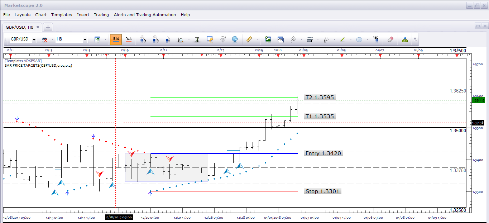
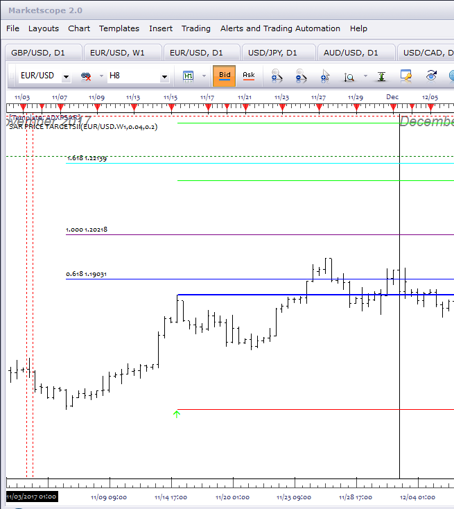
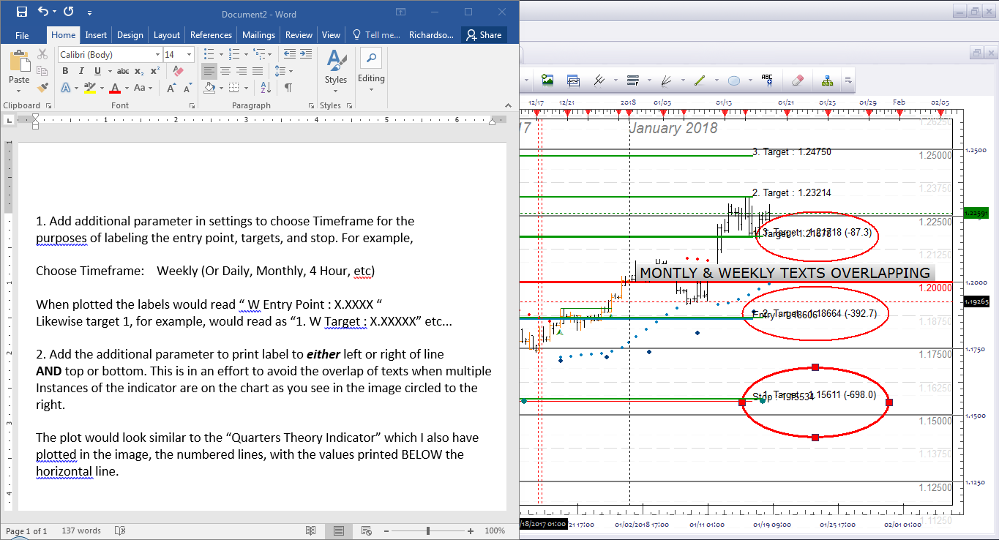
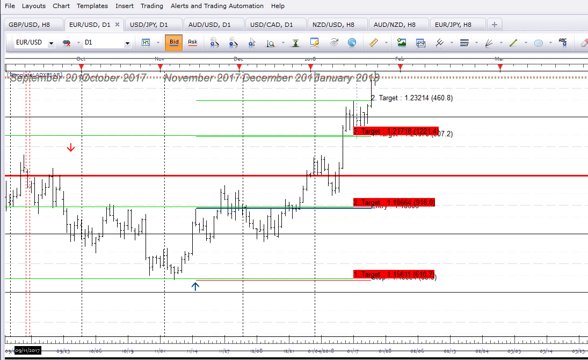
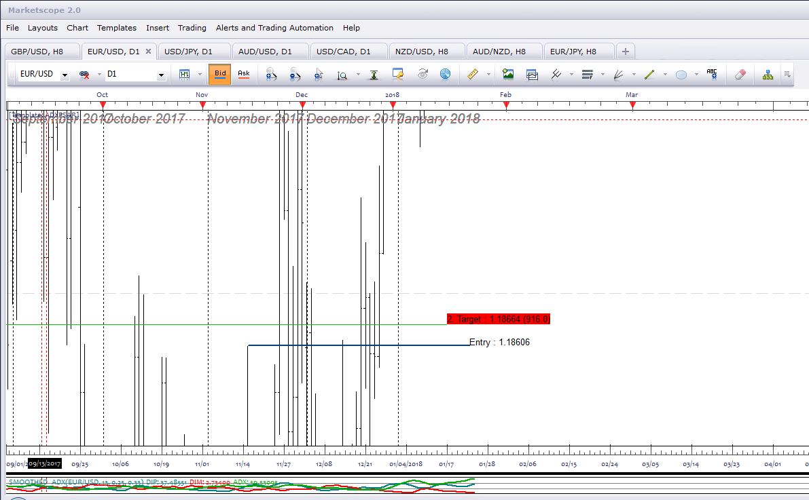
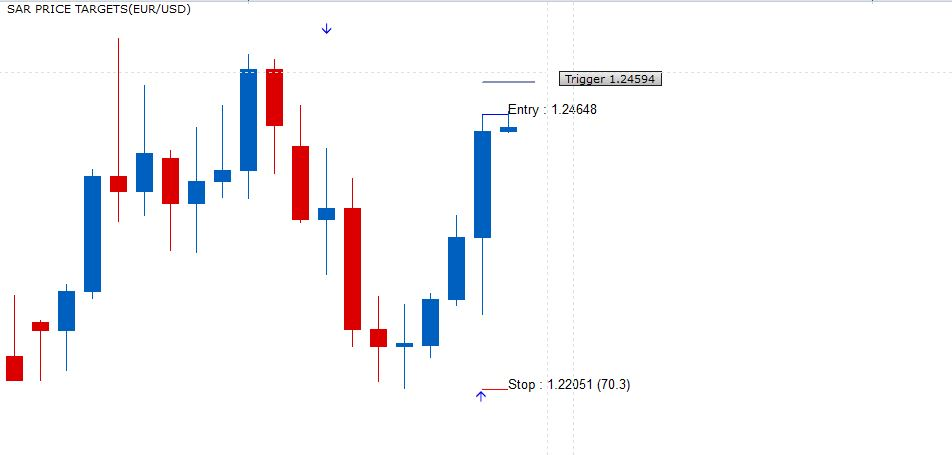
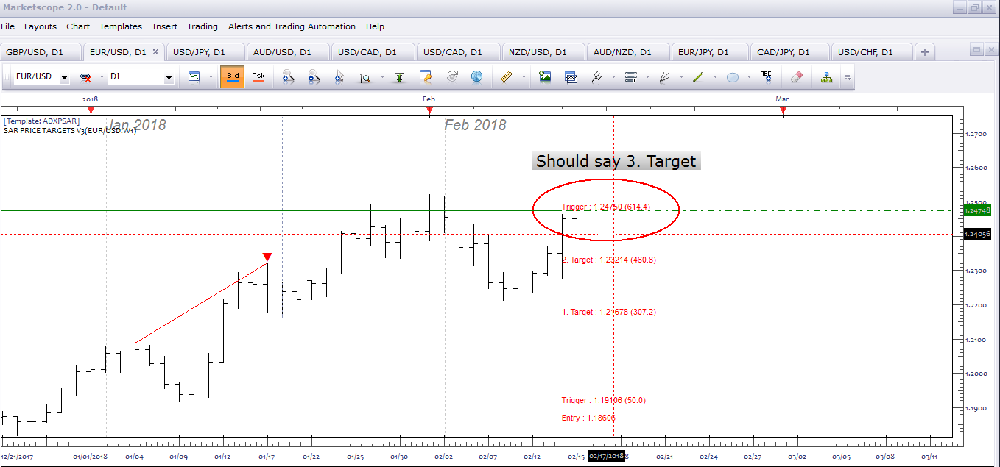
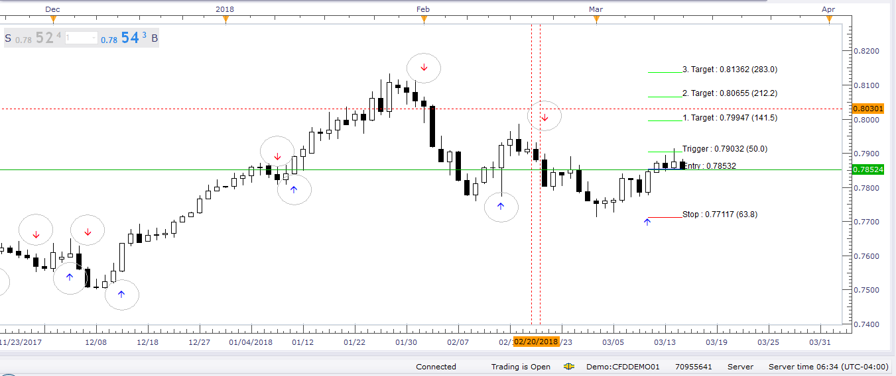

# SAR Price Targets

> Source: https://fxcodebase.com/code/viewtopic.php?f=17&t=65501  
> Forum: 17 · Topic 65501 · 36 post(s)

---

## SAR Price Targets

**Apprentice** · Tue Jan 02, 2018 12:52 pm

Based on the request.
[viewtopic.php?f=27&t=65497](https://fxcodebase.com/code/viewtopic.php?f=27&t=65497)

 [SAR Price Targets.lua](files/116714/SAR%20Price%20Targets.lua)

MT4/MQ4 version
[viewtopic.php?f=38&t=65696&p=117575#p117575](https://fxcodebase.com/code/viewtopic.php?f=38&t=65696&p=117575#p117575)

---

## Re: SAR Price Targets

**jrichardson83** · Tue Jan 02, 2018 3:31 pm

Apprentice,

Great. Thank you. Was wondering if you could add price label on the Stop, Entry, and Targets. Also, can we add one addition target at T3 = 2?

See image

 

---

## Re: SAR Price Targets

**Apprentice** · Wed Jan 03, 2018 6:01 am

Try it now.

---

## Re: SAR Price Targets

**jrichardson83** · Wed Jan 03, 2018 3:19 pm

Awesome, thanks Apprentice.

---

## Re: SAR Price Targets

**jrichardson83** · Tue Jan 16, 2018 12:23 pm

Apprentice,

I was wondering if you could add a couple more layers of code on this indicator. What I've done is add the Weekly PSAR on the daily chart to determine overall direction. What I would like is a basic paint bar based off of the parameters seen in the picture. I would like to be able to adjust the colors for the bars also.

Thanks

 

---

## Re: SAR Price Targets

**jrichardson83** · Wed Jan 17, 2018 7:48 am

> **Apprentice wrote:**
> Try it now.

Oh yeah, also, can we place the #pips at the Target levels, next to the price? For example

Target 1 121678 (315)

Stop 1.15534 (-315)...

Something like that. That keeps me from having to use the ruler tool to measure.

---

## Re: SAR Price Targets

**Apprentice** · Wed Jan 17, 2018 9:07 am

Your request is added to the development list under Id Number 4009

---

## Re: SAR Price Targets

**Apprentice** · Wed Jan 17, 2018 10:31 am

Try this version.

---

## Re: SAR Price Targets

**jrichardson83** · Wed Jan 17, 2018 5:00 pm

> **Apprentice wrote:**
> Try this version.

Which version> Just re-download the first version?

---

## Re: SAR Price Targets

**Apprentice** · Wed Jan 17, 2018 5:33 pm

Yes.

---

## Re: SAR Price Targets

**jrichardson83** · Thu Jan 18, 2018 10:20 am

> **Apprentice wrote:**
> Yes.

Hey Apprentice, i'm not sure here...I re-downloaded the file, but it seems to be the same as the old version. There isn't any paint bar functionality or anything like that.

 

---

## Re: SAR Price Targets

**jrichardson83** · Thu Jan 18, 2018 10:49 am

> **Apprentice wrote:**
> Try this version.

Oh wait, I see the adjustment you made to the pip calculation now. I thought you were referring to other post regarding the paint bars.

---

## Re: SAR Price Targets

**jrichardson83** · Thu Jan 18, 2018 11:11 am

> **Apprentice wrote:**
> Yes.

Okay, I think I should have clarified on the pip calculation. Currently its being dynamically calculated, but what I was hoping o achieve was a static calculation from the entry point to each target and stop level. See the image

 

---

## Re: SAR Price Targets

**jrichardson83** · Fri Jan 19, 2018 9:24 am

Alright, I know my other tweaks are somewhere in the que. I just wanted to add this last bit here. When plotting multiple instances of the indicator for the different timeframes overlapping occurs at particular points. For example, Weekly Target one will coincide with Monthly Target two, and so forth. This makes things difficult to read and interpret. I've suggested some possible fixes in the image.

Thanks. No rush on delivery, just whenever someone gets to it.

 

---

## Re: SAR Price Targets

**Apprentice** · Sat Jan 20, 2018 3:20 pm

Your request is added to the development list under Id Number 4014

---

## Re: SAR Price Targets

**Apprentice** · Sat Jan 20, 2018 3:28 pm

> Currently its being dynamically calculated, but what I was hoping o achieve was a static calculation from the entry point to each target and stop level.

Fixed.

---

## Re: SAR Price Targets

**Apprentice** · Mon Jan 22, 2018 4:54 am

Try it now, we added an optional background (via ownerdraw).

---

## Re: SAR Price Targets

**jrichardson83** · Thu Jan 25, 2018 8:09 am

> **Apprentice wrote:**
> Try it now, we added an optional background (via ownerdraw).

Apprentice,

Thanks for the alteration, but I don't think its going to work. If you see the images below, you'll notice that all the labeling does is make the other timeframe data unreadable. I have to really stretch the chart out to see the separation between the data points.

 

 

---

## Re: SAR Price Targets

**nookie** · Sat Feb 03, 2018 9:30 am

Is there an mq4 version ?

---

## Re: SAR Price Targets

**Apprentice** · Sat Feb 03, 2018 3:11 pm

Your request is added to the development list under Id Number 4030

---

## Re: SAR Price Targets

**Apprentice** · Sun Feb 04, 2018 6:29 am

The Indicator was revised and updated.

---

## Re: SAR Price Targets

**Apprentice** · Mon Feb 05, 2018 1:47 pm

MT4/MQ4 version
[viewtopic.php?f=38&t=65696&p=117575#p117575](https://fxcodebase.com/code/viewtopic.php?f=38&t=65696&p=117575#p117575)

---

## Re: SAR Price Targets

**jrichardson83** · Wed Feb 14, 2018 9:57 pm

I wanted to request a slight addition to this indicator and the MQ4 version. I've been hand measuring a certain pip distance from the Entry line, but can an addition line be coded for the "Trigger." Basically, this is just a user defined pip value from the entry point. I want to place either buy or sell stop orders a certain distance from the entry. The parameter could look something like this:

Trigger (N) Pips.

For example 50 Pips.

 

---

## Re: SAR Price Targets

**Apprentice** · Thu Feb 15, 2018 6:03 am

Try it now.

---

## Re: SAR Price Targets

**jrichardson83** · Thu Feb 15, 2018 9:32 am

> **Apprentice wrote:**
> Try it now.

Good stuff, Apprentice. Thanks. Slight issue with the trigger text replacing the 3rd take profit line. Might need to tweak that a bit.

 

---

## Re: SAR Price Targets

**Apprentice** · Thu Feb 15, 2018 7:42 pm

Fixed.

---

## Re: SAR Price Targets

**jrichardson83** · Sun Mar 04, 2018 9:54 am

Apprentice, I wanted to revisit an earlier request re: this indie because I would still like the option to print text on either the left or right side of the line. The addition of the label to this indicator didn't solve the issue because as the text overlaps still, the label only obscures the text.

One other thing, can we add a parameter to either show or not show historical signals or "show only current" signals? I want to clean up the chart a bit.

 

---

## Re: SAR Price Targets

**Apprentice** · Mon Mar 05, 2018 8:38 am

Historical option added.

---

## Re: SAR Price Targets

**jrichardson83** · Thu Mar 15, 2018 7:36 am

> **Apprentice wrote:**
> Historical option added.

To
Apprentice, can you adjust the "historical options" to not show historical arrows (Circled in the image)? To show only the most recent or active signals?

And also, while you adjusted the label to the left, I was wanting the option to put the label on either the left OR the right. This is so when I have multiple instances of the indicator on the screen the labels aren't on top of each other.

 

---

## Re: SAR Price Targets

**Apprentice** · Thu Mar 15, 2018 5:50 pm

Your request is added to the development list under Id Number 4080

---

## Re: SAR Price Targets

**Apprentice** · Sat Mar 17, 2018 8:11 am

Try this version.

 [SAR Price Targets.lua](files/118261/SAR%20Price%20Targets.lua)

---

## Re: SAR Price Targets

**jrichardson83** · Tue Mar 20, 2018 8:39 am

> **Apprentice wrote:**
> Try this version.
>
>
> SAR Price Targets.lua

Awesome, works like a charm.

---

## Re: SAR Price Targets

**swingtrader** · Wed Apr 19, 2023 10:05 am

I request a strategy based on this indicator

Buy: entry level > stop loss and price cross over entry level

Sell: entry level. < Stop loss and price cross under entry level

Thank u.

---

## Re: SAR Price Targets

**Apprentice** · Sat Apr 22, 2023 12:14 pm

We have added your request to the development list.
Development reference 357.

---

## Re: SAR Price Targets

**Apprentice** · Sat Apr 22, 2023 5:01 pm

Try this version.
[https://fxcodebase.com/code/viewtopic.php?f=31&t=73634](https://fxcodebase.com/code/viewtopic.php?f=31&t=73634)
Note. Signals will be exactly the same as your regular SAR strategy.

---

## Re: SAR Price Targets

**swingtrader** · Sat Apr 22, 2023 11:29 pm

Thank u.
