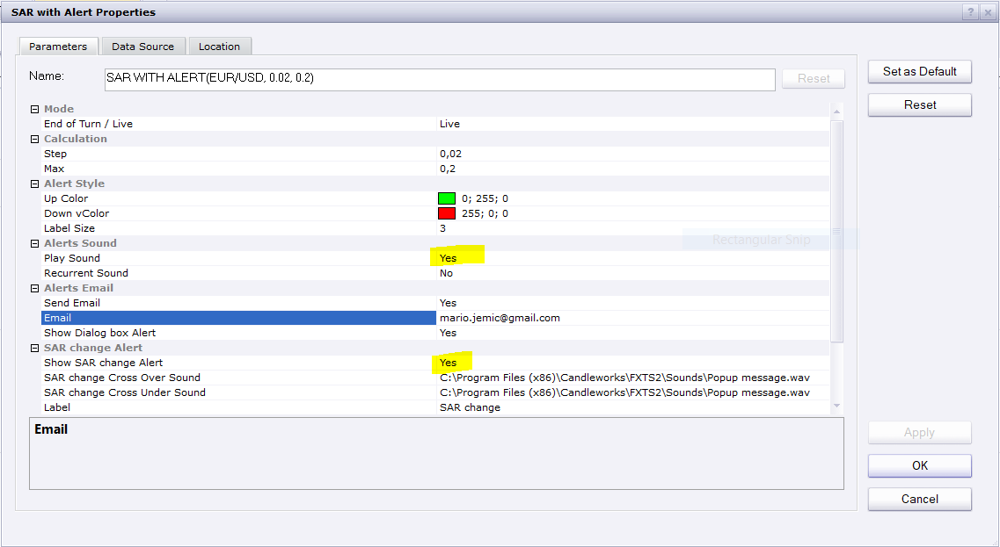

# SAR with Alert

> Source: https://fxcodebase.com/code/viewtopic.php?f=17&t=60311  
> Forum: 17 · Topic 60311 · 5 post(s)

---

## SAR with Alert

**Apprentice** · Sun Feb 16, 2014 8:14 am

In every aspect identical to the standard preinstalled SAR.
The only value added, This indicator will provides Audio / Email Alerts if SAR indication changes.

 [SAR with Alert.lua](files/92689/SAR%20with%20Alert.lua)

 [SAR Price Cross Alert.lua](files/92689/SAR%20Price%20Cross%20Alert.lua)

Compatibility issue fixed.
_Alert Helper is not longer needed.

The indicator was revised and updated

---

## Re: SAR with Alert

**HappyFox8** · Sun Dec 06, 2015 3:45 am

Hi Apprentice,
I would like to use this simple SAR alert but am assuming that it will have compatibility issues now too (as it uses the _Alert). When you have time could you please provide an update that doesn't require the _Alert. Thanks.

---

## Re: SAR with Alert

**Apprentice** · Sun Dec 06, 2015 4:30 am

Compatibility issue fixed.
_Alert Helper is not longer needed.

Also if you know any other indicator that uses Alert Warn me.

---

## Re: SAR with Alert

**HappyFox8** · Tue Jun 13, 2017 3:31 am

Unfortunately this indicator is no longer functioning. The alert does not sound.

---

## Re: SAR with Alert

**Apprentice** · Wed Jun 14, 2017 5:12 am

Have tested it, works as expected.
Set this two to yes.
