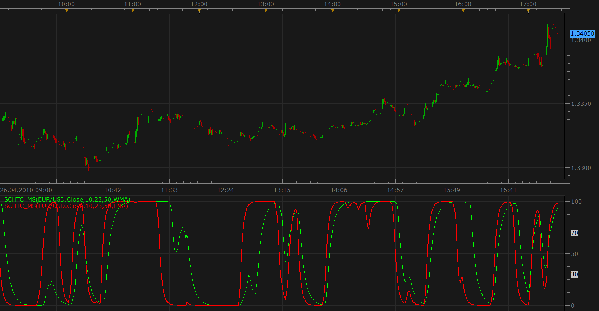

# Schaff Trend Cycle Oscillator with smoothing method selector

> Source: https://fxcodebase.com/code/viewtopic.php?f=17&t=848  
> Forum: 17 · Topic 848 · 8 post(s)

---

## Schaff Trend Cycle Oscillator with smoothing method selector

**Nikolay.Gekht** · Mon Apr 26, 2010 4:29 pm

The indicator is exactly the same as [Schaff Trend Cycle Oscillator](https://fxcodebase.com/code/viewtopic.php?f=17&t=249), but allows you to choose any smoothing method (for example EMA) instead of Wilder's moving average.

 

Download:

 [SCHTC_MS.lua](files/1518/SCHTC_MS.lua)

 [SCHTC Averages.lua](files/1518/SCHTC%20Averages.lua)

Required Averages indicator is available here.
[viewtopic.php?f=17&t=2430&hilit=average](https://fxcodebase.com/code/viewtopic.php?f=17&t=2430&hilit=average)

The indicator was revised and updated

---

## Re: Schaff Trend Cycle Oscillator with smoothing method selector

**mvtrader2000** · Mon Aug 08, 2011 3:20 pm

I want to be able to use the Schaff Trend Cycle Oscillator in the chart window not a separate window.

Is there a way this can be achieved.

I can do this with intellicharts but not MT4

Likewise, I would like to be able to place %williams indicator in the chart window which I can with intellicharts but not MT4

Any help greatly appreciated.

---

## Re: Schaff Trend Cycle Oscillator with smoothing method selector

**conejobum** · Sat Oct 15, 2011 7:40 pm

Hi Fx Code Base Guys

I would like to know if is possible to make this Oscilator for bigger time frame and with options to change line style and line width.

My best regards.

conejobum

---

## Re: Schaff Trend Cycle Oscillator with smoothing method selector

**Apprentice** · Sun Oct 16, 2011 8:03 am

From now on, we implemented the BTF version.
This functionality will be available in the next version of Marketscope.
For all of the available indicators.

---

## Re: Schaff Trend Cycle Oscillator with smoothing method sele

**SuperTrader** · Mon May 18, 2015 5:30 am

Hi. Could we please add in its code the ability to use **more MAs** for smoothing (from the following indicator - i.e. DEMA, TEMA, T3, etc). Many thanks in advance!
[http://fxcodebase.com/code/viewtopic.php?f=17&t=2430&hilit=average](https://fxcodebase.com/code/viewtopic.php?f=17&t=2430&hilit=average)

---

## Re: Schaff Trend Cycle Oscillator with smoothing method sele

**Apprentice** · Tue May 19, 2015 3:23 am

SCHTC Averages.lua Added.

---

## Re: Schaff Trend Cycle Oscillator with smoothing method sele

**SuperTrader** · Tue May 19, 2015 4:54 am

Thank you very much for your quick response Apprentice!
It works just fine (as always!!!)

---

## Re: Schaff Trend Cycle Oscillator with smoothing method sele

**Apprentice** · Tue Jul 04, 2017 9:35 am

The indicator was revised and updated.
