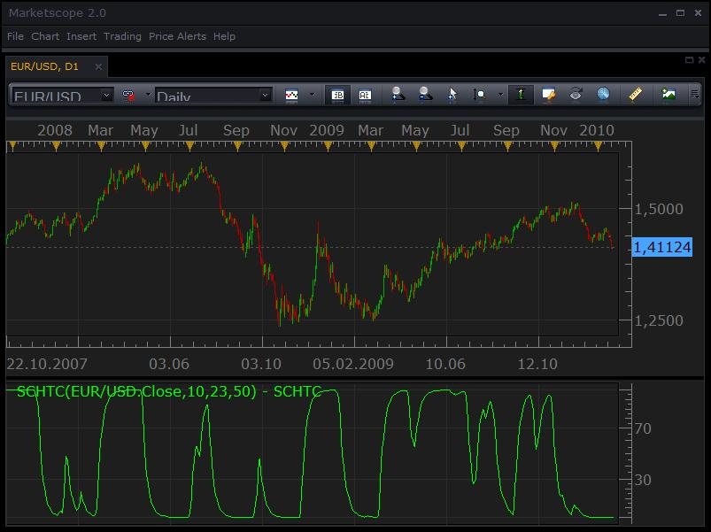

# Schaff Trend Cycle Oscillator

> Source: https://fxcodebase.com/code/viewtopic.php?f=17&t=249  
> Forum: 17 · Topic 249 · 23 post(s)

---

## Schaff Trend Cycle Oscillator

**Nikolay.Gekht** · Wed Jan 20, 2010 7:18 pm

**Schaff Trend Cycle Oscillator**

Parameters:
Schaff cycle periods (C)
Short periods (S)
Long periods (L)

MCD=WMA(PRICE, S) - WMA(PRICE, L)
ST=(MCD - MAX(MCD,C))/(MAX(MCD,C)-MIN(MCD,C) * 100
OSCILLATOR=WMA(ST, C/2);

Where WMA is Wilders Moving Average.

Read more about the indicator [here](http://www.cmsfx.com/en/trading-software/vt-trader-features/many-technical-indicators/schaff-trend-cycle/)

 



Download:

 [SCHTC.lua](files/376/SCHTC.lua)

 [Schaff Trend Cycle Oscillator with Alert.lua](files/376/Schaff%20Trend%20Cycle%20Oscillator%20with%20Alert.lua)

This indicator will provides Audio / Email Alerts if and when Schaff Trend Cycle Oscillator cross Central, Over Bought or Over Sold Level.

Dec 14, 2015: Compatibility issue Fixed. _Alert helper is not longer needed.

---

## Re: [beta] Schaff Trend Cycle Oscillator

**jackfx09** · Mon Mar 12, 2012 6:17 am

Could we please have a strategy for the Schaff Trend Cycle Oscillator.

Very simple rules, similar to a Stochastic Strategy:

Buy: cross UP through the oversold parameter of user specified threshold (30)

Sell: cross DOWN through the overbought parameter of user specified threshold (70)

Please allow user specified parameter for OVERBOUGHT/OVERSOLD and PERIODS for cycle, short and long periods.

Thanks!

sjc

---

## Re: [beta] Schaff Trend Cycle Oscillator

**Apprentice** · Mon Mar 12, 2012 12:23 pm

Requested can be found here.
[viewtopic.php?f=31&t=14741&p=27939#p27939](https://fxcodebase.com/code/viewtopic.php?f=31&t=14741&p=27939#p27939)

---

## Re: [beta] Schaff Trend Cycle Oscillator

**Coondawg71** · Thu Oct 11, 2012 9:06 am

Could we please request a Schaff Trend Oscillator DIVERGENCE indicator based on the Schaff Trend. Divergence based on PRICE vs. Schaff Trend crossing signal line. This attachment uses EMA as signal line.

Perhaps this MT4 indicator will assist.

```
#property copyright "Copyright © 2004, MetaQuotes Software Corp."
#property link "[[email protected]](https://fxcodebase.com/cdn-cgi/l/email-protection) & [[email protected]](https://fxcodebase.com/cdn-cgi/l/email-protection)"
#property indicator_separate_window
#property indicator_buffers 2
#property indicator_color1 LightSeaGreen
#property indicator_color2 Red
 
//---- input parameters
extern int SigPeriod = 23;
extern int MAShort = 23;
extern int MALong = 50;
extern int Cycle = 10;
extern int BarsCount = 500;
 
//----
int shift=0;
double MCD=0, LLV=0, HHV=0, i=0, s=0 ,MA_Short=0, MA_Long=0, ST=0;
double smconst=0;
bool check_begin=false;
bool check_begin_MA=false;
int sum=0, n=0, bars_=0;
double MA=0.0, prev=0.0;
double MCD_Arr[500];
//---- buffers
double TrendBuffer[];
double SignalBuffer[];
//+------------------------------------------------------------------+
//| Custom indicator initialization function                         |
//+------------------------------------------------------------------+
int init()
  {
 
//---- 3 additional buffers are used for counting.
   IndicatorBuffers(2);
//---- indicator buffers
   SetIndexBuffer(0, TrendBuffer);
   SetIndexStyle(0, DRAW_LINE);
   SetIndexBuffer(1, SignalBuffer);
   SetIndexStyle(1, DRAW_LINE);
   //---- name for DataWindow and indicator subwindow label
   IndicatorShortName("Schaff Trend(" + Cycle + ")");
   SetIndexDrawBegin(0, BarsCount);
   return(0);
  }
//+------------------------------------------------------------------+
//|  Schaff Trendy                                                   |
//+------------------------------------------------------------------+
int start()
  {
   check_begin = false;
   check_begin_MA = false;
   n = 1;
   s = 1;
   double a = 1 + Cycle / 2;
   smconst = 1 / a;
   if(BarsCount > 0)
     {
       if(BarsCount > Bars)
         {
           bars_ = Bars;
         }
       else
         {
           bars_ = BarsCount;
         }
     }
   for(shift = bars_ ; shift >= 0; shift--)
     {
       MA_Short = iMA(NULL, 0, MAShort, 0, MODE_EMA, PRICE_TYPICAL, shift);
       MA_Long = iMA(NULL, 0, MALong, 0, MODE_EMA, PRICE_TYPICAL, shift);
       MCD_Arr[n] = MA_Short - MA_Long;
       MCD = MA_Short - MA_Long;
       //----
       if(n >= Cycle )
         {
           n = 1;
           check_begin = true;
         }
       else
           n = n + 1;
 
       if(check_begin)
         {
           for(int i = 1; i <= Cycle; i++)
             {
               if(i == 1)
                   LLV = MCD_Arr[i];
               else
                   if(LLV > MCD_Arr[i])
                       LLV = MCD_Arr[i];
                   //----
                   if(i == 1 )
                       HHV = MCD_Arr[i];
                   else
                       if(HHV < MCD_Arr[i])
                           HHV = MCD_Arr[i];
             }
           ST = ((MCD - LLV) / (HHV - LLV))*100 + 0.01;
           s = s + 1;
           if(s >= (Cycle) / 2)
             {
               s = 1;
               check_begin_MA = true;
             }
         }
       else ST = 0;
           if(check_begin_MA)
             {
               prev = TrendBuffer[shift+1];
               MA = smconst*(ST - prev) + prev;
               //Comment ("\nMa= ",MA,"\nPrev= ",prev,"\nST=  ",ST,"\nLLV=  ",LLV,"\nHHV=  ",HHV,"\nMCD= ",MCD,"\nTrendBuffer=  ",TrendBuffer[shift-1],"\n smsconst  ",smconst);
               TrendBuffer[shift]=MA;
               
             }
             
     }
     for(shift = bars_ ; shift >= 0; shift--)
     {
     SignalBuffer[shift]=iMAOnArray(TrendBuffer,0,SigPeriod,0,MODE_EMA,shift);
     }
   return(0);
  }
//+------------------------------------------------------------------+
```

Thanks,

sjc

---

## Re: [beta] Schaff Trend Cycle Oscillator

**Apprentice** · Thu Oct 11, 2012 2:03 pm

Your request is added to the development list.

---

## Re: Schaff Trend Cycle Oscillator

**Coondawg71** · Fri Oct 12, 2012 8:08 am

Can I please request a MTF MCP heatmap of this indicator. It would prove very useful.

Thanks,

sjc

---

## Re: Schaff Trend Cycle Oscillator

**Apprentice** · Fri Oct 12, 2012 11:38 am


Calculation Modes
1. "Slope"
Shows the slope of underlying indicator. Growth or decline.
2. "OB/OS"
Slope with reference to the overbought / oversold conditions.
3. "Central Line"
Slope with reference to the Central Line.

 [MTF MCP Schaff Trend Cycle Oscillator Heat Map.lua](files/41940/MTF%20MCP%20Schaff%20Trend%20Cycle%20Oscillator%20Heat%20Map.lua)

Please inslatall Schaff Trend Cycle Oscillator (SCHTC) indicator, in order to use this indicator.

---

## Re: Schaff Trend Cycle Oscillator

**Apprentice** · Fri Oct 12, 2012 3:20 pm


 [MTF SCHTC.lua](files/41947/MTF%20SCHTC.lua)

---

## Re: Schaff Trend Cycle Oscillator

**guangho** · Mon Oct 29, 2012 4:55 am

I think this index is very useful, you can now increase on the basis of a same calculation of line? Parameters can be set, it is best to translation.

Thank you very much.

---

## Re: Schaff Trend Cycle Oscillator

**Apprentice** · Mon Oct 29, 2012 2:46 pm

Can you be more clear, unfortunately I do not understand your remark.

---

## Re: Schaff Trend Cycle Oscillator

**swingtrader** · Wed Nov 21, 2012 5:11 am

hi,

can you create mtf strategy based on schaff trend cycle indicator

indicator': SCHAFF TREND CYCLE INDICATOR WITH DEFAULT PARAMETERS

TIME FRAME 1: m15
BUY LEVEL 1: 5
SELL LEVEL1: 95

TIME FRAME 2: H1
BUY LEVEL 2: 98
SELL LEVEL 2: 2

TIME FRAME 3: D1
BUY LEVEL 3: 99
SELL LEVEL3: 1

BUY:
1.SCHAFF TREND CYCLE > BUY LEVEL 2(98) IN H1 AND
2.SCHAFF TREND CYCLE > BUY LEVEL 3 (99) IN D1 AND
3.SCHAFF TREND CYCLE CROSS OVER BUY LEVEL 1 (5) IN M15

SELL:
1.SCHAFF TREND CYCLE < SELL LEVEL 2(2) IN H1 AND
2. SCHAFF TREND CYCLE <SELL LEVEL 3(3) IN D1 AND
3. SCHAFF TREND CYCLE CROSSUNDER SELL LEVEL 1(95) IN M15

EXIT BUY:

1. SCHAFF TREND CYCLE CROSS UNDER SELL LEVEL 1 IN M15 OR
2. SCHAFF TREND CYCLE CROSS UNDER BUY LEVEL 2 IN H1

EXIT SELL:

1. SCHAFF TREND CYCLE CROSS OVER BUY LEVEL 1 IN M15 OR
2. SCHAFF TREND CYCLE CROSS OVER SELL LEVEL 2 IN H1

---

## Re: Schaff Trend Cycle Oscillator

**Apprentice** · Thu Nov 22, 2012 5:52 am

Requested can be found here.
[viewtopic.php?f=31&t=26441](https://fxcodebase.com/code/viewtopic.php?f=31&t=26441)

---

## Re: Schaff Trend Cycle Oscillator

**Apprentice** · Wed Jun 12, 2013 12:33 am

Few Bug are now Fixed in both MTF versions.

---

## Re: Schaff Trend Cycle Oscillator

**Apprentice** · Sun Mar 30, 2014 8:38 am

Schaff Trend Cycle Oscillator with Alert.lua Added.

---

## Re: Schaff Trend Cycle Oscillator

**SuperTrader** · Thu Oct 08, 2015 7:47 am

Hi Apprentice, your very latest version of this indicator "**Schaff Trend Cycle Oscillator with Alert.lua**" is fantastic (the **most complete** Schaff indicator I've found so far). Could you please just add a little "something" to it (whenever you have time): **Colorize its line** so that it's green when rising and red when falling (or when your live alert triggers or whatever you prefer and easier for you), similarly to the attached screenshot. It would be visually great and much easier on the eyes, especially for traders watching many open charts at the same time). **Thank you very much in advance!**

---

## Re: Schaff Trend Cycle Oscillator

**Apprentice** · Mon Oct 12, 2015 5:47 am

Your request is added to the development list.

---

## Re: Schaff Trend Cycle Oscillator

**Apprentice** · Mon Oct 19, 2015 8:23 am

Color Option Added.

---

## Re: Schaff Trend Cycle Oscillator

**SuperTrader** · Tue Oct 20, 2015 3:07 am

wow, the color helps a lot when trading on tick-charts, **thank you** for another good job Apprentice! (by the way, I can't express how much I appreciate **all your efforts here** in this forum all these past years, by developing hundreds of indicators, strategies, signals, it's just great to have someone **as talented as you** to help us all in here!)

---

## Re: Schaff Trend Cycle Oscillator

**Apprentice** · Mon Dec 14, 2015 7:14 am

Dec 14, 2015: Compatibility issue Fixed. _Alert helper is not longer needed.

If you want to use updated version of this indicator,
please make sure to use TS Version 01.14.101415. or higher.

---

## Re: Schaff Trend Cycle Oscillator

**Apprentice** · Thu Oct 05, 2017 6:18 am

The indicator was revised and updated.

---

## Re: Schaff Trend Cycle Oscillator

**jaricarr** · Thu Oct 05, 2017 10:35 pm

Hi Apprentice,

Can you set up a highly adaptable strategy with this indicator please.

---

## Re: Schaff Trend Cycle Oscillator

**Apprentice** · Fri Oct 06, 2017 12:22 pm

Can you define basic rules?

---

## Re: Schaff Trend Cycle Oscillator

**Apprentice** · Fri Jun 08, 2018 8:19 am

The Indicator was revised and updated.
