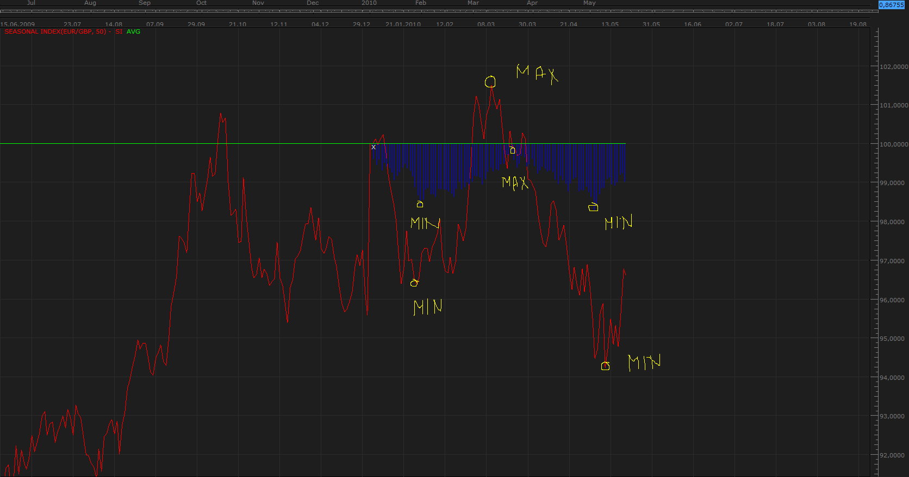

# Seasonal Index

> Source: https://fxcodebase.com/code/viewtopic.php?f=17&t=1084  
> Forum: 17 · Topic 1084 · 5 post(s)

---

## Seasonal Index

**Apprentice** · Sat May 22, 2010 4:20 am

*Seasonal Index*

 

*Seasonal Index*

While seasonal fluctuations are less conspicuous, in the currency markets.
They are stronger on the commodities markets.

As the Chart shows minimums or maximums on the basis of decade of data, almost exactly match.

I decided to write an indicator that tests this, statement.

The indicator can be applied to all instruments.
Recommend you use daily or weekly timeframe.
The more historic data load, index is more accurate.

X - marks the beginning of the calendar year
BOY - Index monitors the relative percentage change in the price of securities from Beginning Of Year (BOY).
(At the beginning of the year BOY index has a value of 0)
Seasonal (Blue histogram) - the cumulative average of BOY indexes for each year.

In the current implementation, you must load the entire previous year, in order to enter into the calculation.

 [Seasonal Index.lua](files/2058/Seasonal%20Index.lua)

Keep in mind that this is the working version of the indicators.

---

## Re: Seasonal Index

**Apprentice** · Sun May 23, 2010 11:33 am

Updated

---

## Re: Seasonal Index

**GBitaly** · Mon Apr 08, 2013 8:27 am

I have downloaded the seasonal Index but I have some problem to use it.
I think that may be more usefull for me have an indicator that is built with the historical data.
The data of each year must be "normalized", for example divinding the data of each bar with the first bar of the year, and then adding the data of the previuos years.

**first indicator**
May also be usefull have in the same area 3 indicator built on data of 5/10/15 years
I think that an image (the up side of "esempio") will be more usefull.

**second indicator**
If is plottet only a line ( on all the historical data) I think that must be given more importance to the data of the last years (like Xaverage that the last data are more important )
May also be usefull indicate on this line the historical Max and min
And may be colored the Up and Down phase .
See the down image of "esempio"

My esplication is not so correct but the image "esempio" will help you.

thank in advance
Guido

---

## Re: Seasonal Index

**GBitaly** · Wed Apr 10, 2013 3:12 am

I think that seasonal index will be more usefull if Seasonal (blue histogram) is plottet with bar in future bar (built using historical data).
If is not possibile plot the Seasonal in future must must be plotted the Seasonal of the previous year .

In this way is it possible use the "seasonal prevision"

Thanks in advance
Guido

---

## Re: Seasonal Index

**Apprentice** · Fri Oct 19, 2018 4:21 am

The indicator was revised and updated.
