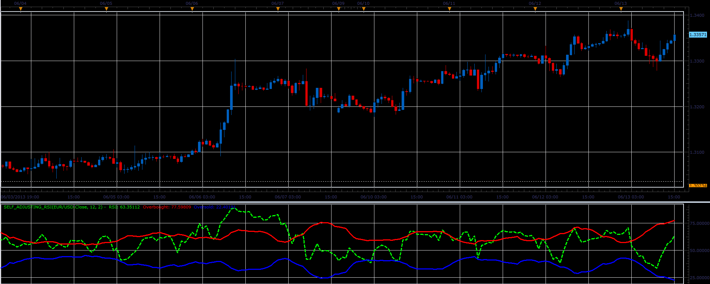

# Selfadjusting RSI

> Source: https://fxcodebase.com/code/viewtopic.php?f=17&t=41322  
> Forum: 17 · Topic 41322 · 2 post(s)

---

## Selfadjusting RSI

**Alexander.Gettinger** · Tue Jun 18, 2013 3:27 pm

This indicator is a ported MQL5 indicator from [http://www.mql5.com/ru/code/1731](http://www.mql5.com/ru/code/1731) (in Russian).

RSI oscillator with the boundaries of overbought / oversold as Bollinger Bands.

 

Download:

 [Self_Adjusting_RSI.lua](files/67552/Self_Adjusting_RSI.lua)

For this indicator must be installed StdDev indicator ([viewtopic.php?f=17&t=870](https://fxcodebase.com/code/viewtopic.php?f=17&t=870)).

The indicator was revised and updated

---

## Re: Selfadjusting RSI

**Apprentice** · Sat May 27, 2017 12:03 pm

Indicator was revised and updated.
