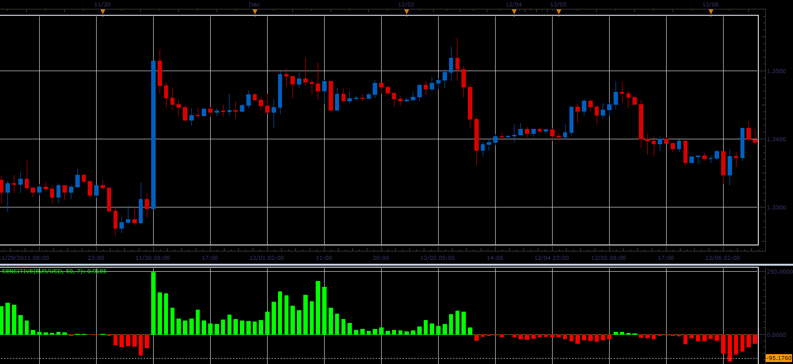

# Sensitive oscillator

> Source: https://fxcodebase.com/code/viewtopic.php?f=17&t=10502  
> Forum: 17 · Topic 10502 · 3 post(s)

---

## Sensitive oscillator

**Alexander.Gettinger** · Tue Dec 27, 2011 4:18 am

This indicator is a ported MQL5 indicator from [http://www.mql5.com/ru/code/782](http://www.mql5.com/ru/code/782) (in Russian).

Formulas:
Sensitive[i]=(5*MAclose-5*MAopen+max+min-MAhigh-MAlow)*Volume, where
MAclose, MAopen, MAhigh, MAlow - moving averages (with [Period] period) of close, open, high and low prices,
max, min - maximum and minimum prices at range from (i-Sensitive) to (i).

 

Download:

 [Sensitive.lua](files/21762/Sensitive.lua)

The indicator was revised and updated

---

## Re: Sensitive oscillator

**Alexander.Gettinger** · Wed Dec 28, 2011 8:28 am

Strategy based on Sensitive oscillator: [viewtopic.php?f=31&t=10554](https://fxcodebase.com/code/viewtopic.php?f=31&t=10554)

---

## Re: Sensitive oscillator

**Apprentice** · Mon Mar 20, 2017 8:16 am

Indicator was revised and updated.
