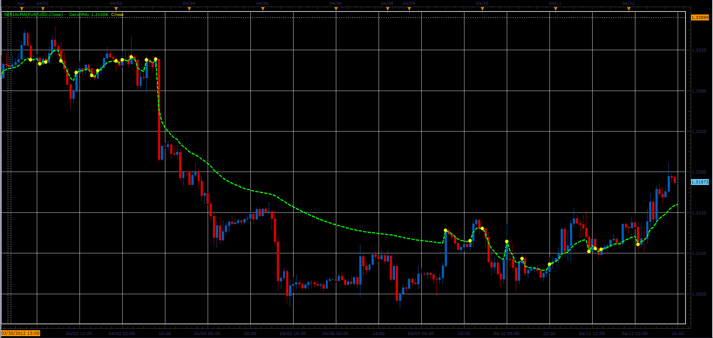
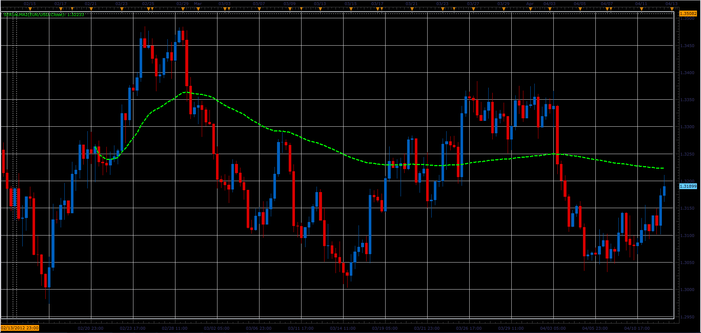
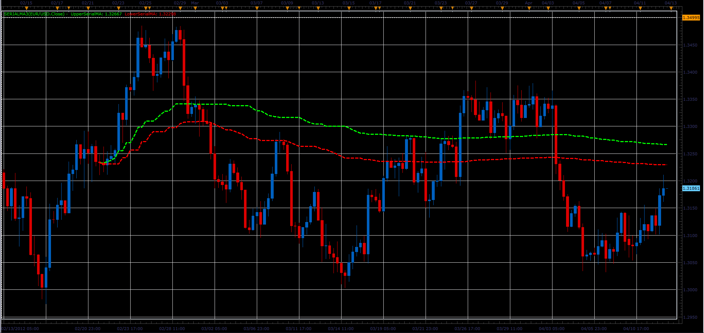

# Serial moving average

> Source: https://fxcodebase.com/code/viewtopic.php?f=17&t=15886  
> Forum: 17 · Topic 15886 · 6 post(s)

---

## Serial moving average

**Alexander.Gettinger** · Thu Apr 12, 2012 3:17 pm

Simple moving average with a variable (increasing) period.
The period resets in the points of intersection of price and MA.

 

Download:

 [SerialMA.lua](files/29820/SerialMA.lua)

The indicator was revised and updated

---

## Re: Serial moving average

**Alexander.Gettinger** · Thu Apr 12, 2012 3:32 pm

Serial MA with user-defined starting point.
The starting point is specified in the command menu.
Starting from the initial point, the period of MA will be increased by 1 on each bar.

 

Download:

 [SerialMA2.lua](files/29824/SerialMA2.lua)

---

## Re: Serial moving average

**Alexander.Gettinger** · Thu Apr 12, 2012 4:00 pm

Indicator with user-defined starting point and separate summing for UP (Close>Open) and DN (Close<Open) candles.

 

Download:

 [SerialMA3.lua](files/29828/SerialMA3.lua)

---

## Re: Serial moving average

**Alexander.Gettinger** · Tue Apr 17, 2012 1:28 pm

Strategy based on Serial MA indicator: [viewtopic.php?f=31&t=16211](https://fxcodebase.com/code/viewtopic.php?f=31&t=16211)

---

## Re: Serial moving average

**Alexander.Gettinger** · Fri Apr 27, 2012 12:38 pm

MQL4 version of serial moving average: [viewtopic.php?f=38&t=16426](https://fxcodebase.com/code/viewtopic.php?f=38&t=16426)

---

## Re: Serial moving average

**Apprentice** · Mon Apr 03, 2017 6:15 am

Indicator was revised and updated.
