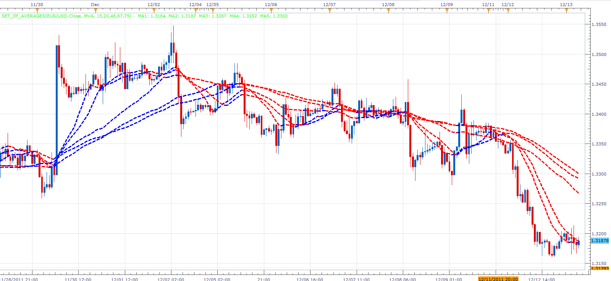
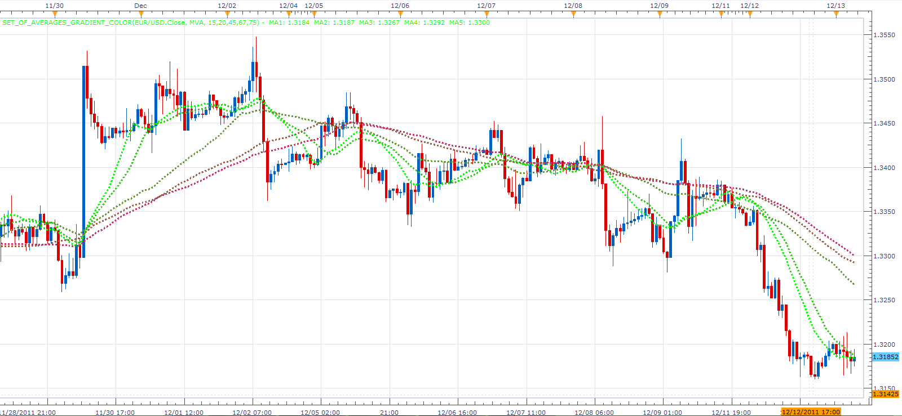

# Set of averages

> Source: https://fxcodebase.com/code/viewtopic.php?f=17&t=9568  
> Forum: 17 · Topic 9568 · 8 post(s)

---

## Set of averages

**Alexander.Gettinger** · Tue Dec 13, 2011 5:40 am

The indicator draws a set of averages. Periods are entered as a string. Characters other than numbers are perceived as a separator.

 

Download:

 [Set_Of_Averages.lua](files/20513/Set_Of_Averages.lua)

 [Set_Of_Averages with Alert.lua](files/20513/Set_Of_Averages%20with%20Alert.lua)

Dec 14, 2015: Compatibility issue Fixed. _Alert helper is not longer needed.

With gradient colors.

 

Download:

 [Set_Of_Averages_Gradient_Color.lua](files/20513/Set_Of_Averages_Gradient_Color.lua)

For this indicator must be installed Averages indicator from [viewtopic.php?f=17&t=2430](https://fxcodebase.com/code/viewtopic.php?f=17&t=2430)

---

## Re: Set of averages

**Alexander.Gettinger** · Mon Feb 20, 2012 1:50 pm

Indicator show minimum and maximum of averages.

Download:

 [Set_Of_Averages2.lua](files/26451/Set_Of_Averages2.lua)

---

## Re: Set of averages

**Alexander.Gettinger** · Tue May 08, 2012 5:24 pm

MQL4 version of indicator: [viewtopic.php?f=38&t=17984](https://fxcodebase.com/code/viewtopic.php?f=38&t=17984)

---

## Re: Set of averages

**adloule** · Mon May 04, 2015 10:20 am

is it possible to add an alert when the dot appears please ?

---

## Re: Set of averages

**Apprentice** · Wed May 06, 2015 8:33 am

Set_Of_Averages with Alert.lua Added.

---

## Re: Set of averages

**adloule** · Thu May 07, 2015 5:39 am

thanks a lot

---

## Re: Set of averages

**Apprentice** · Mon Dec 14, 2015 5:39 am

Dec 14, 2015: Compatibility issue Fixed. _Alert helper is not longer needed.

If you want to use updated version of this indicator,
please make sure to use TS Version 01.14.101415. or higher.

---

## Re: Set of averages

**Apprentice** · Thu Sep 13, 2018 3:32 am

The indicator was revised and updated.
