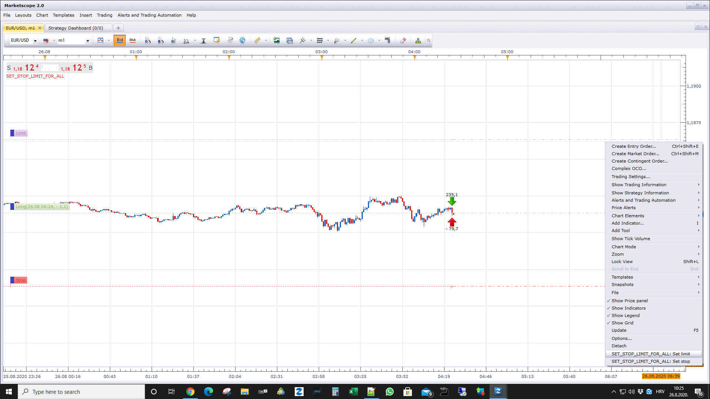

# Set stop/limit for all trades

> Source: https://fxcodebase.com/code/viewtopic.php?f=17&t=65384  
> Forum: 17 · Topic 65384 · 8 post(s)

---

## Set stop/limit for all trades

**Alexander.Gettinger** · Tue Nov 21, 2017 2:14 pm

The indicator by the command sets a stop or limit for all trades.
Commands are available in the menu by right-clicking the mouse.

Download:

 [Set_Stop_Limit_For_All.lua](files/116151/Set_Stop_Limit_For_All.lua)

MT4/MQ4 version.
[viewtopic.php?f=38&t=70479](https://fxcodebase.com/code/viewtopic.php?f=38&t=70479)

---

## Re: Set stop/limit for all trades

**Apprentice** · Tue Aug 07, 2018 4:43 am

The Indicator was revised and updated.

---

## Re: Set stop/limit for all trades

**Gilles** · Wed Aug 19, 2020 7:36 am

Hi Alexander,

Please can you provide a MT4 release of that ?
Thank you :) !
See you soon :)

---

## Re: Set stop/limit for all trades

**Apprentice** · Thu Aug 20, 2020 6:21 am

Your request is added to the development list.
Development reference 1914.

---

## Re: Set stop/limit for all trades

**neel111** · Tue Aug 25, 2020 1:54 pm

> **Alexander.Gettinger wrote:**
> The indicator by the command sets a stop or limit for all trades.
> Commands are available in the menu by right-clicking the mouse.
>
> Download:
>
>
> The attachment **Set_Stop_Limit_For_All.lua** is no longer available

sorry if question is dumb, i tried to use this and limit pip profit, means i set fix profit set in this indicator(pic. attached ) , i want to fix my profit 4 Pip (example) , mean when ever i put trade manually either Buy/Long or Sell/short , it close trade automatically after 4 pip favor (or desired set value pip) ,
for loss or negative side pip it should stay open, trade only close on profit side,
i am new and many time i have to leave trade unattended so this small 4-7 pip auto close trade tool works for me, is this indicator work for that ? i tried to set the value in box while trade was on till 7 pip positive it didn't close , seems i am doing something wrong, help appreciated thanks in advance

---

## Re: Set stop/limit for all trades

**Apprentice** · Wed Aug 26, 2020 5:15 am

After you add an indicator to the chart,
you will need to start the process by clicking on "Set limit" or "Set stop"

---

## Re: Set stop/limit for all trades

**neel111** · Wed Aug 26, 2020 2:00 pm

> **Apprentice wrote:**
>
>
> info.png
>
>
> After you add an indicator to the chart,
> you will need to start the process by clicking on "Set limit" or "Set stop"

thank you very much !! will test today

---

## Re: Set stop/limit for all trades

**Apprentice** · Thu Sep 24, 2020 2:51 am

MT4/MQ4 version.
[viewtopic.php?f=38&t=70479](https://fxcodebase.com/code/viewtopic.php?f=38&t=70479)
