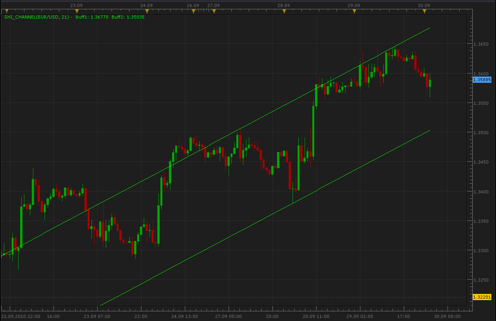

# SHI Channel indicator

> Source: https://fxcodebase.com/code/viewtopic.php?f=17&t=2305  
> Forum: 17 · Topic 2305 · 11 post(s)

---

## SHI Channel indicator

**Alexander.Gettinger** · Thu Sep 30, 2010 2:18 am

[viewtopic.php?f=27&t=2265](https://fxcodebase.com/code/viewtopic.php?f=27&t=2265)

Indicator finds last and previous fractals and draw draws line through them. Parallel line draws on opposite side on last fractal.

 

 [SHI_Channel.lua](files/4896/SHI_Channel.lua)

The indicator was revised and updated

---

## Re: SHI Channel indicator

**Apprentice** · Tue Jan 04, 2011 10:35 am

Performance update.
Small change but significantly decreases the loading time.
For big changes have not had time.

---

## Re: SHI Channel indicator

**dlgoad** · Wed Jul 20, 2011 6:28 pm

Hi,
Can you describe the Bars for Fractal variable and its implications?

I have seen another MT4 SHI Channel indicator with a barsforfract variable that does not appear to operate the same way as yours.

Thanks!

---

## Re: SHI Channel indicator

**superleo** · Sat Jan 25, 2014 12:23 pm

hi ,
can you create a strategy based on this indicator.

buy: price cross over upper line
sell: price cross under lowe line

thank you.

---

## Re: SHI Channel indicator

**Apprentice** · Sat Jan 25, 2014 2:08 pm

Your request is added to the development list.

---

## Re: SHI Channel indicator

**swingtrader** · Tue Jan 28, 2014 1:59 am

hi to all,

can you add line style changing and line width changing option to this shi channel

---

## Re: SHI Channel indicator

**Apprentice** · Tue Jan 28, 2014 2:47 am

Style Option Added.

---

## Re: SHI Channel indicator

**swingtrader** · Tue Jan 28, 2014 3:06 am

THANK YOU

---

## Re: SHI Channel indicator

**moomoofx** · Wed Feb 26, 2014 9:58 pm

Strategy created here: [viewtopic.php?f=31&t=60355](https://fxcodebase.com/code/viewtopic.php?f=31&t=60355)

Cheers,
MooMooFX

---

## Re: SHI Channel indicator

**superleo** · Thu Feb 27, 2014 2:50 am

thank you very much for making strategy based on this indicator

---

## Re: SHI Channel indicator

**MC. Trend Trader** · Wed Mar 01, 2017 4:31 pm

Hi,

I have Request for Bigger time frame version of this SHI Channel Indicator.

Regards

MC. Trend Trader
