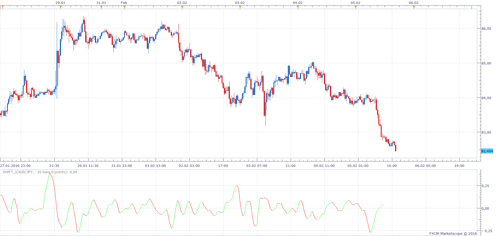

# Shift_I & Shift_O

> Source: https://fxcodebase.com/code/viewtopic.php?f=17&t=63122  
> Forum: 17 · Topic 63122 · 5 post(s)

---

## Shift_I & Shift_O

**Apprentice** · Sun Feb 07, 2016 6:11 am

Will give you functionality of recently removed SHIFT_I & SHIFT_O,
of horizontal and vertical shift, for most indicators out there.

 [Shift_O.lua](files/104672/Shift_O.lua)

 [Shift_I.lua](files/104672/Shift_I.lua)

A similar indicator can be found here.
[viewtopic.php?f=17&t=60009&p=94740&hilit=shifted#p94740](https://fxcodebase.com/code/viewtopic.php?f=17&t=60009&p=94740&hilit=shifted#p94740)

 [Shift_I Tick.lua](files/104672/Shift_I%20Tick.lua)

 [Shift_O Tick.lua](files/104672/Shift_O%20Tick.lua)

---

## Re: Shift_I & Shift_O

**Apprentice** · Wed Jul 13, 2016 11:11 am

Minor Update.

---

## Re: Shift_I & Shift_O

**Apprentice** · Mon Jul 09, 2018 5:09 am

The indicator was revised and updated.

---

## Re: Shift_I & Shift_O

**Apprentice** · Thu Feb 11, 2021 4:43 am

Tick version added.
[viewtopic.php?f=17&t=63122](https://fxcodebase.com/code/viewtopic.php?f=17&t=63122)

---

## Re: Shift_I & Shift_O

**Paul W** · Thu Feb 11, 2021 10:54 am

Thank you
