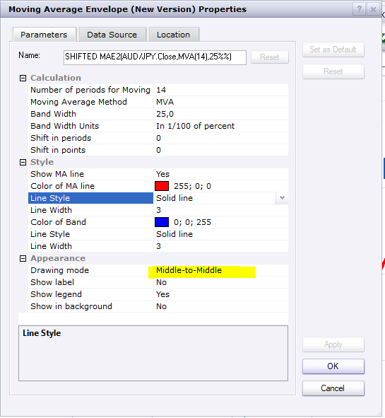
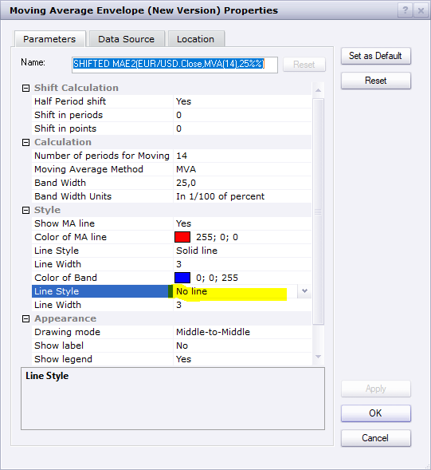

# Shifted MAE2

> Source: https://fxcodebase.com/code/viewtopic.php?f=17&t=69779  
> Forum: 17 · Topic 69779 · 18 post(s)

---

## Shifted MAE2

**Apprentice** · Fri May 01, 2020 9:24 am

Based on request.
[viewtopic.php?f=17&t=658](https://fxcodebase.com/code/viewtopic.php?f=17&t=658)

 [Shifted MAE2.lua](files/133429/Shifted%20MAE2.lua)

---

## Re: Shifted MAE2

**fortcentral** · Mon May 04, 2020 6:33 am

Dear Apprentice,
Thank you so much for this and also for the quick response on the request! Would it be possible please to include the following options:
1) Increase in number of decimal points used in MA and band calculations from 4 to 8, to further reduce rounding error?
2) Option to change thickness (weight) and style (dash, dotted, etc.) of "MA Line" and "Band lines"?
3) "Shift in period" parameter input - option to shift by decimal "0.5" or "1/2 time-periods", such that calculated moving average point is plotted between two price bars?

Regards,
Fortcentral

---

## Re: Shifted MAE2

**Apprentice** · Mon May 04, 2020 7:25 am

1)
2)
Added.

About 3)

 

Try to use these options.
If your logic is applied, what will be current value of lines?

---

## Re: Shifted MAE2

**fortcentral** · Mon May 04, 2020 10:16 am

Thank you again!

About 3) - the logic would be for example that in the calculation of a 10-period Simple-Moving-Average (SMA), which is shifted "-4.5" periods. The calculated SMA-value of the last 10-periods (inclusive of the current period), will be plotted between the 5-th and the 6-th bar of the period used for calculation of the SMA.

Similarly, in a 4-period SMA shifted "-1.5" periods, the calculated value will be plotted between the 2-nd and the 3-rd bar. Hope example below makes it clearer.

Example (Closing price of each bar being used in calculation):
Bar 1: 10
Bar 2: 12
Bar 3: 8
Bar 4: 6 (current bar - yet to close but current "bid" price is 6)

4-period SMA(current) = (10+12+8+6)/4 = 9 shifted "-1.5" periods will be plotted in the space between "Bar 2" and "Bar 3".

Regards,
Fortcentral

---

## Re: Shifted MAE2

**Apprentice** · Tue May 05, 2020 4:27 am

Your request is added to the development list.
Development reference 1221.

---

## Re: Shifted MAE2

**fortcentral** · Tue May 05, 2020 5:36 am

Dear Apprentice,
Further to my "logic description" yesterday, which was very basic, please see the following clarifications. The plot of the "1/2 period shift" will require some type of interpolation to estimate the shifted curve position. I hope the following description and picture makes the idea for the shift clearer.

Whole period shifts either forward or backward in time are relatively easy as per the current functionality of the indicator. This is the best outcome for most shifted envelopes. However under certain circumstances, 1/2 period shifts are recommended and hence the request for this additional functionality.

For half-period (0.5) shifts in time, you may be able to use a 2-period SMA of the "Moving Average Calculation" shifted by the next-whole-number up from the "input half-period", i.e. if "-1.5" period shift is required then a 2-period SMA of the moving average (or average of the last two moving-average values), each shifted by -2.0 periods in time.

Please see worked example in attached picture.

Regards,
Fortcentral

---

## Re: Shifted MAE2

**Apprentice** · Sun May 10, 2020 3:59 am

Try this version.

 [Shifted MAE2.lua](files/133778/Shifted%20MAE2.lua)

---

## Re: Shifted MAE2

**fortcentral** · Wed May 13, 2020 12:19 am

Dear Apprentice,
Thank you for the last update. The calculations are working well. Two change requests please to finalise this one:

1) This change applies only to the "half-shift" calculation. The calculated values for the "half-shift" plot are accurate. But for correct display, the "half-shift" plot needs to be displaced an extra period over the input "Shift-in-period" parameter value.

So for example, if we enable "half-shift" and input parameter "+1 period shift" then calculated "half-shift" curve should be displaced "+2 periods" to display correctly. Similarly for example, with "half-shift" enabled and input of "-3 period shift", the calculated "half-shift" curve should be displaced "-4 periods" in the plot instead of the current "-3 period shift", to display correctly.

2) Option to "switch-off" display for "MAE band", similar to the option available for the "moving-average line". This will help to simplify screen when displaying nested bands for example.

Regards,
Fortcentral

---

## Re: Shifted MAE2

**fortcentral** · Wed May 27, 2020 8:59 am

Dear Apprentice,
Any chance for you to have a look at the two modifications requested in my earlier reply (Wed May 13, 2020 3:19 pm)? Would be great to finalise the indicator.

Thanks,
Forcentral

---

## Re: Shifted MAE2

**Apprentice** · Wed May 27, 2020 3:59 pm

Your request is added to the development list.
Development reference 1379.

---

## Re: Shifted MAE2

**Apprentice** · Thu May 28, 2020 6:27 am

[Shifted MAE2.lua](files/134403/Shifted%20MAE2.lua)

Try this version.

---

## Re: Shifted MAE2

**fortcentral** · Tue Jun 02, 2020 3:39 am

Dear Apprentice,
Thank you so much for updating the indicator. The calculations are perfect now.

In regards to the second part of the earlier request (Wed May 13, 2020 3:19 pm); is it not possible to the have the option to "turn-off" the display of the moving-average-band lines? Ofcourse in such a situation the moving-average-line display would be kept "turned-on" instead.

This feature would allow the display to be simplified, when for example we just need to display the (half-shift) moving-average-line for cross-over indications. There is a shifted-MA indicator already, but it is not currently modified for half-shift calculations.

So the option to turn-off the bands and just keep the MA-line will help and double the utility of this indicator by producing both a half-shift MA as well as a MA envelope, as and when required.

Regards,
Fortcentral

---

## Re: Shifted MAE2

**Apprentice** · Tue Jun 02, 2020 5:32 am

You can use "no line" option.

---

## Re: Shifted MAE2

**fortcentral** · Thu Jun 04, 2020 10:23 am

Got it - thank you so much for your help with this one!

Regards,
Fortcentral

---

## Re: Shifted MAE2

**fx1954** · Sun Jun 28, 2020 9:44 am

Is there a version of this indicator that covers also TriMA?

---

## Re: Shifted MAE2

**Apprentice** · Mon Jun 29, 2020 7:07 am

Your request is added to the development list.
Development reference 1581.

---

## Re: Shifted MAE2

**Apprentice** · Tue Jun 30, 2020 2:22 am

[Shifted MAE2.lua](files/135422/Shifted%20MAE2.lua)

Try this version.

---

## Re: Shifted MAE2

**fx1954** · Tue Jun 30, 2020 9:11 am

Thank you very much.
