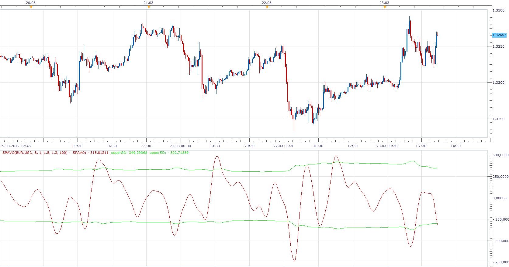

# Short-term Volume and Price Oscillator

> Source: https://fxcodebase.com/code/viewtopic.php?f=17&t=15080  
> Forum: 17 · Topic 15080 · 12 post(s)

---

## Short-term Volume and Price Oscillator

**Apprentice** · Fri Mar 23, 2012 9:48 am

 [SPAVO.lua](files/28557/SPAVO.lua)

 [SPAVO with Alert.lua](files/28557/SPAVO%20with%20Alert.lua)

This indicator provides Audio / Email Alerts on SPAVO Lines / Top/Bottom Band Line Cross.

The indicator was revised and updated

---

## Re: Short-term Volume and Price Oscillator

**jackfx09** · Fri Mar 23, 2012 1:06 pm

Apprentice,

Love the idea behind the concept...looks to me like you could use this for possible divergence identifier? Otherwise could you please explain your interpretation on how it should be applied.

Thanks!

sjc

---

## Re: Short-term Volume and Price Oscillator

**turingdesign** · Thu May 16, 2013 5:04 am

Is there a MQL version of this indicator?

thanks in advance
Andrew

---

## Re: Short-term Volume and Price Oscillator

**Apprentice** · Fri May 17, 2013 6:04 am

Unfortunately not.
Your request is added to the development list.

---

## Re: Short-term Volume and Price Oscillator

**speakinmymind** · Fri May 17, 2013 10:16 am

Could you create an alert for when the hi/lo bands are touched?

Also what does cutoff effect?

---

## Re: Short-term Volume and Price Oscillator

**Apprentice** · Tue May 21, 2013 5:22 am

Your request is added to the development list.

---

## Re: Short-term Volume and Price Oscillator

**Alexander.Gettinger** · Tue Jun 18, 2013 2:58 pm

> **turingdesign wrote:**
> Is there a MQL version of this indicator?

The indicator can be found here: [viewtopic.php?f=38&t=41312](https://fxcodebase.com/code/viewtopic.php?f=38&t=41312)

---

## Re: Short-term Volume and Price Oscillator

**Coondawg71** · Sat Feb 01, 2014 10:58 am

> **speakinmymind wrote:**
> Could you create an alert for when the hi/lo bands are touched?
>
> Also what does cutoff effect?

I second the request for Alerts to be added to this indicator.

thanks,

sjc

---

## Re: Short-term Volume and Price Oscillator

**Apprentice** · Sat Feb 01, 2014 2:55 pm

Your request is added to the development list.

---

## Re: Short-term Volume and Price Oscillator

**Apprentice** · Sun Feb 02, 2014 4:46 am

SPAVO with Alert added.

---

## Re: Short-term Volume and Price Oscillator

**Apprentice** · Mon Dec 07, 2015 7:06 am

Compatibility issue fixed.
_Alert Helper is not longer needed.

---

## Re: Short-term Volume and Price Oscillator

**Apprentice** · Fri Jul 21, 2017 8:40 am

The indicator was revised and updated.
