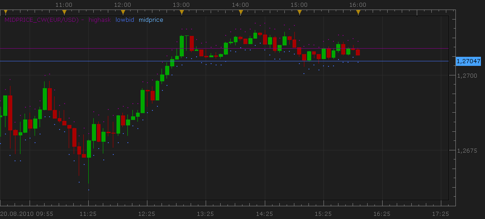

# Show a candle of the middle price of bid and ask

> Source: https://fxcodebase.com/code/viewtopic.php?f=17&t=1916  
> Forum: 17 · Topic 1916 · 7 post(s)

---

## Show a candle of the middle price of bid and ask

**Nikolay.Gekht** · Mon Aug 23, 2010 8:16 pm

The simple indicator which shows the candles of the middle price of the bid and ask (open = (bid open + ask open) / 2, high = (bid high + ask high) / 2 and so on).

The indicator also shows the ask high and bid low dots as well as the most recent price. You can apply other indicators as on the bid/ask prices (whichever is chosen in the chart toolbar) or to these midprice candles (see the "Source" tab in the indicator options).

The indicator also shows the current bid and ask prices as a lines.

 

Download indicator:

 [midprice_nw.lua](files/3867/midprice_nw.lua)

---

## Re: Show a candle of the middle price of bid and ask

**Silverthorn** · Sun Dec 22, 2013 4:29 pm

Is it possible to get a HA version of this?

---

## Re: Show a candle of the middle price of bid and ask

**Apprentice** · Mon Dec 23, 2013 10:31 am

I believe you already can add HA on chart.
Once you add midprice_nw.lua to Chart.
Ha will use midprice_nw.lua as a source for its calculations.

---

## Re: Show a candle of the middle price of bid and ask

**Apprentice** · Wed Apr 22, 2015 4:08 am

Bump Up.

---

## Re: Show a candle of the middle price of bid and ask

**Apprentice** · Mon Oct 29, 2018 7:20 am

The indicator was revised and updated.

---

## Re: Show a candle of the middle price of bid and ask

**Silverthorn** · Mon Nov 19, 2018 2:59 am

Hi Apprentice,

I've been doing a lot of Lua learning and have written an indicator based off this indicator. I'm now trying to create a Strategy based off it.

I'm trying to use the indicator_instance profile:createInstance (source, parameters) method I found here.

[http://www.fxcodebase.com/documents/Ind ... tance.html](http://www.fxcodebase.com/documents/IndicoreSDK/web-content.html#profile.createInstance.html)

But I can't figure out how to provide a combined bid and ask stream to the indicator.

I can't find a way of getting a combined source directly so have been trying to figure out how to combine the two streams created by
 bid = ExtSubscribe(1, nil, instance.parameters.timeframe, true, "bar");
 ask = ExtSubscribe(2, nil, instance.parameters.timeframe, false, "bar");

What's the correct way to do this??

Cheers.

---

## Re: Show a candle of the middle price of bid and ask

**Apprentice** · Mon Nov 19, 2018 8:29 am

local MA_Period=10;
MAofBid= core.indicators:create("MVA", bid , MA_Period);
MAofAsk= core.indicators:create("MVA", ask, MA_Period);
