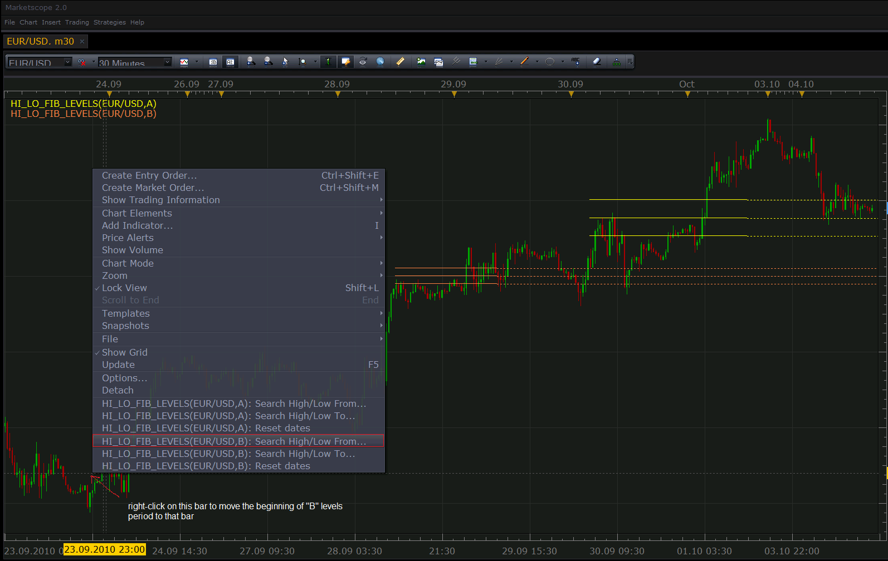

# Show auto fibonacci lines

> Source: https://fxcodebase.com/code/viewtopic.php?f=17&t=2338  
> Forum: 17 · Topic 2338 · 18 post(s)

---

## Show auto fibonacci lines

**Nikolay.Gekht** · Mon Oct 04, 2010 1:52 pm

The indicator shows Fibonacci lines using lowest price of the chosen time period as 0-line and highest price of the chosen period as 1-line.

When indicator is started, the lines are drawn on the base of last 50 bars of the chart. Then, you can choose new start and new end of the period by right-click on a bar and choosing "Search High/Low From..." and "Search High/Low To..." commands.

Also, the indicator saves chosen dates when time frame is switched and/or when chart is closed and then opened again.

To reset the search area back to the last 50 bars just right click anywhere on the chart and choose "Reset dates" command in the context menu.

You can create more than one instance of the indicator on the same chart. Just use different labels for them and choose the command of the proper indicator in the context menu.

 

Download indicator:

 [hi_lo_fib_levels.lua](files/4995/hi_lo_fib_levels.lua)

---

## Re: Show auto fibonacci lines

**luigipg** · Tue Jan 04, 2011 5:47 am

Dear Nikolay always thank you for what you do, could you develop this indicator in such a way that always show the levels and their respective prices, without having to pass the mouse over them? Thanks in advance. Luigi.

---

## Re: Show auto fibonacci lines

**transformer** · Tue Mar 26, 2013 12:46 pm

hi,

can you create option for changing line width(1,2,3) and style(straight line, dotted line, dashed line) and coloring options , and yes or no options for each line to show and hide the line.

---

## Re: Show auto fibonacci lines

**Apprentice** · Wed Mar 27, 2013 6:15 am

Your requests are added to the development list.

---

## Re: Show auto fibonacci lines

**speakinmymind** · Thu Mar 28, 2013 1:07 pm

Hey could you add an option to automate the "To" part of the from - to scenario so that the if a new low or new high is created it automatically adjusts?

Also, could you create an option for an alert for each line when touched?

 Lastly, could you allow the option to use High/Lows instead of close price?

I appreciate your organization for providing these things for free, you guys are amazing

---

## Re: Show auto fibonacci lines

**Apprentice** · Fri Mar 29, 2013 2:07 pm

[hi_lo_fib_levels.lua](files/57660/hi_lo_fib_levels.lua)

Line Style Options Added.
Line On/Off exists already.
Alert added to the development list.

---

## Re: Show auto fibonacci lines

**speakinmymind** · Sun Mar 31, 2013 5:06 pm

Can you add the labels to each line as well?

---

## Re: Show auto fibonacci lines

**Apprentice** · Mon Apr 01, 2013 7:16 am

Will add them, in the next update.

---

## Re: Show auto fibonacci lines

**speakinmymind** · Tue Apr 02, 2013 12:43 pm

Can you make the lines static when changing time frames??

Basically, I would like to find a range on a 1D chart, then change my time frame to a 2hr chart without having to go back and set the fib lines again.

I would like the lines that were set on the 1D chart to be static at the same prices even if I change time frames

---

## Re: Show auto fibonacci lines

**speakinmymind** · Fri Apr 05, 2013 4:58 am

Another request for this indicator is to highlight the actual price of each line on the right of the screen to allow for ease of trade planning.

---

## Re: Show auto fibonacci lines

**Apprentice** · Sat Apr 06, 2013 4:33 am

Last request is impossible to fulfill.
Value Label, is a possible alternative.

---

## Re: Show auto fibonacci lines

**speakinmymind** · Sat Apr 06, 2013 9:48 am

> **Apprentice wrote:**
> Last request is impossible to fulfill.
> Value Label, is a possible alternative.

Yes, the same labels that are on the manual Fibonacci lines should be on the auto fibs. If there was an option to display the labels on the right side that would be great.

---

## Re: Show auto fibonacci lines

**speakinmymind** · Thu Apr 11, 2013 6:00 am

Could you please add a midpoint between each line that can be turned on/off? Also the color of the midlines should be different.

---

## Re: Show auto fibonacci lines

**Apprentice** · Fri Apr 12, 2013 4:23 am

Your request is added to the development list.

---

## Re: Show auto fibonacci lines

**stfx_81** · Thu Jun 19, 2014 5:53 am

Hi Apprentice,

Was there an update that alerts you when the levels are touched or crossed?

Also, not sure where to post this, but is there an indicator that monitors the high and low - as set in dealing rates on TS2 that if they are touched/crossed an alert will pop up.

I am having to go through each pair each day and place price alerts at these levels as taken from the dealing rates... Zzzzzz lol takes for ever and i have to do this every day.

Again, sorry for posting in possibly the wrong place, but failing the above request. Could you add code to the current price alerts, that has an option to set as high or low for pair with maybe start of day parameter and an alert if crossed...Many thanks

---

## Re: Show auto fibonacci lines

**Apprentice** · Sat Jun 21, 2014 4:28 am

Unfortunately not.
Will try to find time next week.

---

## Re: Show auto fibonacci lines

**Apprentice** · Thu Jul 03, 2014 4:34 pm

Steve,
U will find your alert here.
[viewtopic.php?f=29&t=60868](https://fxcodebase.com/code/viewtopic.php?f=29&t=60868)

---

## Re: Show auto fibonacci lines

**Apprentice** · Wed Sep 12, 2018 5:59 am

The indicator was revised and updated.
