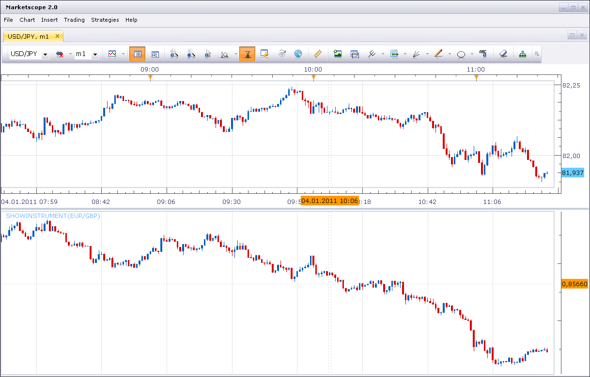

# Show Other Instrument on New Chart Area

> Source: https://fxcodebase.com/code/viewtopic.php?f=17&t=3094  
> Forum: 17 · Topic 3094 · 2 post(s)

---

## Show Other Instrument on New Chart Area

**Nikolay.Gekht** · Tue Jan 04, 2011 11:31 am

The simple indicator which just shows the chosen instrument in additional bar area.

 

Download:

 [showinstrument.lua](files/7210/showinstrument.lua)

The indicator was revised and updated

---

## Re: Show Other Instrument on New Chart Area

**Apprentice** · Sun Feb 12, 2017 7:10 am

Indicator was revised and updated.
